# 图像相似度度量完全指南

> **场景变化检测的核心算法详解**

本文档系统性地讲解图像相似度度量的三大核心算法：**颜色直方图**、**巴氏距离**、**SSIM 结构相似度**，以及它们在场景变化检测中的融合应用。

---

## 总览架构

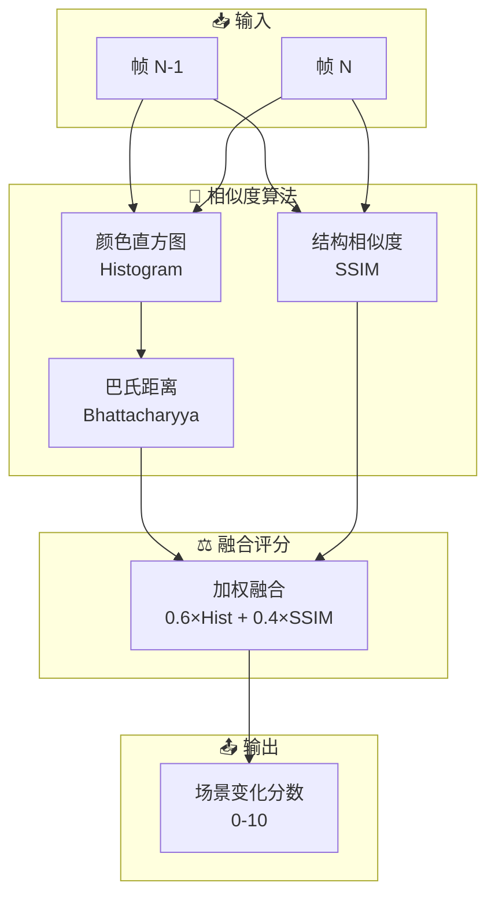

---

# 第一章：颜色直方图 (Color Histogram)

## 1.1 什么是直方图

**直方图**是图像中像素值分布的统计表示。它将像素值（0-255）划分为若干"桶"（bins），统计每个桶内的像素数量。

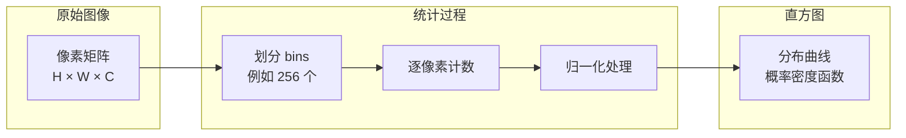

### 数学定义

对于灰度图像，设像素值范围 $[0, L-1]$，直方图定义为：

$$
h(k) = \frac{n_k}{N}, \quad k = 0, 1, ..., L-1
$$

其中：
- $n_k$ = 像素值为 $k$ 的像素个数
- $N$ = 图像总像素数
- $h(k)$ = 像素值 $k$ 出现的概率

---

## 1.2 RGB 与 HSV 色彩空间

颜色直方图可以在不同的色彩空间中计算，两种最常用的是 **RGB** 和 **HSV**：

| 特性 | RGB | HSV |
|:----:|:---:|:---:|
| **分量含义** | 红、绿、蓝光强度 | 色调、饱和度、明度 |
| **人类感知** | 不符合直觉 | 接近人眼感知 |
| **光照敏感度** | 高（光照变化影响大） | 低（H 通道相对稳定） |
| **适用场景** | 颜色精确匹配 | 光照变化环境 |
| **计算复杂度** | 低 | 中（需要转换） |

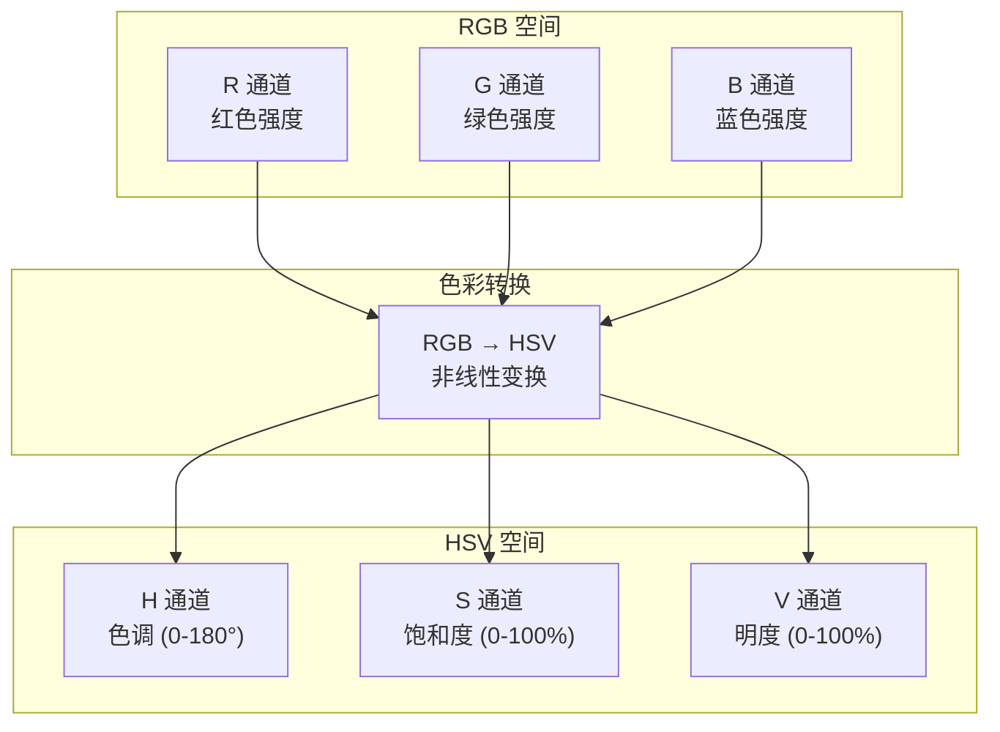

> [!TIP]
> **实战建议**：对于屏幕录制场景，**推荐使用 RGB 直方图**。屏幕内容通常光照恒定（背光显示器），RGB 空间的计算效率更高。

---

## 1.3 直方图计算流程

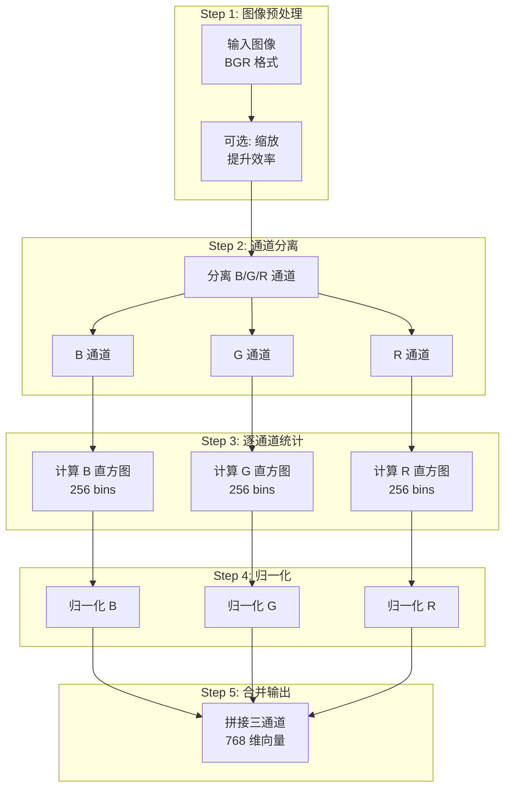

---

## 1.4 OpenCV C++ 实现

```cpp
#include <opencv2/opencv.hpp>

/**
 * @brief 计算图像的归一化颜色直方图
 * 
 * @param image 输入图像 (BGR 格式)
 * @return cv::Mat 归一化后的直方图 (768×1 浮点向量)
 */
cv::Mat calculateColorHistogram(const cv::Mat& image) {
    // ===== Step 1: 参数定义 =====
    const int histSize = 256;           // 每个通道 256 个 bins
    const float range[] = {0, 256};     // 像素值范围
    const float* histRange = {range};
    
    // ===== Step 2: 分离 BGR 通道 =====
    std::vector<cv::Mat> bgrChannels;
    cv::split(image, bgrChannels);
    
    // ===== Step 3: 计算每个通道的直方图 =====
    cv::Mat histB, histG, histR;
    cv::calcHist(&bgrChannels[0], 1, 0, cv::Mat(), 
                 histB, 1, &histSize, &histRange);
    cv::calcHist(&bgrChannels[1], 1, 0, cv::Mat(), 
                 histG, 1, &histSize, &histRange);
    cv::calcHist(&bgrChannels[2], 1, 0, cv::Mat(), 
                 histR, 1, &histSize, &histRange);
    
    // ===== Step 4: 归一化 (概率分布) =====
    cv::normalize(histB, histB, 0, 1, cv::NORM_MINMAX);
    cv::normalize(histG, histG, 0, 1, cv::NORM_MINMAX);
    cv::normalize(histR, histR, 0, 1, cv::NORM_MINMAX);
    
    // ===== Step 5: 拼接为 768 维向量 =====
    cv::Mat combinedHist;
    cv::vconcat(std::vector<cv::Mat>{histB, histG, histR}, combinedHist);
    
    return combinedHist;
}
```

### 关键函数说明

| 函数 | 作用 | 关键参数 |
|:----:|:-----|:---------|
| `cv::split()` | 将多通道图像分离为单通道数组 | `bgrChannels` 接收三个 Mat |
| `cv::calcHist()` | 计算直方图 | `histSize=256`, `range=[0,256)` |
| `cv::normalize()` | 归一化到指定范围 | `NORM_MINMAX` 缩放到 [0,1] |
| `cv::vconcat()` | 垂直拼接多个矩阵 | 输出 768×1 向量 |

---

# 第二章：巴氏距离 (Bhattacharyya Distance)

## 2.1 概率分布距离度量简介

比较两个直方图（概率分布）的相似程度，有多种距离度量方法：

| 距离类型 | 公式简述 | 优点 | 缺点 |
|:--------:|:---------|:-----|:-----|
| **欧氏距离** | $\sqrt{\sum(p_i - q_i)^2}$ | 计算简单 | 对绝对值敏感，忽略分布形状 |
| **余弦距离** | $1 - \frac{p \cdot q}{\|p\|\|q\|}$ | 关注方向 | 忽略向量幅度 |
| **卡方距离** | $\sum\frac{(p_i - q_i)^2}{p_i + q_i}$ | 考虑相对差异 | 分母可能为零 |
| **巴氏距离** | $\sqrt{1 - BC(p, q)}$ | 概率论基础，鲁棒性强 | 计算略复杂 |

> [!IMPORTANT]
> **巴氏距离**是基于概率论的距离度量，具有**几何可解释性**：它衡量两个分布在统计流形上的"角度差异"。

---

## 2.2 巴氏系数的数学定义

**巴氏系数 (Bhattacharyya Coefficient, BC)** 衡量两个概率分布的重叠程度：

$$
BC(p, q) = \sum_{i=1}^{n} \sqrt{p_i \cdot q_i}
$$

其中：
- $p = (p_1, p_2, ..., p_n)$ 是第一个直方图 (归一化后)
- $q = (q_1, q_2, ..., q_n)$ 是第二个直方图 (归一化后)
- $BC \in [0, 1]$：
  - $BC = 1$：两个分布完全相同
  - $BC = 0$：两个分布完全不重叠

### 几何解释

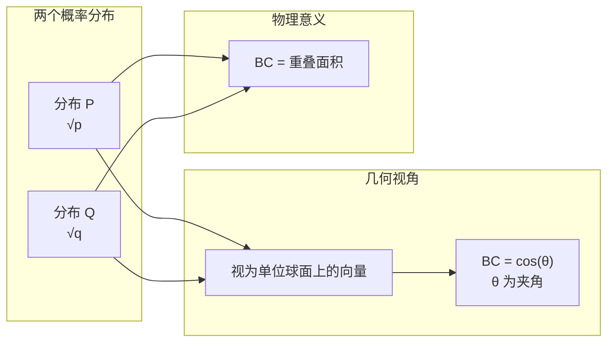

将 $\sqrt{p}$ 和 $\sqrt{q}$ 视为向量，它们的点积就是 BC：
$$
BC = \langle \sqrt{p}, \sqrt{q} \rangle = \sum_i \sqrt{p_i} \cdot \sqrt{q_i}
$$

这正是两个单位向量夹角余弦的定义！

---

## 2.3 巴氏距离的计算

**巴氏距离** 由巴氏系数推导而来：

$$
D_B = \sqrt{1 - BC(p, q)}
$$

或者使用对数形式（常用于机器学习）：

$$
D_B = -\ln(BC(p, q))
$$

### 推导过程

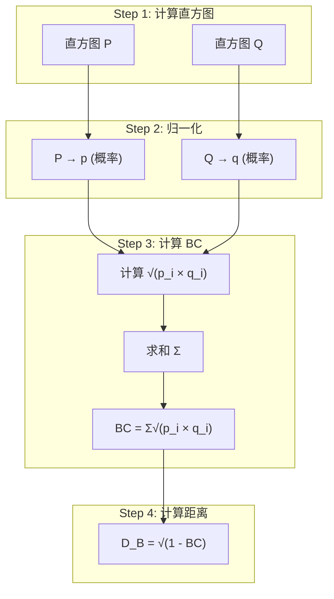

### 数值范围

| BC 值 | D_B 值 | 含义 |
|:-----:|:------:|:-----|
| 1.0 | 0.0 | 完全相同 |
| 0.9 | 0.32 | 高度相似 |
| 0.7 | 0.55 | 中等相似 |
| 0.5 | 0.71 | 较大差异 |
| 0.1 | 0.95 | 极大差异 |
| 0.0 | 1.0 | 完全不同 |

---

## 2.4 为何选择巴氏距离

与其他距离度量相比，巴氏距离在图像相似度场景中有独特优势：

### 优势对比表

| 特性 | 欧氏距离 | 卡方距离 | 巴氏距离 |
|:----:|:--------:|:--------:|:--------:|
| **光照鲁棒性** | ❌ 差 | ⚠️ 中等 | ✅ 好 |
| **噪声容忍度** | ❌ 差 | ⚠️ 中等 | ✅ 好 |
| **分布形状敏感** | ❌ 只看绝对值 | ⚠️ 部分考虑 | ✅ 完全考虑 |
| **有界性** | ❌ 无上界 | ❌ 无上界 | ✅ [0, 1] |
| **概率论基础** | ❌ 无 | ⚠️ 弱 | ✅ 强 |

### 直观示例

```
场景: 图像 A 整体变亮 20%

欧氏距离: 巨大变化 (像素值绝对差异大)
巴氏距离: 较小变化 (分布形状相似，只是整体平移)
```

> [!TIP]
> **实战建议**：在屏幕录制场景中，显示器亮度波动可能导致整体亮度变化。**巴氏距离**对这种"分布平移"具有更好的鲁棒性。

---

## 2.5 OpenCV 实现

OpenCV 提供了便捷的直方图比较函数：

```cpp
#include <opencv2/opencv.hpp>

/**
 * @brief 计算两个图像直方图的巴氏距离
 * 
 * @param image1 第一张图像
 * @param image2 第二张图像
 * @return double 巴氏距离 [0, 1]，越大差异越大
 */
double calculateBhattacharyyaDistance(
    const cv::Mat& image1, 
    const cv::Mat& image2
) {
    // ===== Step 1: 转换为 HSV 空间 (可选，增强光照鲁棒性) =====
    cv::Mat hsv1, hsv2;
    cv::cvtColor(image1, hsv1, cv::COLOR_BGR2HSV);
    cv::cvtColor(image2, hsv2, cv::COLOR_BGR2HSV);
    
    // ===== Step 2: 定义直方图参数 =====
    // H: 0-180, S: 0-256
    int hBins = 50, sBins = 60;
    int histSize[] = {hBins, sBins};
    float hRanges[] = {0, 180};
    float sRanges[] = {0, 256};
    const float* ranges[] = {hRanges, sRanges};
    int channels[] = {0, 1};  // H 和 S 通道
    
    // ===== Step 3: 计算直方图 =====
    cv::Mat hist1, hist2;
    cv::calcHist(&hsv1, 1, channels, cv::Mat(), 
                 hist1, 2, histSize, ranges, true, false);
    cv::calcHist(&hsv2, 1, channels, cv::Mat(), 
                 hist2, 2, histSize, ranges, true, false);
    
    // ===== Step 4: 归一化 =====
    cv::normalize(hist1, hist1, 0, 1, cv::NORM_MINMAX);
    cv::normalize(hist2, hist2, 0, 1, cv::NORM_MINMAX);
    
    // ===== Step 5: 计算巴氏距离 =====
    double distance = cv::compareHist(hist1, hist2, cv::HISTCMP_BHATTACHARYYA);
    
    return distance;
}
```

### `cv::compareHist` 方法常量

| 常量 | 方法 | 结果范围 | 相似时值 |
|:----:|:----:|:--------:|:--------:|
| `HISTCMP_CORREL` | 相关性 | [-1, 1] | 接近 1 |
| `HISTCMP_CHISQR` | 卡方距离 | [0, ∞) | 接近 0 |
| `HISTCMP_INTERSECT` | 交集 | [0, 1] | 接近 1 |
| `HISTCMP_BHATTACHARYYA` | 巴氏距离 | [0, 1] | 接近 0 |

---

# 第三章：SSIM 结构相似度

## 3.1 人类视觉感知模型

传统的图像比较方法（如 MSE、PSNR）基于逐像素差异，但这**并不符合人类视觉感知**。

### MSE 的问题示例

| 对比场景 | MSE 值 | 人眼感知 |
|:--------:|:------:|:--------:|
| 原图 vs 轻微模糊 | 较大 | 几乎无差别 |
| 原图 vs 对比度增强 | 较大 | 质量更好 |
| 原图 vs 随机噪点 | 较小 | 明显劣化 |

> 上表说明：**MSE 高不代表人眼感知差异大，MSE 低也不代表视觉质量好**。

SSIM 的设计目标是模拟人类视觉系统 (HVS) 的感知特性：
- 对**结构信息**敏感
- 对**亮度绝对值**不敏感
- 对**对比度相对变化**有适应性

---

## 3.2 SSIM 三分量解析

SSIM 将图像相似度分解为三个独立分量：

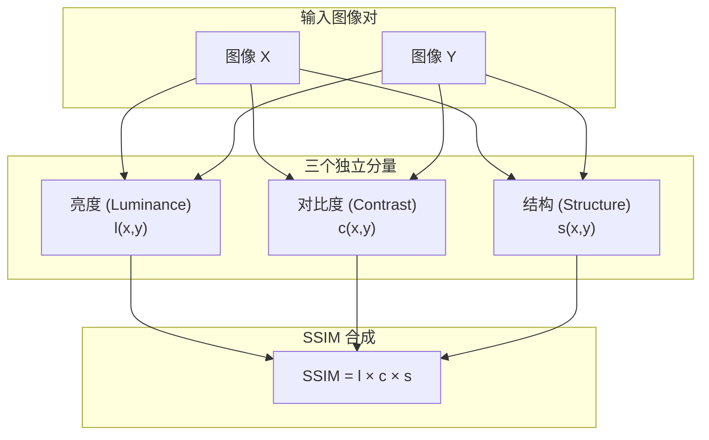

### 3.2.1 亮度分量 (Luminance)

比较两幅图像的**平均亮度**：

$$
l(x, y) = \frac{2\mu_x\mu_y + C_1}{\mu_x^2 + \mu_y^2 + C_1}
$$

其中：
- $\mu_x$ = 图像 X 的均值
- $\mu_y$ = 图像 Y 的均值
- $C_1 = (K_1 \cdot L)^2$，稳定常数，避免分母为零

### 3.2.2 对比度分量 (Contrast)

比较两幅图像的**对比度**（标准差）：

$$
c(x, y) = \frac{2\sigma_x\sigma_y + C_2}{\sigma_x^2 + \sigma_y^2 + C_2}
$$

其中：
- $\sigma_x$ = 图像 X 的标准差
- $\sigma_y$ = 图像 Y 的标准差
- $C_2 = (K_2 \cdot L)^2$，稳定常数

### 3.2.3 结构分量 (Structure)

比较两幅图像的**结构相关性**：

$$
s(x, y) = \frac{\sigma_{xy} + C_3}{\sigma_x\sigma_y + C_3}
$$

其中：
- $\sigma_{xy}$ = X 与 Y 的协方差
- $C_3 = C_2 / 2$

### 分量可视化

| 分量 | 敏感对象 | 不敏感对象 |
|:----:|:---------|:-----------|
| **亮度 l** | 整体明暗变化 | 局部细节 |
| **对比度 c** | 动态范围变化 | 绝对亮度 |
| **结构 s** | 边缘、纹理变化 | 均匀区域亮度变化 |

---

## 3.3 SSIM 数学公式推导

### 完整 SSIM 公式

将三个分量相乘，得到最终的 SSIM 指数：

$$
\text{SSIM}(x, y) = l(x,y) \cdot c(x,y) \cdot s(x,y)
$$

展开后的**简化形式**（常用实现）：

$$
\text{SSIM}(x, y) = \frac{(2\mu_x\mu_y + C_1)(2\sigma_{xy} + C_2)}{(\mu_x^2 + \mu_y^2 + C_1)(\sigma_x^2 + \sigma_y^2 + C_2)}
$$

### 默认参数

| 参数 | 默认值 | 说明 |
|:----:|:------:|:-----|
| $K_1$ | 0.01 | 亮度稳定因子 |
| $K_2$ | 0.03 | 对比度稳定因子 |
| $L$ | 255 | 像素值动态范围 |
| $C_1$ | $(0.01 \times 255)^2 = 6.5$ | 亮度常数 |
| $C_2$ | $(0.03 \times 255)^2 = 58.5$ | 对比度常数 |

---

## 3.4 滑动窗口与全局 SSIM

SSIM 通常在**局部窗口**内计算，然后取平均得到全局 SSIM：

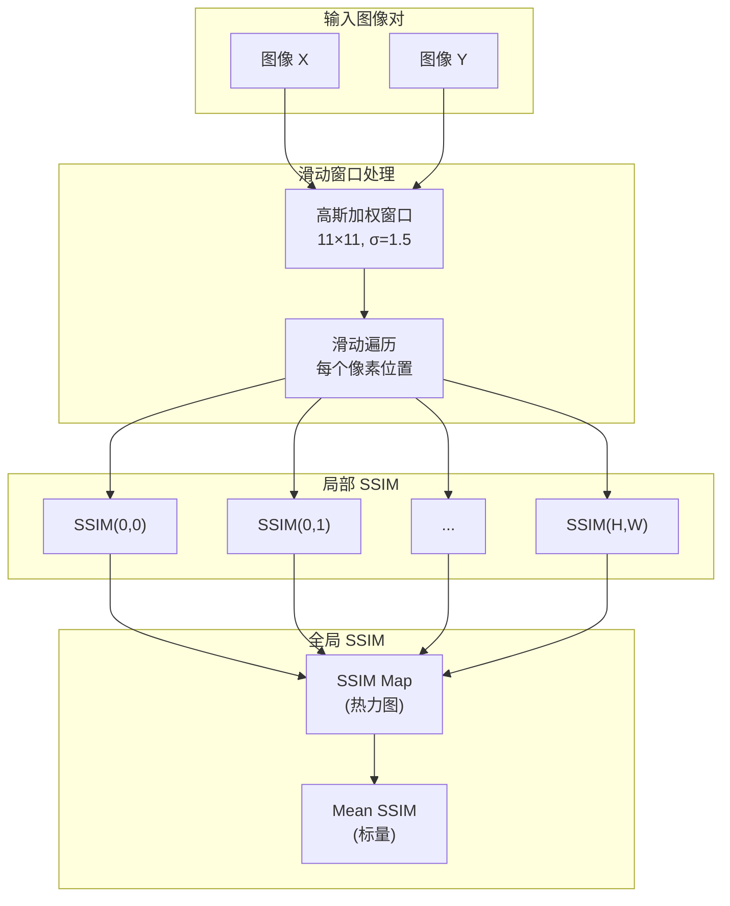

### 高斯窗口的作用

| 无高斯加权 | 有高斯加权 |
|:-----------|:-----------|
| 边界效应明显 | 边界平滑过渡 |
| 块状伪影 | 无伪影 |
| 计算均匀 | 中心像素权重更高 |

---

## 3.5 OpenCV C++ 实现

OpenCV 没有内置 SSIM 函数，但实现起来并不复杂：

```cpp
#include <opencv2/opencv.hpp>

/**
 * @brief 计算两幅图像的 SSIM 指数
 * 
 * @param img1 第一张图像 (灰度)
 * @param img2 第二张图像 (灰度)
 * @return double SSIM 值 [0, 1]，越大越相似
 */
double calculateSSIM(const cv::Mat& img1, const cv::Mat& img2) {
    // ===== 常量定义 =====
    const double C1 = 6.5025;    // (0.01 * 255)^2
    const double C2 = 58.5225;   // (0.03 * 255)^2
    
    // ===== Step 1: 转换为浮点数 =====
    cv::Mat I1, I2;
    img1.convertTo(I1, CV_64F);
    img2.convertTo(I2, CV_64F);
    
    // ===== Step 2: 计算基础统计量 =====
    cv::Mat I1_sq = I1.mul(I1);   // I1^2
    cv::Mat I2_sq = I2.mul(I2);   // I2^2
    cv::Mat I1_I2 = I1.mul(I2);   // I1 * I2
    
    // ===== Step 3: 高斯模糊 (滑动窗口均值) =====
    cv::Mat mu1, mu2;
    cv::GaussianBlur(I1, mu1, cv::Size(11, 11), 1.5);
    cv::GaussianBlur(I2, mu2, cv::Size(11, 11), 1.5);
    
    cv::Mat mu1_sq = mu1.mul(mu1);
    cv::Mat mu2_sq = mu2.mul(mu2);
    cv::Mat mu1_mu2 = mu1.mul(mu2);
    
    // ===== Step 4: 计算方差和协方差 =====
    cv::Mat sigma1_sq, sigma2_sq, sigma12;
    cv::GaussianBlur(I1_sq, sigma1_sq, cv::Size(11, 11), 1.5);
    sigma1_sq -= mu1_sq;  // Var(X) = E[X^2] - E[X]^2
    
    cv::GaussianBlur(I2_sq, sigma2_sq, cv::Size(11, 11), 1.5);
    sigma2_sq -= mu2_sq;
    
    cv::GaussianBlur(I1_I2, sigma12, cv::Size(11, 11), 1.5);
    sigma12 -= mu1_mu2;   // Cov(X,Y) = E[XY] - E[X]E[Y]
    
    // ===== Step 5: 计算 SSIM 公式 =====
    cv::Mat numerator = (2 * mu1_mu2 + C1).mul(2 * sigma12 + C2);
    cv::Mat denominator = (mu1_sq + mu2_sq + C1).mul(sigma1_sq + sigma2_sq + C2);
    
    cv::Mat ssimMap;
    cv::divide(numerator, denominator, ssimMap);
    
    // ===== Step 6: 返回全局平均 SSIM =====
    cv::Scalar mssim = cv::mean(ssimMap);
    return mssim[0];
}
```

### 代码关键步骤解析

| 步骤 | 作用 | 对应公式符号 |
|:----:|:-----|:-------------|
| `GaussianBlur(I1)` | 计算局部均值 | $\mu_x$ |
| `sigma1_sq = E[X^2] - E[X]^2` | 计算方差 | $\sigma_x^2$ |
| `sigma12 = E[XY] - E[X]E[Y]` | 计算协方差 | $\sigma_{xy}$ |
| `ssimMap = num / denom` | 逐像素计算 SSIM | $\text{SSIM}(x, y)$ |
| `mean(ssimMap)` | 全局平均 | $\overline{\text{SSIM}}$ |

---

# 第四章：场景变化检测融合策略

## 4.1 直方图 vs SSIM 优缺点

| 特性 | 颜色直方图 + 巴氏距离 | SSIM |
|:----:|:----------------------|:-----|
| **计算速度** | ✅ 快 (O(N)) | ⚠️ 慢 (O(N×W²)) |
| **空间位置信息** | ❌ 完全丢失 | ✅ 保留局部结构 |
| **光照鲁棒性** | ✅ 好 | ⚠️ 中等 |
| **纹理敏感度** | ❌ 不敏感 | ✅ 高度敏感 |
| **适用场景** | 大范围颜色变化 | 局部结构变化 |

> [!NOTE]
> **关键洞察**：直方图善于捕捉"整体颜色大变化"（如切换应用），SSIM 善于捕捉"局部结构变化"（如对话框弹出）。两者**互补**，融合使用效果最佳。

---

## 4.2 加权融合公式

基于两种方法的互补特性，设计加权融合策略：

$$
\text{SceneScore} = \alpha \cdot D_{\text{Bhattacharyya}} + \beta \cdot (1 - \text{SSIM})
$$

推荐参数：
- $\alpha = 0.6$（直方图权重，捕捉大变化）
- $\beta = 0.4$（SSIM 权重，捕捉结构变化）

### 融合流程

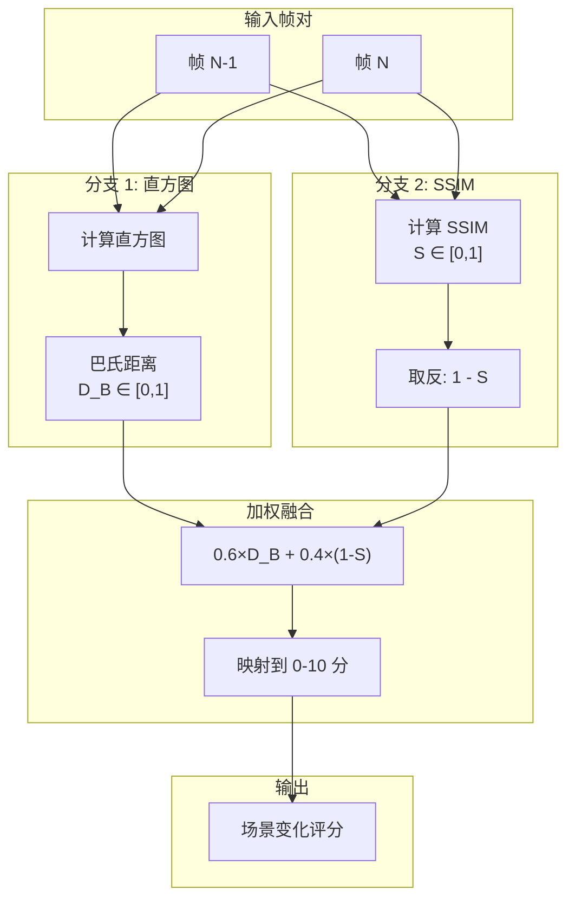

---

## 4.3 阈值选择策略

场景变化检测本质是**二分类问题**（变化 vs 不变化），需要选择合适的阈值：

### 阈值选择方法

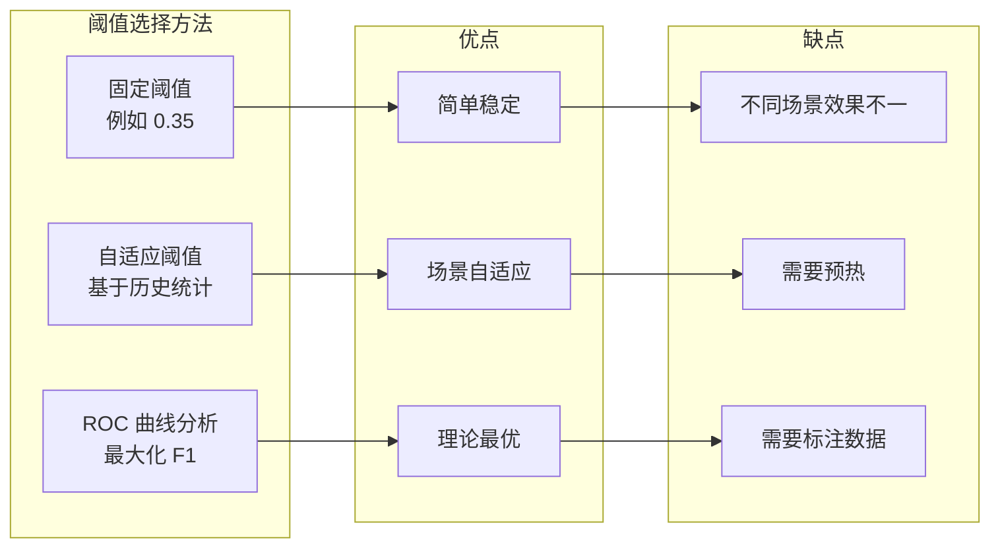

### 推荐阈值参考

| 场景类型 | 推荐阈值 | 说明 |
|:--------:|:--------:|:-----|
| 桌面办公 | 0.30 | 应用切换频繁 |
| 视频观看 | 0.45 | 内容变化渐进 |
| 游戏录制 | 0.50 | 大量运动，需更高阈值 |
| 混合场景 | 0.35 | 平衡选择 |

---

## 4.4 完整实现示例

### 类设计

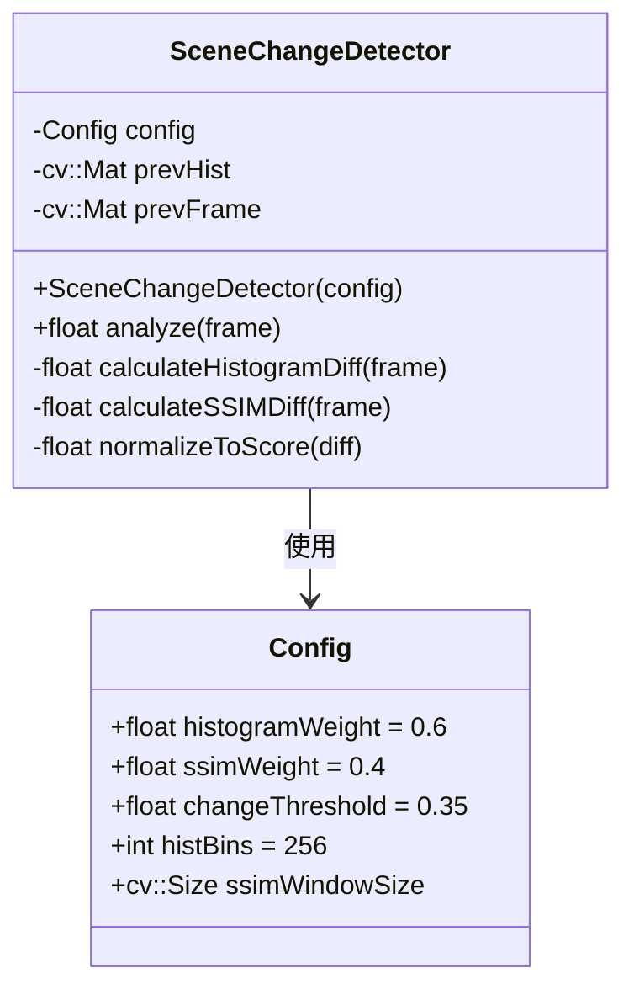

### 完整 C++ 代码

```cpp
#include <opencv2/opencv.hpp>
#include <algorithm>

/**
 * @brief 场景变化检测器
 * 
 * 融合颜色直方图（巴氏距离）和 SSIM 两种算法，
 * 实现鲁棒的场景变化检测。
 */
class SceneChangeDetector {
public:
    struct Config {
        float histogramWeight = 0.6f;    // 直方图权重
        float ssimWeight = 0.4f;         // SSIM 权重
        float changeThreshold = 0.35f;   // 变化阈值
        int histBins = 256;              // 直方图 bins 数量
    };
    
    explicit SceneChangeDetector(const Config& cfg = Config{})
        : config_(cfg), isFirstFrame_(true) {}
    
    /**
     * @brief 分析当前帧，返回场景变化评分
     * 
     * @param frame 当前帧 (BGR 格式)
     * @return float 评分 [0, 10]，越高表示变化越大
     */
    float analyze(const cv::Mat& frame) {
        if (isFirstFrame_) {
            updateState(frame);
            isFirstFrame_ = false;
            return 0.0f;  // 第一帧无法比较
        }
        
        // ===== 1. 计算直方图差异 (巴氏距离) =====
        float histDiff = calculateHistogramDiff(frame);
        
        // ===== 2. 计算 SSIM 差异 =====
        float ssimDiff = calculateSSIMDiff(frame);
        
        // ===== 3. 加权融合 =====
        float combinedDiff = config_.histogramWeight * histDiff
                           + config_.ssimWeight * ssimDiff;
        
        // ===== 4. 更新状态 =====
        updateState(frame);
        
        // ===== 5. 映射到 0-10 分 =====
        return normalizeToScore(combinedDiff);
    }
    
    /**
     * @brief 判断是否发生场景变化
     */
    bool isSceneChange(float score) const {
        return score >= (config_.changeThreshold * 10.0f);
    }

private:
    Config config_;
    cv::Mat prevHist_;
    cv::Mat prevGray_;
    bool isFirstFrame_;
    
    /**
     * @brief 计算直方图巴氏距离
     */
    float calculateHistogramDiff(const cv::Mat& frame) {
        cv::Mat hist = computeHistogram(frame);
        
        if (prevHist_.empty()) {
            return 0.0f;
        }
        
        // 使用 OpenCV 内置的巴氏距离计算
        double distance = cv::compareHist(prevHist_, hist, cv::HISTCMP_BHATTACHARYYA);
        return static_cast<float>(distance);
    }
    
    /**
     * @brief 计算 SSIM 差异
     */
    float calculateSSIMDiff(const cv::Mat& frame) {
        cv::Mat gray;
        cv::cvtColor(frame, gray, cv::COLOR_BGR2GRAY);
        
        if (prevGray_.empty()) {
            return 0.0f;
        }
        
        // 缩小尺寸以提升性能
        cv::Mat resized1, resized2;
        cv::resize(prevGray_, resized1, cv::Size(320, 180));
        cv::resize(gray, resized2, cv::Size(320, 180));
        
        double ssim = computeSSIM(resized1, resized2);
        return static_cast<float>(1.0 - ssim);  // 转换为差异值
    }
    
    /**
     * @brief 计算归一化直方图
     */
    cv::Mat computeHistogram(const cv::Mat& frame) {
        cv::Mat hsv;
        cv::cvtColor(frame, hsv, cv::COLOR_BGR2HSV);
        
        int hBins = 50, sBins = 60;
        int histSize[] = {hBins, sBins};
        float hRanges[] = {0, 180};
        float sRanges[] = {0, 256};
        const float* ranges[] = {hRanges, sRanges};
        int channels[] = {0, 1};
        
        cv::Mat hist;
        cv::calcHist(&hsv, 1, channels, cv::Mat(), hist, 2, histSize, ranges);
        cv::normalize(hist, hist, 0, 1, cv::NORM_MINMAX);
        
        return hist;
    }
    
    /**
     * @brief 计算 SSIM
     */
    double computeSSIM(const cv::Mat& img1, const cv::Mat& img2) {
        const double C1 = 6.5025, C2 = 58.5225;
        
        cv::Mat I1, I2;
        img1.convertTo(I1, CV_64F);
        img2.convertTo(I2, CV_64F);
        
        cv::Mat mu1, mu2;
        cv::GaussianBlur(I1, mu1, cv::Size(11, 11), 1.5);
        cv::GaussianBlur(I2, mu2, cv::Size(11, 11), 1.5);
        
        cv::Mat mu1_sq = mu1.mul(mu1);
        cv::Mat mu2_sq = mu2.mul(mu2);
        cv::Mat mu1_mu2 = mu1.mul(mu2);
        
        cv::Mat sigma1_sq, sigma2_sq, sigma12;
        cv::GaussianBlur(I1.mul(I1), sigma1_sq, cv::Size(11, 11), 1.5);
        cv::GaussianBlur(I2.mul(I2), sigma2_sq, cv::Size(11, 11), 1.5);
        cv::GaussianBlur(I1.mul(I2), sigma12, cv::Size(11, 11), 1.5);
        
        sigma1_sq -= mu1_sq;
        sigma2_sq -= mu2_sq;
        sigma12 -= mu1_mu2;
        
        cv::Mat ssimMap;
        cv::divide(
            (2 * mu1_mu2 + C1).mul(2 * sigma12 + C2),
            (mu1_sq + mu2_sq + C1).mul(sigma1_sq + sigma2_sq + C2),
            ssimMap
        );
        
        return cv::mean(ssimMap)[0];
    }
    
    /**
     * @brief 更新状态
     */
    void updateState(const cv::Mat& frame) {
        prevHist_ = computeHistogram(frame);
        cv::cvtColor(frame, prevGray_, cv::COLOR_BGR2GRAY);
    }
    
    /**
     * @brief 将差异值映射到 0-10 分
     */
    float normalizeToScore(float diff) {
        // 使用 S 型曲线进行非线性映射
        // diff=0 → score=0, diff=0.5 → score=5, diff=1 → score=10
        float score = 10.0f * diff;
        return std::clamp(score, 0.0f, 10.0f);
    }
};
```

### 使用示例

```cpp
int main() {
    cv::VideoCapture cap("screen_recording.mp4");
    
    SceneChangeDetector::Config config;
    config.histogramWeight = 0.6f;
    config.ssimWeight = 0.4f;
    config.changeThreshold = 0.35f;
    
    SceneChangeDetector detector(config);
    
    cv::Mat frame;
    int frameIndex = 0;
    
    while (cap.read(frame)) {
        float score = detector.analyze(frame);
        
        if (detector.isSceneChange(score)) {
            std::cout << "Scene change detected at frame " 
                      << frameIndex << ", score: " << score << std::endl;
        }
        
        frameIndex++;
    }
    
    return 0;
}
```

---

## 总结

本文档完整介绍了**图像相似度度量**的三大核心算法及其融合应用：

| 章节 | 核心内容 | 关键公式/概念 |
|:----:|:---------|:--------------|
| **第一章** | 颜色直方图 | 像素分布统计、RGB/HSV 比较 |
| **第二章** | 巴氏距离 | $D_B = \sqrt{1 - BC}$，概率分布距离 |
| **第三章** | SSIM | 亮度×对比度×结构，人眼感知模型 |
| **第四章** | 融合策略 | $0.6×D_B + 0.4×(1-SSIM)$ |

通过将**直方图**（捕捉全局颜色变化）与 **SSIM**（捕捉局部结构变化）融合，可以实现**鲁棒、准确**的场景变化检测，为关键帧智能选择提供可靠的评分依据。
