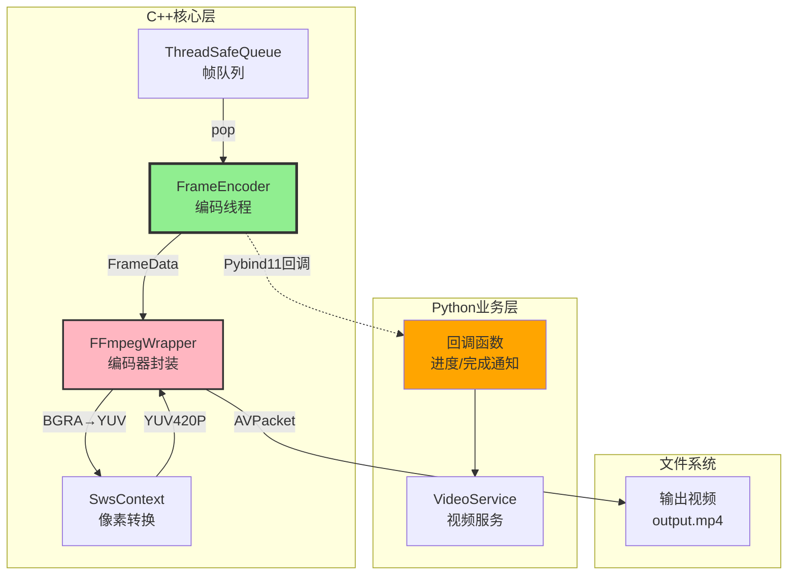
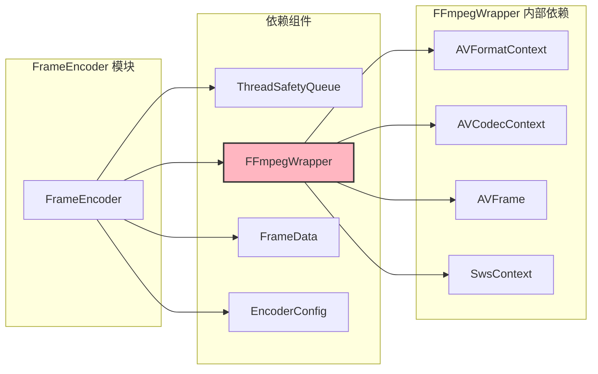
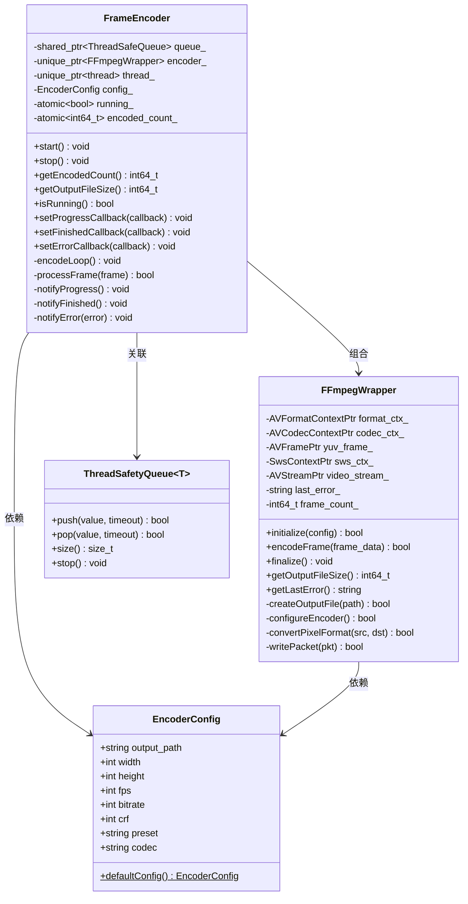
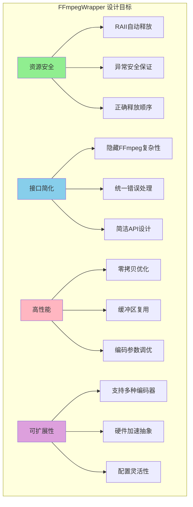
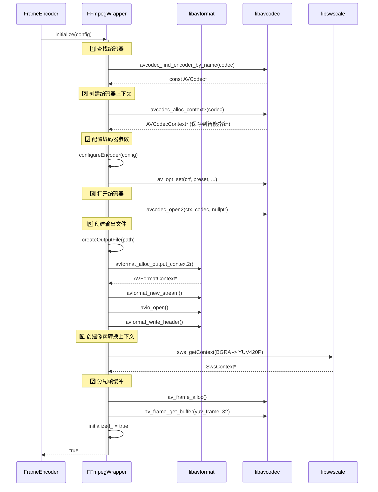
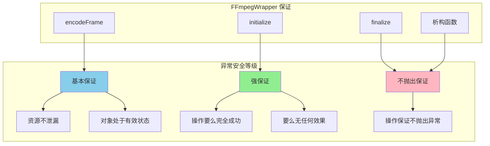
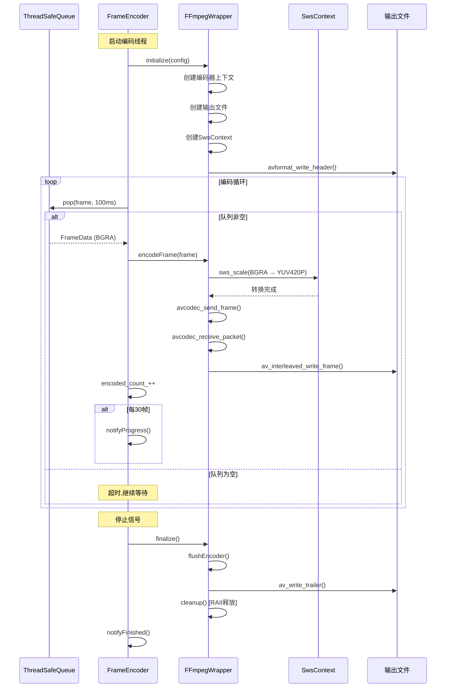
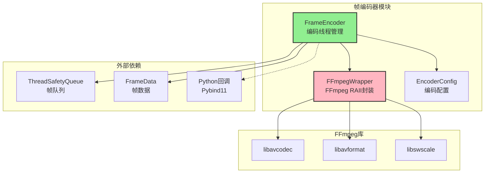

# 3.2.3 帧编码器设计 (优化版)

> **消费者核心与FFmpeg深度集成**  
> `FrameEncoder` 是视频流处理的消费者，负责从队列中取出原始帧数据，通过 `FFmpegWrapper` 进行像素格式转换和H.264编码，最终写入视频文件。本文档详解其设计原理、**FFmpegWrapper RAII封装设计**、FFmpeg集成和性能优化策略。

---

## 📋 目录

1. [模块概述与定位](#模块概述与定位)
2. [设计目标与挑战](#设计目标与挑战)
3. [核心架构设计](#核心架构设计)
4. [FFmpegWrapper 详细设计](#ffmpegwrapper-详细设计) ⭐ **新增**
5. [详细实现解析](#详细实现解析)
6. [像素格式转换](#像素格式转换)
7. [FFmpeg编码流程](#ffmpeg编码流程)
8. [Pybind11回调机制](#pybind11回调机制)
9. [性能优化策略](#性能优化策略)
10. [实战使用指南](#实战使用指南)

---

## 模块概述与定位

### 在系统中的位置



### 核心职责

| 职责 | 说明 | 技术实现 |
|------|------|---------|
| **队列消费** | 从ThreadSafeQueue取帧 | 阻塞式pop,超时100ms |
| **格式转换** | BGRA → YUV420P | libswscale (`sws_scale`) |
| **视频编码** | H.264编码 | libavcodec (x264) |
| **文件写入** | 写入MP4容器 | libavformat |
| **进度通知** | 通知Python层 | Pybind11回调 + GIL |
| **资源管理** | RAII资源封装 | FFmpegWrapper 智能指针 |

### 模块依赖关系



---

## 设计目标与挑战

### 核心设计目标


### 技术挑战

| 挑战 | 问题 | 解决方案 |
|------|------|---------|
| **格式转换** | BGRA→YUV420P耗时 | `sws_scale` 硬件加速 + SIMD |
| **编码延迟** | H.264编码慢于采集 | 队列缓冲 + 编码参数优化 |
| **内存管理** | AVFrame/AVPacket泄漏 | **FFmpegWrapper RAII封装** |
| **GIL阻塞** | Python回调影响性能 | 异步通知 + 批量回调 |
| **资源释放顺序** | FFmpeg资源依赖关系复杂 | 自定义删除器 + 正确释放顺序 |

---

## 核心架构设计

### 类结构总览



### FrameEncoder 类定义

```cpp
#pragma once

#include <thread>
#include <atomic>
#include <memory>
#include <functional>

#include "ThreadSafetyQueue.h"
#include "IScreenGrabber.h"  // FrameData定义
#include "FFmpegWrapper.h"

/**
 * @brief 帧编码器
 * 
 * 从队列中取出帧,进行像素格式转换和H.264编码
 */
class FrameEncoder {
public:
    /**
     * @brief 构造函数
     * @param queue 帧队列
     * @param config 编码器配置
     */
    FrameEncoder(
        std::shared_ptr<ThreadSafetyQueue<FrameData>> queue,
        const EncoderConfig& config
    );
    
    ~FrameEncoder();
    
    // 禁止拷贝
    FrameEncoder(const FrameEncoder&) = delete;
    FrameEncoder& operator=(const FrameEncoder&) = delete;
    
    /**
     * @brief 启动编码线程
     */
    void start();
    
    /**
     * @brief 停止编码线程
     */
    void stop();
    
    /**
     * @brief 获取统计信息
     */
    int64_t getEncodedCount() const { return encoded_count_; }
    int64_t getOutputFileSize() const;
    bool isRunning() const { return running_; }
    
    // Pybind11回调函数类型
    using ProgressCallback = std::function<void(int64_t, int64_t)>;
    using FinishedCallback = std::function<void(int64_t, const std::string&)>;
    using ErrorCallback = std::function<void(const std::string&)>;
    
    /**
     * @brief 设置回调函数
     */
    void setProgressCallback(ProgressCallback callback) {
        on_progress_ = callback;
    }
    void setFinishedCallback(FinishedCallback callback) {
        on_finished_ = callback;
    }
    void setErrorCallback(ErrorCallback callback) {
        on_error_ = callback;
    }
    
private:
    /**
     * @brief 编码循环 (在独立线程中运行)
     */
    void encodeLoop();
    
    /**
     * @brief 处理一帧
     */
    bool processFrame(const FrameData& frame);
    
    /**
     * @brief 调用Python回调
     */
    void notifyProgress();
    void notifyFinished();
    void notifyError(const std::string& error);
    
    // 核心组件
    std::shared_ptr<ThreadSafetyQueue<FrameData>> queue_;
    std::unique_ptr<FFmpegWrapper> encoder_;  // FFmpeg RAII封装
    std::unique_ptr<std::thread> thread_;
    EncoderConfig config_;
    
    // 状态标志
    std::atomic<bool> running_{false};
    
    // 统计信息
    std::atomic<int64_t> encoded_count_{0};
    
    // Python回调
    ProgressCallback on_progress_;
    FinishedCallback on_finished_;
    ErrorCallback on_error_;
};
```

### 编码器配置

```cpp
struct EncoderConfig {
    std::string output_path;        // 输出文件路径
    int width;                       // 视频宽度
    int height;                      // 视频高度
    int fps;                         // 帧率
    int bitrate;                     // 码率 (bps)
    int crf;                         // 质量参数 (0-51, 默认23)
    std::string preset;              // 编码预设 (ultrafast/fast/medium/slow)
    std::string codec;               // 编码器 (libx264/h264_nvenc)
    
    // 默认配置
    static EncoderConfig defaultConfig() {
        return {
            .output_path = "output.mp4",
            .width = 1920,
            .height = 1080,
            .fps = 60,
            .bitrate = 8000000,  // 8Mbps
            .crf = 23,
            .preset = "fast",
            .codec = "libx264"
        };
    }
};
```

---

## FFmpegWrapper 详细设计

> [!IMPORTANT]
> **核心设计理念**  
> `FFmpegWrapper` 是对FFmpeg编码功能的RAII封装，解决了FFmpeg C API资源管理的痛点，确保异常安全和零内存泄漏。

### 设计目标



### 类定义

```cpp
#pragma once

extern "C" {
#include <libavformat/avformat.h>
#include <libavcodec/avcodec.h>
#include <libswscale/swscale.h>
#include <libavutil/opt.h>
#include <libavutil/imgutils.h>
}

#include <memory>
#include <string>
#include <functional>
#include "IScreenGrabber.h"  // FrameData

// 前向声明
struct EncoderConfig;

/**
 * @brief FFmpeg RAII封装类
 * 
 * 封装FFmpeg编码流程，提供安全的资源管理和简洁的接口
 * 
 * @design 设计原则：
 *   1. RAII：所有FFmpeg资源使用智能指针管理
 *   2. 单一职责：只负责编码，不处理采集或业务逻辑
 *   3. 异常安全：所有操作保证强异常安全
 */
class FFmpegWrapper {
public:
    FFmpegWrapper();
    ~FFmpegWrapper();
    
    // 禁止拷贝（资源非可复制）
    FFmpegWrapper(const FFmpegWrapper&) = delete;
    FFmpegWrapper& operator=(const FFmpegWrapper&) = delete;
    
    // 允许移动
    FFmpegWrapper(FFmpegWrapper&&) noexcept;
    FFmpegWrapper& operator=(FFmpegWrapper&&) noexcept;
    
    /**
     * @brief 初始化编码器
     * @param config 编码配置
     * @return 成功返回true
     */
    bool initialize(const EncoderConfig& config);
    
    /**
     * @brief 编码一帧
     * @param frame_data 原始帧数据 (BGRA格式)
     * @return 成功返回true
     */
    bool encodeFrame(const FrameData& frame_data);
    
    /**
     * @brief 完成编码并关闭文件
     */
    void finalize();
    
    /**
     * @brief 获取输出文件大小
     */
    int64_t getOutputFileSize() const;
    
    /**
     * @brief 获取最后的错误信息
     */
    std::string getLastError() const { return last_error_; }
    
    /**
     * @brief 检查是否已初始化
     */
    bool isInitialized() const { return initialized_; }
    
private:
    // ========== 自定义删除器 ==========
    
    /**
     * @brief AVFormatContext 删除器
     * @note 必须先关闭I/O，再释放上下文
     */
    struct AVFormatContextDeleter {
        void operator()(AVFormatContext* ctx) {
            if (ctx) {
                if (ctx->pb) {
                    avio_closep(&ctx->pb);
                }
                avformat_free_context(ctx);
            }
        }
    };
    
    /**
     * @brief AVCodecContext 删除器
     */
    struct AVCodecContextDeleter {
        void operator()(AVCodecContext* ctx) {
            if (ctx) {
                avcodec_free_context(&ctx);
            }
        }
    };
    
    /**
     * @brief AVFrame 删除器
     */
    struct AVFrameDeleter {
        void operator()(AVFrame* frame) {
            if (frame) {
                av_frame_free(&frame);
            }
        }
    };
    
    /**
     * @brief SwsContext 删除器
     */
    struct SwsContextDeleter {
        void operator()(SwsContext* ctx) {
            if (ctx) {
                sws_freeContext(ctx);
            }
        }
    };
    
    /**
     * @brief AVPacket 删除器
     */
    struct AVPacketDeleter {
        void operator()(AVPacket* pkt) {
            if (pkt) {
                av_packet_free(&pkt);
            }
        }
    };
    
    // ========== 智能指针类型别名 ==========
    using AVFormatContextPtr = std::unique_ptr<AVFormatContext, AVFormatContextDeleter>;
    using AVCodecContextPtr = std::unique_ptr<AVCodecContext, AVCodecContextDeleter>;
    using AVFramePtr = std::unique_ptr<AVFrame, AVFrameDeleter>;
    using SwsContextPtr = std::unique_ptr<SwsContext, SwsContextDeleter>;
    using AVPacketPtr = std::unique_ptr<AVPacket, AVPacketDeleter>;
    
    // ========== 私有方法 ==========
    
    /**
     * @brief 创建输出文件
     */
    bool createOutputFile(const std::string& path);
    
    /**
     * @brief 配置编码器参数
     */
    bool configureEncoder(const EncoderConfig& config);
    
    /**
     * @brief 像素格式转换 BGRA -> YUV420P
     */
    bool convertPixelFormat(const FrameData& src, AVFrame* dst);
    
    /**
     * @brief 写入编码后的数据包
     */
    bool writePacket(AVPacket* pkt);
    
    /**
     * @brief 刷新编码器缓冲区
     */
    void flushEncoder();
    
    /**
     * @brief 释放所有资源
     */
    void cleanup();
    
    // ========== 成员变量 ==========
    
    // FFmpeg 上下文 (按释放顺序排列)
    AVFormatContextPtr format_ctx_;    // 格式上下文 (最后释放)
    AVCodecContextPtr codec_ctx_;      // 编码器上下文
    AVFramePtr yuv_frame_;             // YUV帧缓冲 (复用)
    SwsContextPtr sws_ctx_;            // 像素转换上下文
    AVPacketPtr packet_;               // 数据包缓冲 (复用)
    
    AVStream* video_stream_ = nullptr; // 视频流 (由format_ctx_管理)
    
    // 状态
    bool initialized_ = false;
    std::string last_error_;
    std::string output_path_;
    int64_t frame_count_ = 0;
    
    // 配置备份
    int width_ = 0;
    int height_ = 0;
};
```

### RAII 资源管理设计


> [!WARNING]
> **资源释放顺序至关重要！**
> 
> FFmpeg 资源之间存在依赖关系，必须按正确顺序释放：
> 1. 先释放 SwsContext（无依赖）
> 2. 释放 AVFrame（无依赖）  
> 3. 释放 AVCodecContext（无依赖）
> 4. **先关闭 avio**（`avio_closep`）
> 5. 最后释放 AVFormatContext

### FFmpegWrapper 初始化流程



### FFmpegWrapper 实现详解

#### 初始化方法

```cpp
bool FFmpegWrapper::initialize(const EncoderConfig& config) {
    if (initialized_) {
        last_error_ = "Already initialized";
        return false;
    }
    
    output_path_ = config.output_path;
    width_ = config.width;
    height_ = config.height;
    
    // 1️⃣ 查找编码器
    const AVCodec* codec = avcodec_find_encoder_by_name(config.codec.c_str());
    if (!codec) {
        // 尝试使用默认H.264编码器
        codec = avcodec_find_encoder(AV_CODEC_ID_H264);
        if (!codec) {
            last_error_ = "Codec not found: " + config.codec;
            return false;
        }
    }
    
    // 2️⃣ 创建编码器上下文 (RAII)
    codec_ctx_.reset(avcodec_alloc_context3(codec));
    if (!codec_ctx_) {
        last_error_ = "Failed to allocate codec context";
        return false;
    }
    
    // 3️⃣ 配置编码器
    if (!configureEncoder(config)) {
        return false;
    }
    
    // 4️⃣ 打开编码器
    int ret = avcodec_open2(codec_ctx_.get(), codec, nullptr);
    if (ret < 0) {
        char errbuf[AV_ERROR_MAX_STRING_SIZE];
        av_strerror(ret, errbuf, sizeof(errbuf));
        last_error_ = std::string("Failed to open codec: ") + errbuf;
        return false;
    }
    
    // 5️⃣ 创建输出文件
    if (!createOutputFile(config.output_path)) {
        return false;
    }
    
    // 6️⃣ 创建像素转换上下文 (RAII)
    sws_ctx_.reset(sws_getContext(
        config.width, config.height, AV_PIX_FMT_BGRA,   // 源格式
        config.width, config.height, AV_PIX_FMT_YUV420P, // 目标格式
        SWS_BILINEAR, nullptr, nullptr, nullptr
    ));
    
    if (!sws_ctx_) {
        last_error_ = "Failed to create SwsContext";
        cleanup();
        return false;
    }
    
    // 7️⃣ 分配YUV帧缓冲 (RAII)
    yuv_frame_.reset(av_frame_alloc());
    if (!yuv_frame_) {
        last_error_ = "Failed to allocate YUV frame";
        cleanup();
        return false;
    }
    
    yuv_frame_->format = AV_PIX_FMT_YUV420P;
    yuv_frame_->width = config.width;
    yuv_frame_->height = config.height;
    
    // 32字节对齐，优化SIMD性能
    ret = av_frame_get_buffer(yuv_frame_.get(), 32);
    if (ret < 0) {
        last_error_ = "Failed to allocate frame buffer";
        cleanup();
        return false;
    }
    
    // 8️⃣ 分配数据包缓冲 (RAII)
    packet_.reset(av_packet_alloc());
    if (!packet_) {
        last_error_ = "Failed to allocate packet";
        cleanup();
        return false;
    }
    
    initialized_ = true;
    frame_count_ = 0;
    
    return true;
}
```

#### 编码器配置

```cpp
bool FFmpegWrapper::configureEncoder(const EncoderConfig& config) {
    codec_ctx_->width = config.width;
    codec_ctx_->height = config.height;
    codec_ctx_->time_base = {1, config.fps};
    codec_ctx_->framerate = {config.fps, 1};
    codec_ctx_->pix_fmt = AV_PIX_FMT_YUV420P;
    codec_ctx_->bit_rate = config.bitrate;
    
    // GOP设置 (关键帧间隔)
    codec_ctx_->gop_size = config.fps * 2;  // 2秒一个关键帧
    codec_ctx_->max_b_frames = 2;
    
    // CRF 质量控制 (仅libx264)
    if (config.codec == "libx264" || config.codec.find("x264") != std::string::npos) {
        av_opt_set(codec_ctx_->priv_data, "crf", 
                   std::to_string(config.crf).c_str(), 0);
        av_opt_set(codec_ctx_->priv_data, "preset", 
                   config.preset.c_str(), 0);
        
        // 低延迟设置
        av_opt_set(codec_ctx_->priv_data, "tune", "zerolatency", 0);
    }
    
    // NVENC 硬件编码器设置
    if (config.codec.find("nvenc") != std::string::npos) {
        av_opt_set(codec_ctx_->priv_data, "preset", "p4", 0);
        av_opt_set(codec_ctx_->priv_data, "rc", "vbr", 0);
        av_opt_set(codec_ctx_->priv_data, "cq", 
                   std::to_string(config.crf).c_str(), 0);
    }
    
    return true;
}
```

#### 创建输出文件

```cpp
bool FFmpegWrapper::createOutputFile(const std::string& path) {
    AVFormatContext* fmt_ctx = nullptr;
    
    // 分配格式上下文
    int ret = avformat_alloc_output_context2(&fmt_ctx, nullptr, nullptr, path.c_str());
    if (ret < 0 || !fmt_ctx) {
        last_error_ = "Failed to create output context";
        return false;
    }
    
    format_ctx_.reset(fmt_ctx);  // RAII接管
    
    // 创建视频流
    video_stream_ = avformat_new_stream(format_ctx_.get(), nullptr);
    if (!video_stream_) {
        last_error_ = "Failed to create video stream";
        return false;
    }
    
    video_stream_->time_base = codec_ctx_->time_base;
    
    // 复制编码器参数到流
    ret = avcodec_parameters_from_context(video_stream_->codecpar, codec_ctx_.get());
    if (ret < 0) {
        last_error_ = "Failed to copy codec parameters";
        return false;
    }
    
    // 打开输出文件
    if (!(format_ctx_->oformat->flags & AVFMT_NOFILE)) {
        ret = avio_open(&format_ctx_->pb, path.c_str(), AVIO_FLAG_WRITE);
        if (ret < 0) {
            char errbuf[AV_ERROR_MAX_STRING_SIZE];
            av_strerror(ret, errbuf, sizeof(errbuf));
            last_error_ = std::string("Failed to open file: ") + errbuf;
            return false;
        }
    }
    
    // 写入文件头
    ret = avformat_write_header(format_ctx_.get(), nullptr);
    if (ret < 0) {
        last_error_ = "Failed to write header";
        return false;
    }
    
    return true;
}
```

#### 编码一帧

```cpp
bool FFmpegWrapper::encodeFrame(const FrameData& frame_data) {
    if (!initialized_) {
        last_error_ = "Not initialized";
        return false;
    }
    
    // 确保帧可写
    int ret = av_frame_make_writable(yuv_frame_.get());
    if (ret < 0) {
        last_error_ = "Frame not writable";
        return false;
    }
    
    // 1️⃣ 像素格式转换 BGRA -> YUV420P
    if (!convertPixelFormat(frame_data, yuv_frame_.get())) {
        return false;
    }
    
    // 2️⃣ 设置时间戳
    yuv_frame_->pts = frame_count_++;
    
    // 3️⃣ 发送帧到编码器
    ret = avcodec_send_frame(codec_ctx_.get(), yuv_frame_.get());
    if (ret < 0) {
        char errbuf[AV_ERROR_MAX_STRING_SIZE];
        av_strerror(ret, errbuf, sizeof(errbuf));
        last_error_ = std::string("avcodec_send_frame failed: ") + errbuf;
        return false;
    }
    
    // 4️⃣ 接收编码后的数据包
    while (ret >= 0) {
        ret = avcodec_receive_packet(codec_ctx_.get(), packet_.get());
        
        if (ret == AVERROR(EAGAIN) || ret == AVERROR_EOF) {
            break;  // 正常情况，无更多数据包
        } else if (ret < 0) {
            last_error_ = "avcodec_receive_packet failed";
            return false;
        }
        
        // 5️⃣ 写入文件
        if (!writePacket(packet_.get())) {
            return false;
        }
        
        av_packet_unref(packet_.get());
    }
    
    return true;
}
```

#### 完成编码

```cpp
void FFmpegWrapper::finalize() {
    if (!initialized_) {
        return;
    }
    
    // 刷新编码器
    flushEncoder();
    
    // 写入文件尾
    if (format_ctx_) {
        av_write_trailer(format_ctx_.get());
    }
    
    // 清理资源 (RAII自动处理)
    cleanup();
    
    initialized_ = false;
}

void FFmpegWrapper::flushEncoder() {
    // 发送NULL帧触发编码器flush
    avcodec_send_frame(codec_ctx_.get(), nullptr);
    
    // 接收剩余的数据包
    int ret = 0;
    while (ret >= 0) {
        ret = avcodec_receive_packet(codec_ctx_.get(), packet_.get());
        if (ret == AVERROR(EAGAIN) || ret == AVERROR_EOF) {
            break;
        }
        
        writePacket(packet_.get());
        av_packet_unref(packet_.get());
    }
}

void FFmpegWrapper::cleanup() {
    // 智能指针按声明反序自动释放
    // 但我们显式reset以确保顺序
    
    packet_.reset();      // 先释放packet
    sws_ctx_.reset();     // 释放转换上下文
    yuv_frame_.reset();   // 释放帧缓冲
    codec_ctx_.reset();   // 释放编码器上下文
    // format_ctx_ 最后释放 (删除器会先关闭avio)
    format_ctx_.reset();
    
    video_stream_ = nullptr;
}
```

### 智能指针类型别名总览

```cpp
// ========== 推荐在项目中使用的类型别名 ==========

// 格式上下文 (包含I/O和流信息)
using AVFormatContextPtr = std::unique_ptr<AVFormatContext, AVFormatContextDeleter>;

// 编码器上下文
using AVCodecContextPtr = std::unique_ptr<AVCodecContext, AVCodecContextDeleter>;

// 帧缓冲
using AVFramePtr = std::unique_ptr<AVFrame, AVFrameDeleter>;

// 像素转换上下文
using SwsContextPtr = std::unique_ptr<SwsContext, SwsContextDeleter>;

// 数据包
using AVPacketPtr = std::unique_ptr<AVPacket, AVPacketDeleter>;
```

### 异常安全保证



| 方法 | 异常安全等级 | 说明 |
|------|-------------|------|
| `initialize()` | **强保证** | 失败时不创建任何资源 |
| `encodeFrame()` | **基本保证** | 失败可能导致帧丢失 |
| `finalize()` | **不抛出** | 资源释放不会失败 |
| `~FFmpegWrapper()` | **不抛出** | 析构函数从不抛出 |

---

## 详细实现解析

### start() 方法

```cpp
void FrameEncoder::start() {
    if (running_) {
        return;  // 已经在运行
    }
    
    // 1️⃣ 创建FFmpeg编码器 (RAII)
    encoder_ = std::make_unique<FFmpegWrapper>();
    
    // 2️⃣ 设置运行标志
    running_ = true;
    
    // 3️⃣ 启动编码线程
    thread_ = std::make_unique<std::thread>(&FrameEncoder::encodeLoop, this);
    
    std::cout << "[FrameEncoder] Started" << std::endl;
}
```

### encodeLoop() - 核心编码循环

```cpp
void FrameEncoder::encodeLoop() {
    // 1️⃣ 初始化编码器
    if (!encoder_->initialize(config_)) {
        notifyError("Failed to initialize encoder: " + encoder_->getLastError());
        return;
    }
    
    std::cout << "[FrameEncoder] Encoding started" << std::endl;
    
    // 2️⃣ 主循环
    while (running_) {
        FrameData frame;
        
        // 3️⃣ 从队列取帧 (超时100ms)
        if (!queue_->pop(frame, std::chrono::milliseconds(100))) {
            // 超时,继续等待
            continue;
        }
        
        // 4️⃣ 处理帧
        if (!processFrame(frame)) {
            notifyError("Failed to encode frame: " + encoder_->getLastError());
            break;
        }
        
        // 5️⃣ 更新统计
        encoded_count_++;
        
        // 6️⃣ 每30帧通知一次进度
        if (encoded_count_ % 30 == 0) {
            notifyProgress();
        }
    }
    
    // 7️⃣ 完成编码
    encoder_->finalize();
    
    std::cout << "[FrameEncoder] Encoding finished, total frames: " 
              << encoded_count_ << std::endl;
    
    // 8️⃣ 通知完成
    notifyFinished();
}
```

### 编码流程时序图



---

## 像素格式转换

### 为什么需要格式转换?

| 格式 | 每像素字节 | 1080p帧大小 | 适用场景 |
|------|----------|------------|---------|
| BGRA | 4字节 | 8.3MB | 采集、处理 |
| YUV420P | 1.5字节 | 3.1MB | 编码、存储 |

**性能影响**:
- 转换耗时: ~2ms/帧 (1080p)
- 内存节省: 62.5%
- 必要性: H.264要求

### SwsContext 配置

```cpp
// 在FFmpegWrapper::initialize()中
sws_ctx_.reset(sws_getContext(
    config.width, config.height, AV_PIX_FMT_BGRA,     // 源格式
    config.width, config.height, AV_PIX_FMT_YUV420P,  // 目标格式
    SWS_BILINEAR,  // 转换算法
    nullptr, nullptr, nullptr
));
```

### 转换算法对比

| 算法 | 质量 | 速度 | 适用场景 |
|------|------|------|---------|
| `SWS_FAST_BILINEAR` | ⭐⭐ | ⚡⚡⚡ | 实时录制 ✅ |
| `SWS_BILINEAR` | ⭐⭐⭐ | ⚡⚡ | 平衡模式 ✅ |
| `SWS_BICUBIC` | ⭐⭐⭐⭐ | ⚡ | 高质量离线 |
| `SWS_LANCZOS` | ⭐⭐⭐⭐⭐ | 🐌 | 专业后期 |

### convertPixelFormat() 实现

```cpp
bool FFmpegWrapper::convertPixelFormat(const FrameData& src, AVFrame* dst) {
    // 1️⃣ 准备源数据
    // BGRA stride可能有padding，需要正确计算
    const uint8_t* src_data[1] = { src.data };
    int src_linesize[1] = { src.width * 4 };  // BGRA每像素4字节
    
    // 2️⃣ 执行转换
    int ret = sws_scale(
        sws_ctx_.get(),
        src_data,           // 源数据指针
        src_linesize,       // 源行字节数
        0,                  // 起始行
        src.height,         // 高度
        dst->data,          // 目标数据指针
        dst->linesize       // 目标行字节数
    );
    
    if (ret <= 0) {
        last_error_ = "sws_scale failed";
        return false;
    }
    
    return true;
}
```

---

## 性能优化策略

### 内存管理优化

```cpp
// ✅ 使用智能指针 + 自定义删除器 (FFmpegWrapper已实现)
using AVFramePtr = std::unique_ptr<AVFrame, AVFrameDeleter>;
using AVPacketPtr = std::unique_ptr<AVPacket, AVPacketDeleter>;

// ✅ 帧缓冲复用 (不每帧分配)
// yuv_frame_ 在initialize时分配一次，后续复用

// ✅ 数据包缓冲复用
// packet_ 在initialize时分配一次，使用av_packet_unref清空后复用
```

### 编码参数调优

| 参数 | 低延迟 | 平衡 | 高质量 |
|------|--------|------|--------|
| **Preset** | ultrafast | fast ✅ | medium |
| **CRF** | 28 | 23 ✅ | 18 |
| **Bitrate** | 4Mbps | 8Mbps ✅ | 12Mbps |
| **CPU占用** | 10% | 20% | 35% |

### 硬件加速

```cpp
// 使用NVIDIA硬件编码器
EncoderConfig config;
config.codec = "h264_nvenc";  // 替代libx264
config.preset = "p4";  // NVENC预设

// 性能提升:
// - CPU占用: 20% → 5%
// - 编码速度: 2x-3x提升
```

---

## Pybind11回调机制

### 回调函数实现

```cpp
void FrameEncoder::notifyProgress() {
    if (!on_progress_) {
        return;
    }
    
    try {
        // 获取Python GIL
        py::gil_scoped_acquire acquire;
        
        // 调用Python回调
        on_progress_(
            encoded_count_.load(),
            encoder_->getOutputFileSize()
        );
    } catch (const std::exception& e) {
        std::cerr << "[FrameEncoder] Progress callback error: " << e.what() << std::endl;
    }
}
```

### Pybind11绑定

```cpp
PYBIND11_MODULE(video_analysis_cpp, m) {
    // 编码器配置
    py::class_<EncoderConfig>(m, "EncoderConfig")
        .def(py::init<>())
        .def_readwrite("output_path", &EncoderConfig::output_path)
        .def_readwrite("width", &EncoderConfig::width)
        .def_readwrite("height", &EncoderConfig::height)
        .def_readwrite("fps", &EncoderConfig::fps)
        .def_readwrite("bitrate", &EncoderConfig::bitrate)
        .def_readwrite("crf", &EncoderConfig::crf)
        .def_readwrite("preset", &EncoderConfig::preset)
        .def_readwrite("codec", &EncoderConfig::codec)
        .def_static("default_config", &EncoderConfig::defaultConfig);
    
    // 帧编码器
    py::class_<FrameEncoder, std::shared_ptr<FrameEncoder>>(m, "FrameEncoder")
        .def(py::init<
            std::shared_ptr<ThreadSafetyQueue<FrameData>>,
            const EncoderConfig&
        >())
        .def("start", &FrameEncoder::start)
        .def("stop", &FrameEncoder::stop)
        .def("get_encoded_count", &FrameEncoder::getEncodedCount)
        .def("get_output_file_size", &FrameEncoder::getOutputFileSize)
        .def("is_running", &FrameEncoder::isRunning)
        
        // 回调函数
        .def("set_progress_callback", &FrameEncoder::setProgressCallback)
        .def("set_finished_callback", &FrameEncoder::setFinishedCallback)
        .def("set_error_callback", &FrameEncoder::setErrorCallback);
}
```

---

## 实战使用指南

### C++层使用

```cpp
#include "FrameEncoder.h"

int main() {
    // 创建队列
    auto queue = std::make_shared<ThreadSafetyQueue<FrameData>>(30);
    
    // 配置编码器
    EncoderConfig config = EncoderConfig::defaultConfig();
    config.output_path = "recording.mp4";
    config.width = 1920;
    config.height = 1080;
    config.fps = 60;
    
    // 创建编码器
    auto encoder = std::make_shared<FrameEncoder>(queue, config);
    
    // 设置回调
    encoder->setProgressCallback([](int64_t frames, int64_t size) {
        std::cout << "Encoded: " << frames << " frames, " 
                  << size / 1024 / 1024 << " MB" << std::endl;
    });
    
    // 启动
    encoder->start();
    
    // ... 运行 ...
    
    // 停止
    encoder->stop();
    
    return 0;
}
```

### Python层使用

```python
import video_analysis_cpp as vac

class VideoService:
    def __init__(self):
        self.queue = vac.ThreadSafetyQueue(30)
        
        # 配置编码器
        config = vac.EncoderConfig.default_config()
        config.output_path = "recording.mp4"
        config.fps = 60
        
        self.encoder = vac.FrameEncoder(self.queue, config)
        
        # 设置回调
        self.encoder.set_progress_callback(self._on_progress)
        self.encoder.set_finished_callback(self._on_finished)
    
    def _on_progress(self, frames: int, file_size: int):
        """编码进度回调"""
        mb = file_size / 1024 / 1024
        print(f"📹 Encoded: {frames} frames, {mb:.1f} MB")
    
    def _on_finished(self, total_frames: int, output_path: str):
        """编码完成回调"""
        print(f"✅ Encoding finished: {total_frames} frames")
        print(f"📁 Output: {output_path}")
```

---

## 总结

### 模块关系图



### 关键特性总结

✅ **高效编码**: H.264实时编码，支持60fps  
✅ **格式转换**: BGRA→YUV420P，SIMD加速  
✅ **FFmpegWrapper RAII封装**: 自定义删除器，异常安全，零内存泄漏  
✅ **跨语言通信**: Pybind11回调 + GIL管理  
✅ **硬件加速**: 支持NVENC等硬件编码器  
✅ **资源安全**: 正确的资源释放顺序，强异常安全保证

### 文件结构建议

```
cpp/include/core/ScreenRecorder/ProcessLayer/
├── FrameEncoder.h          # 帧编码器定义
├── FFmpegWrapper.h         # FFmpeg RAII封装 ⭐ 新增
├── EncoderConfig.h         # 编码器配置 (可选，也可在FFmpegWrapper.h中)
├── FrameGrabberThread.h    # 帧采集线程
└── ThreadSafetyQueue.h     # 线程安全队列

cpp/src/core/ScreenRecorder/ProcessLayer/
├── FrameEncoder.cpp        # 帧编码器实现
├── FFmpegWrapper.cpp       # FFmpeg封装实现 ⭐ 新增
└── FrameGrabberThread.cpp  # 帧采集线程实现
```

---

**下一步**: 整合生产者和消费者 [3.2.4 生产者-消费者协作机制](file:///d:/编程/项目/AiVideoAnalsysSystem/.agent/第三章/3.2.4_生产者消费者协作.md)
