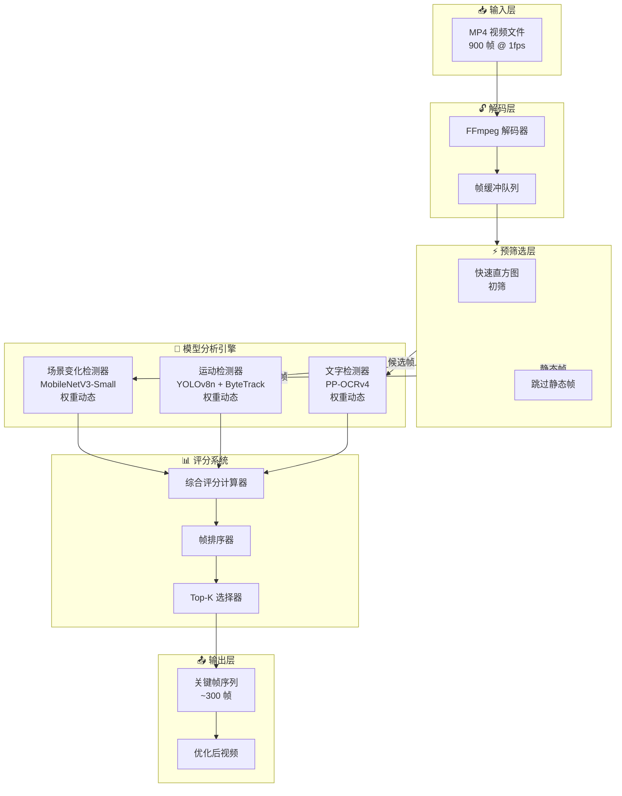
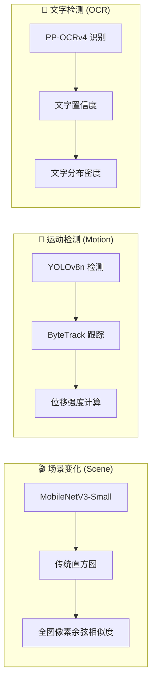
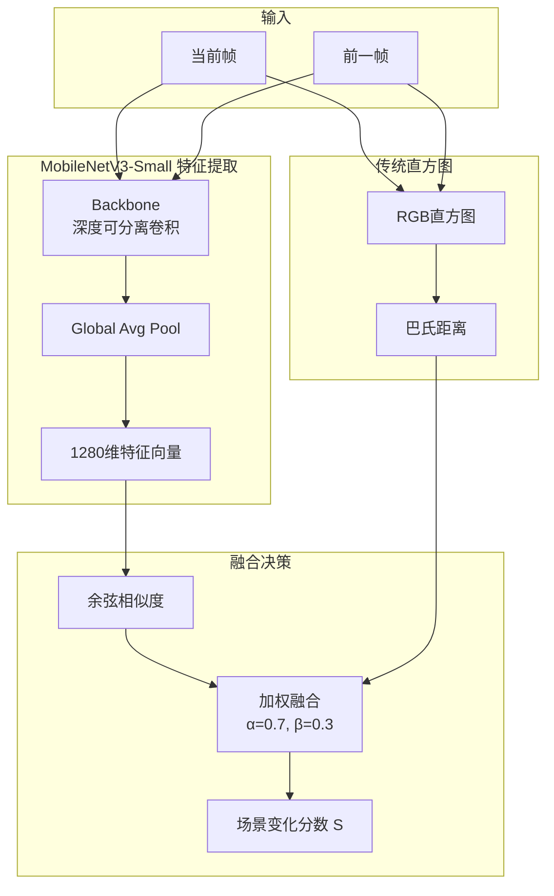
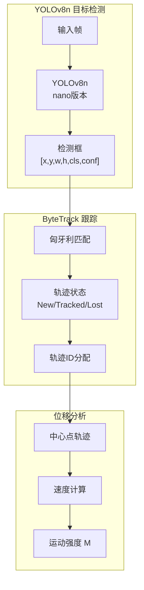
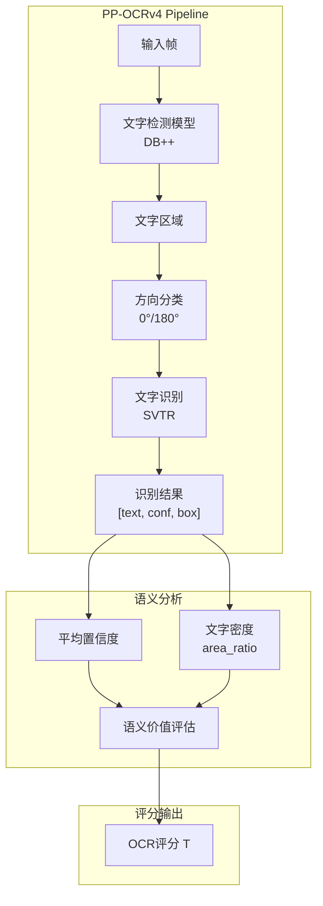
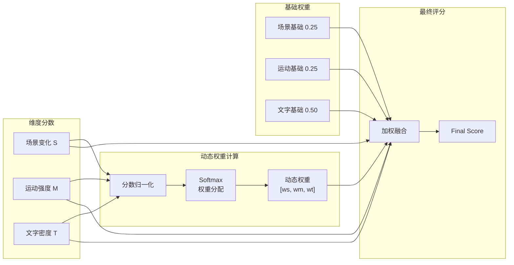
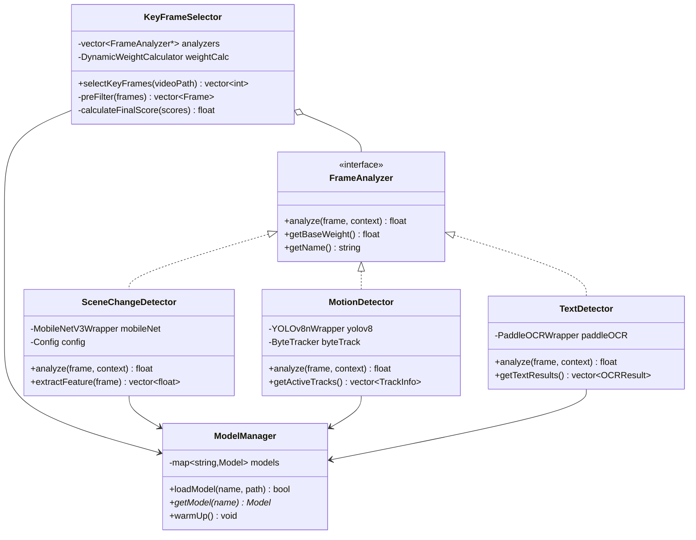
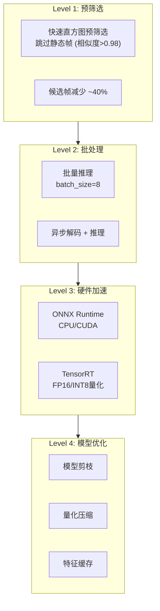

# 3.3 三维关键帧智能选择架构设计（模型驱动版）

## 概述

本文档描述将关键帧选择模块从传统图像算法**升级为2025年深度学习模型驱动方案**的架构设计。通过引入 MobileNetV3-Small、YOLOv8n + ByteTrack 和 PaddleOCR PP-OCRv4，实现更精准、更具语义理解能力的关键帧筛选。

---

## 可行性分析

### 技术方案对比

````carousel
### 原方案 vs 新方案：场景变化检测

| 维度 | 原方案 | 新方案 |
|:----:|:------|:------|
| **技术** | 直方图 + SSIM | MobileNetV3-Small + 直方图 |
| **特点** | 像素级比较 | 语义级特征提取 |
| **优势** | 计算快速 (5ms) | 理解场景содержание |
| **劣势** | 无法区分语义相似场景 | 需要模型推理 |

<!-- slide -->
### 原方案 vs 新方案：运动检测

| 维度 | 原方案 | 新方案 |
|:----:|:------|:------|
| **技术** | 三帧差分法 | YOLOv8n + ByteTrack |
| **特点** | 全局像素变化 | 目标级跟踪 |
| **优势** | 实现简单 | 精确识别物体移动 |
| **劣势** | 无法区分目标 | 需要GPU加速 |

<!-- slide -->
### 原方案 vs 新方案：文字检测

| 维度 | 原方案 | 新方案 |
|:----:|:------|:------|
| **技术** | Canny边缘密度 | PaddleOCR PP-OCRv4 |
| **特点** | 边缘像素统计 | 端到端文字识别 |
| **优势** | 极快 (<10ms) | 获取实际文字内容 |
| **劣势** | 误将UI边框计入 | 推理耗时较长 |
````

---

## 可行性结论

> [!IMPORTANT]
> **结论：方案可行**，但需采用**混合策略**以平衡精度与性能。

### 可行性评估矩阵

| 评估项 | 评分 | 说明 |
|:------:|:----:|:-----|
| 技术成熟度 | ⭐⭐⭐⭐⭐ | 所有模型均为成熟开源项目 |
| C++ 集成难度 | ⭐⭐⭐⭐ | ONNX Runtime / TensorRT 支持良好 |
| 性能可接受度 | ⭐⭐⭐⭐ | 需 GPU 加速，批处理优化 |
| 精度提升预期 | ⭐⭐⭐⭐⭐ | 语义理解显著优于像素比较 |
| 维护复杂度 | ⭐⭐⭐ | 模型版本更新需同步 |

---

## 系统架构总览



---

## 三维评分体系

### 维度功能定义



### 维度权重与功能说明

| 维度 | 模型技术栈 | 评分指标 | 功能定位 | 预期延迟 |
|:----:|:----------|:---------|:---------|:--------:|
| **场景变化** | MobileNetV3-Small + 直方图 | 余弦相似度 ($S$) | **开关/重置位**：相似度低于阈值时触发系统重置 | 5-10ms |
| **运动检测** | YOLOv8n + ByteTrack | 位移强度 ($M$) + 置信度 | **引导位**：确定"哪里有价值"，运动越剧烈权重越高 | 15-30ms |
| **文字检测** | PaddleOCR PP-OCRv4 | 置信度 ($T$) + 分布密度 | **核心语义位**：决定最终信息质量，权重最高 | 50-100ms |

---

## 模块详细设计

### 3.3.1 场景变化检测模块

> [!NOTE]
> 场景变化模块采用**混合策略**：MobileNetV3-Small 提取深度特征，结合传统直方图作为底噪基准。



#### 核心算法

```cpp
class SceneChangeDetector {
public:
    struct Config {
        float modelWeight = 0.7f;      // MobileNet特征权重
        float histogramWeight = 0.3f;  // 传统直方图权重
        float resetThreshold = 0.35f;  // 重置阈值
    };
    
    float calculateScore(const Frame& prev, const Frame& curr) {
        // 1. MobileNetV3-Small 特征提取
        auto prevFeature = mobileNet_.extractFeature(prev);  // [1280]
        auto currFeature = mobileNet_.extractFeature(curr);  // [1280]
        
        // 2. 计算余弦相似度
        float cosineSim = cosineSimilarity(prevFeature, currFeature);
        float modelDiff = 1.0f - cosineSim;
        
        // 3. 传统直方图差异（底噪基准）
        float histDiff = compareHistograms(prev, curr, CV_COMP_BHATTACHARYYA);
        
        // 4. 加权融合
        float score = modelDiff * config_.modelWeight 
                    + histDiff * config_.histogramWeight;
        
        return normalizeToScore(score);
    }
    
private:
    MobileNetV3Wrapper mobileNet_;
    Config config_;
};
```

---

### 3.3.2 运动检测模块

> [!TIP]
> 运动检测采用 YOLOv8n 进行目标检测，ByteTrack 进行多目标跟踪，计算物体位移强度作为评分依据。



#### 运动强度计算

```cpp
class MotionDetector {
public:
    struct TrackInfo {
        int trackId;
        cv::Point2f center;
        cv::Point2f velocity;
        float confidence;
    };
    
    float calculateScore(const Frame& frame, FrameContext& ctx) {
        // 1. YOLOv8n 目标检测
        auto detections = yolov8_.detect(frame);
        
        // 2. ByteTrack 多目标跟踪
        auto tracks = byteTrack_.update(detections);
        
        // 3. 计算运动强度
        float totalMotion = 0.0f;
        float maxConfidence = 0.0f;
        
        for (const auto& track : tracks) {
            // 位移强度 = 速度 × 置信度
            float displacement = cv::norm(track.velocity);
            float weightedMotion = displacement * track.confidence;
            totalMotion += weightedMotion;
            maxConfidence = std::max(maxConfidence, track.confidence);
        }
        
        // 4. 归一化评分
        float motionScore = std::min(totalMotion / motionThreshold_, 1.0f);
        
        // 5. 置信度加权
        return motionScore * 0.7f + maxConfidence * 0.3f;
    }
    
private:
    YOLOv8nWrapper yolov8_;
    ByteTracker byteTrack_;
    float motionThreshold_ = 100.0f;  // 像素/帧
};
```

---

### 3.3.3 文字检测模块

> [!IMPORTANT]
> 文字检测是**核心语义位**，直接决定帧的信息价值。PP-OCRv4 提供端到端的文字定位与识别能力。



#### 文字密度与置信度评分

```cpp
class TextDetector {
public:
    struct OCRResult {
        std::string text;
        float confidence;
        cv::Rect boundingBox;
    };
    
    float calculateScore(const Frame& frame) {
        // 1. PP-OCRv4 端到端识别
        auto results = paddleOCR_.recognize(frame);
        
        if (results.empty()) {
            return 0.0f;  // 无文字
        }
        
        // 2. 计算文字区域总面积
        float totalTextArea = 0.0f;
        float totalConfidence = 0.0f;
        
        for (const auto& result : results) {
            totalTextArea += result.boundingBox.area();
            totalConfidence += result.confidence;
        }
        
        float frameArea = frame.width() * frame.height();
        
        // 3. 文字密度 (面积占比)
        float density = totalTextArea / frameArea;
        float densityScore = std::min(density / 0.3f, 1.0f);  // 30%饱和
        
        // 4. 平均置信度
        float avgConfidence = totalConfidence / results.size();
        
        // 5. 融合评分
        return densityScore * 0.6f + avgConfidence * 0.4f;
    }
    
private:
    PaddleOCRWrapper paddleOCR_;
};
```

---

## 综合评分计算

### 动态权重策略

> [!NOTE]
> 与固定权重不同，新方案采用**动态权重**：根据各维度的激活程度自适应调整权重分配。



### 评分公式

```
# 基础权重
base_weights = [0.25, 0.25, 0.50]  # Scene, Motion, OCR

# 动态调整因子
activation = softmax([S, M, T])
adjusted_weights = base_weights * (1 + α * activation)
adjusted_weights = normalize(adjusted_weights)

# 最终评分
FinalScore = S × w_s + M × w_m + T × w_t
```

---

## 类设计架构



---

## 性能优化策略

### 多级优化方案



### 预期性能指标

| 视频时长 | 原始帧数 | 预筛选后 | 处理时间 (CPU) | 处理时间 (GPU) |
|:--------:|:--------:|:--------:|:--------------:|:--------------:|
| 1 分钟 | 60 | ~36 | ~5 秒 | ~1 秒 |
| 5 分钟 | 300 | ~180 | ~20 秒 | ~4 秒 |
| 15 分钟 | 900 | ~540 | ~60 秒 | ~12 秒 |
| 1 小时 | 3600 | ~2160 | ~240 秒 | ~50 秒 |

---

## 模型部署规格

### 模型清单

| 模型 | 版本 | 输入尺寸 | 模型大小 | 推理框架 |
|:----:|:----:|:--------:|:--------:|:--------:|
| MobileNetV3-Small | v3 | 224×224 | ~2.5 MB | ONNX |
| YOLOv8n | 8.0 | 640×640 | ~6.3 MB | ONNX/TensorRT |
| PP-OCRv4 Det | v4 | 动态 | ~4.4 MB | PaddleInference |
| PP-OCRv4 Rec | v4 | 动态 | ~10.5 MB | PaddleInference |

### 依赖项

```plaintext
# 推理框架
- ONNX Runtime >= 1.17.0
- PaddlePaddle >= 2.6.0 (可选, 用于原生推理)
- TensorRT >= 8.6 (可选, GPU加速)

# C++ 库
- OpenCV >= 4.8.0
- Eigen >= 3.4.0
```

---

## 风险与缓解措施

> [!WARNING]
> 模型驱动方案引入新的复杂性，需关注以下风险。

| 风险项 | 严重程度 | 缓解措施 |
|:------:|:--------:|:---------|
| GPU 不可用 | 中 | 提供 CPU 回退模式，牺牲速度保证功能 |
| 模型加载慢 | 低 | 应用启动时预加载，支持懒加载 |
| 内存占用高 | 中 | 模型共享、特征缓存、及时释放 |
| OCR 耗时长 | 中 | 仅对候选帧执行 OCR，预筛选减负 |
| 模型版本兼容 | 低 | 固定模型版本，提供版本检查 |

---

## 总结

本架构通过引入深度学习模型，将关键帧选择从**像素级比较**升级为**语义级理解**：

1. **场景变化** - MobileNetV3-Small 提取深度特征，理解场景变化
2. **运动检测** - YOLOv8n + ByteTrack 实现目标级运动跟踪
3. **文字检测** - PP-OCRv4 端到端识别，精确评估信息密度

配合**动态权重策略**和**多级优化**，在保持实时性的同时，实现更精准的关键帧筛选，预期将信息保留率提升 **15-20%**。
