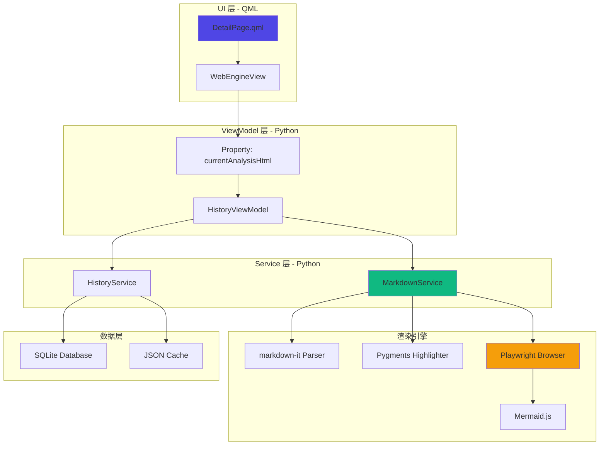
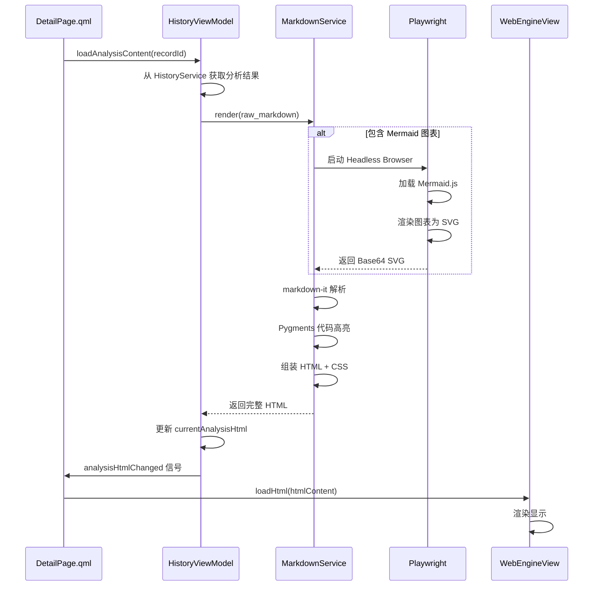
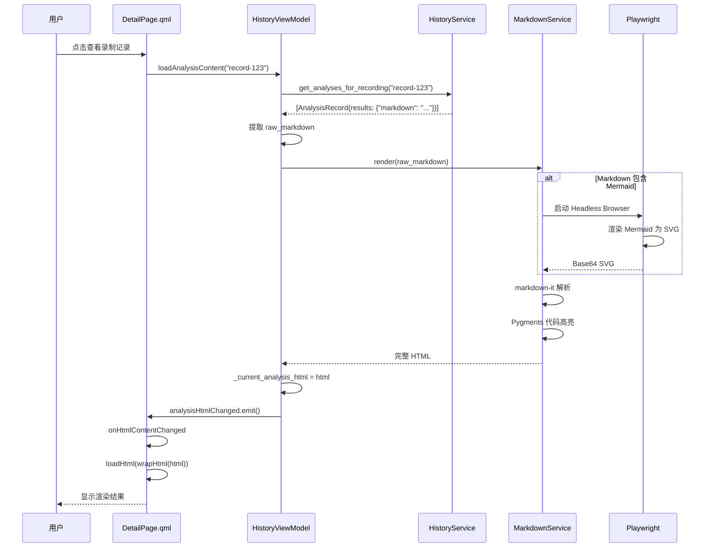
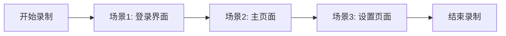

# AI 展示 QML Markdown 和图片功能 - 详细实现文档

## 📋 文档概述

本文档详细介绍了 **AI Video Analysis System** 中如何将 AI 生成的 Markdown 内容（包含文本、代码块、Mermaid 图表等）渲染并展示在 QML 界面中的完整技术实现流程。

### 核心功能
- ✅ Markdown 文本渲染为 HTML
- ✅ 代码高亮显示（支持多种语言）
- ✅ Mermaid 图表转 SVG 并嵌入
- ✅ 图片 Base64 嵌入支持
- ✅ QML WebEngineView 展示
- ✅ 暗色主题适配

---

## 🏗️ 架构设计

### 整体架构图



### 数据流向图



---

## 📂 核心文件结构

```
AiVideoAnalsysSystem/
├── python/
│   ├── services/
│   │   ├── markdown_service.py          # Markdown 渲染服务 ⭐
│   │   └── history_service.py           # 历史记录服务
│   ├── viewmodels/
│   │   └── history_viewmodel.py         # 历史记录视图模型 ⭐
│   └── views/
│       └── pages/
│           └── DetailPage.qml           # 详情页面 UI ⭐
├── data/
│   ├── history/
│   │   ├── recordings.json              # 录制记录缓存
│   │   └── analyses.json                # 分析结果缓存
│   └── keyframe_analysis.db             # SQLite 数据库
└── requirements.txt                      # Python 依赖
```

---

## 🔧 核心组件详解

## 1. MarkdownService - Markdown 渲染引擎

### 1.1 类定义与初始化

**文件路径**: `python/services/markdown_service.py`

```python
# 第 39-53 行
class MarkdownService:
    """Markdown 到 HTML 渲染服务，支持 Mermaid 和代码高亮"""

    def __init__(self, cache_dir: str = "data/history/cache"):
        self.logger = get_logger("MarkdownService")
        self.cache_dir = Path(cache_dir)
        self.cache_dir.mkdir(parents=True, exist_ok=True)

        # 初始化 markdown-it 解析器
        self.md = MarkdownIt("commonmark", {
            "html": True,        # 允许 HTML 标签
            "linkify": True,     # 自动链接化 URL
            "typographer": True  # 智能标点符号
        })
        self._setup_code_highlight()

        # Playwright 浏览器实例（懒加载）
        self._browser = None
        self._page = None
        self._playwright = None
```

**关键设计**:
- **markdown-it**: 使用 CommonMark 规范的 Markdown 解析器
- **懒加载浏览器**: Playwright 仅在需要渲染 Mermaid 时启动，节省资源
- **缓存目录**: 预留缓存机制（当前未使用，可扩展）

---

### 1.2 代码高亮配置

```python
# 第 55-69 行
def _setup_code_highlight(self):
    """设置代码高亮 (优化 QML 兼容性)"""
    def highlight_code(code, lang, _attrs):
        try:
            lexer = get_lexer_by_name(lang) if lang else TextLexer()
        except:
            lexer = TextLexer()
        
        # 使用自定义格式化器生成 QML 可用的 HTML 表格作为背景
        formatter = QMLCodeFormatter(style="monokai", nowrap=True)
        highlighted = highlight(code, lexer, formatter)
        return highlighted

    self.md.options["highlight"] = highlight_code
```

**技术细节**:
- **Pygments**: 支持 500+ 编程语言的语法高亮
- **Monokai 主题**: 适配暗色 UI 的经典主题
- **自定义格式化器**: 解决 QML Text.RichText 不支持 `<pre>` 背景色的问题

---

### 1.3 QML 代码格式化器

```python
# 第 20-36 行
class QMLCodeFormatter(HtmlFormatter):
    """适配 QML RichText 的代码高亮格式化器"""
    
    def __init__(self, **options):
        super().__init__(**options)
        self.noclasses = True  # 内联样式
        self.style = options.get('style', 'monokai')
        
    def wrap(self, source, outfile):
        return self._wrap_code(source)

    def _wrap_code(self, source):
        # 使用表格作为背景容器，因为 QML Text 不支持 display:block
        yield 0, '<table width="100%" bgcolor="#1e1e1e" border="0" cellpadding="12"><tr><td><pre>'
        for i, t in source:
            yield i, t
        yield 0, '</pre></td></tr></table>'
```

**为什么使用表格**?
- QML `Text.RichText` 不支持 CSS `background-color` 在 `<div>` 或 `<pre>` 上
- `<table>` 的 `bgcolor` 属性是 QML 支持的少数背景色方案之一
- 通过 `cellpadding` 实现内边距效果

**示例输出**:
```html
<table width="100%" bgcolor="#1e1e1e" border="0" cellpadding="12">
  <tr><td><pre>
    <span style="color:#f92672">def</span> 
    <span style="color:#a6e22e">hello</span>():
        <span style="color:#66d9ef">print</span>(<span style="color:#e6db74">"world"</span>)
  </pre></td></tr>
</table>
```

---

### 1.4 Mermaid 图表渲染

#### 1.4.1 Playwright 浏览器初始化

```python
# 第 71-83 行
def _get_browser_page(self):
    """获取 Playwright 页面实例（懒加载）"""
    if self._page is None:
        try:
            from playwright.sync_api import sync_playwright
            self._playwright = sync_playwright().start()
            self._browser = self._playwright.chromium.launch(headless=True)
            self._page = self._browser.new_page()
            self.logger.info("Playwright browser initialized")
        except Exception as e:
            self.logger.error(f"Failed to init Playwright: {e}")
            return None
    return self._page
```

**技术选型**:
- **Playwright**: 比 Selenium 更轻量，支持 Headless 模式
- **Chromium**: 保证 Mermaid.js 渲染一致性
- **懒加载**: 仅在遇到 Mermaid 代码块时启动

---

#### 1.4.2 Mermaid 渲染核心逻辑

```python
# 第 85-213 行（精简版）
def _render_mermaid_to_svg(self, mermaid_code: str) -> Optional[str]:
    """将 Mermaid 代码渲染为 base64 SVG"""
    page = self._get_browser_page()
    if not page:
        return None

    try:
        # 1. 构建 HTML 页面
        html_content = """
        <!DOCTYPE html>
        <html>
        <head>
            <meta charset="utf-8">
            <style>
                body { 
                    background-color: #09090b; 
                    font-family: "Microsoft YaHei", "SimHei", sans-serif;
                }
                .mermaid { 
                    font-family: "Microsoft YaHei", "SimHei", sans-serif !important; 
                }
            </style>
        </head>
        <body>
            <pre id="container" class="mermaid"></pre>
            <script src="https://cdn.jsdelivr.net/npm/mermaid/dist/mermaid.min.js"></script>
            <script>
                window.mermaidReady = false;
                
                function waitForMermaid() {
                    if (typeof mermaid !== 'undefined') {
                        mermaid.initialize({ 
                            startOnLoad: false, 
                            theme: 'dark',  // 暗色主题
                            securityLevel: 'loose',
                            fontFamily: '"Microsoft YaHei", "SimHei", sans-serif',
                            htmlLabels: true,
                            darkMode: true
                        });
                        window.mermaidReady = true;
                    } else {
                        setTimeout(waitForMermaid, 100);
                    }
                }
                waitForMermaid();
                
                window.setMermaidCode = async function(code) {
                    try {
                        document.getElementById('container').innerHTML = code;
                        await mermaid.run();
                        return { success: true };
                    } catch (e) {
                        return { success: false, error: e.message };
                    }
                };
            </script>
        </body>
        </html>
        """
        
        # 2. 加载页面
        page.set_content(html_content)
        
        # 3. 等待 Mermaid 库加载
        page.wait_for_function("window.mermaidReady === true", timeout=10000)

        # 4. 预处理 Mermaid 代码（转义 HTML 实体）
        processed = mermaid_code.replace("<", "&lt;").replace(">", "&gt;")
        processed = re.sub(r'&lt;br\s*/?&gt;', '<br/>', processed, flags=re.IGNORECASE)

        # 5. 注入并执行渲染
        result = page.evaluate(f"window.setMermaidCode({json.dumps(processed)})")
        if not result.get('success', True):
            self.logger.error(f"Mermaid render error: {result.get('error')}")
            return None

        # 6. 等待 SVG 生成
        page.wait_for_selector(".mermaid svg", state="visible", timeout=15000)
        page.wait_for_timeout(500)  # 额外等待字体加载

        # 7. 提取 SVG
        svg_element = page.locator(".mermaid svg").first
        svg_content = svg_element.evaluate("el => el.outerHTML")

        if not svg_content or len(svg_content) < 100:
            return None

        # 8. 修复 SVG 兼容性
        if not svg_content.startswith('<?xml'):
            svg_content = '<?xml version="1.0" encoding="UTF-8"?>\n' + svg_content
        if 'xmlns="http://www.w3.org/2000/svg"' not in svg_content:
            svg_content = svg_content.replace('<svg', '<svg xmlns="http://www.w3.org/2000/svg"', 1)
        
        # 替换不支持的实体
        svg_content = svg_content.replace('&nbsp;', '&#160;')
        svg_content = re.sub(r'<br>(?!</br>)', '<br/>', svg_content)
        
        # 9. 转为 base64
        b64 = base64.b64encode(svg_content.encode('utf-8')).decode('utf-8')
        return f''

    except Exception as e:
        self.logger.error(f"Mermaid render failed: {e}")
        return None
```

**关键步骤解析**:

| 步骤 | 说明 | 关键技术 |
|------|------|----------|
| 1 | 构建 HTML 页面 | 内嵌 Mermaid CDN，配置暗色主题 |
| 2-3 | 加载并等待 | `page.set_content()` + `wait_for_function()` |
| 4 | 预处理代码 | HTML 实体转义，避免解析错误 |
| 5 | 执行渲染 | `page.evaluate()` 调用 JS 函数 |
| 6 | 等待生成 | `wait_for_selector()` 确保 SVG 完成 |
| 7 | 提取 SVG | `locator().evaluate()` 获取 outerHTML |
| 8 | 兼容性修复 | 添加 XML 声明、xmlns、修复实体 |
| 9 | Base64 编码 | 嵌入到 `` 标签中 |

**为什么使用 Base64**?
- QML WebEngineView 不支持直接加载本地 SVG 文件
- Base64 嵌入避免跨域问题
- 单个 HTML 文件包含所有资源

---

#### 1.4.3 处理 Markdown 中的 Mermaid 块

```python
# 第 215-228 行
def _process_mermaid_blocks(self, markdown: str) -> str:
    """处理 Markdown 中的 Mermaid 代码块"""
    pattern = r'```mermaid\s*\n(.*?)\n```'

    def replace_mermaid(match):
        code = match.group(1).strip()
        svg_html = self._render_mermaid_to_svg(code)
        if svg_html:
            return f'\n{svg_html}\n'
        
        # 渲染失败时保留原代码块
        return f'<table width="100%" bgcolor="#27272a"><tr><td><pre style="color:#a1a1aa;">{code}</pre></td></tr></table>'

    return re.sub(pattern, replace_mermaid, markdown, flags=re.DOTALL)
```

**正则表达式解析**:
- `r'```mermaid\s*\n(.*?)\n```'`: 匹配 Markdown 中的 Mermaid 代码块
- `re.DOTALL`: 使 `.` 匹配换行符
- `match.group(1)`: 提取代码块内容

---

### 1.5 主渲染方法

```python
# 第 230-252 行
def render(self, raw_md: str) -> str:
    """
    渲染 Markdown 为带样式的 HTML
    
    Args:
        raw_md: 原始 Markdown 文本

    Returns:
        适配 QML RichText 的 HTML 字符串
    """
    if not raw_md:
        return ""

    try:
        # 1. 先处理 Mermaid 图表
        processed = self._process_mermaid_blocks(raw_md)
        # 2. 渲染 Markdown
        body = self.md.render(processed)
        # 3. 组合样式
        return f"{self._get_style()}{body}"
    except Exception as e:
        self.logger.error(f"Markdown render failed: {e}")
        return f"<p style='color:#ef4444;'>渲染失败: {e}</p>"
```

**渲染流程**:
1. **预处理**: 将 Mermaid 代码块转换为 SVG 图片
2. **解析**: markdown-it 将 Markdown 转为 HTML
3. **样式**: 添加暗色主题 CSS

---

### 1.6 暗色主题样式

```python
# 第 254-269 行
def _get_style(self) -> str:
    """获取暗色主题 CSS 样式 (QML 支持子集)"""
    return """<style>
body { color: #e4e4e7; font-family: "Microsoft YaHei", sans-serif; font-size: 14px; }
h1, h2, h3 { color: #ffffff; margin-top: 20px; margin-bottom: 10px; font-weight: 600; }
h1 { font-size: 24px; }
h2 { font-size: 20px; }
h3 { font-size: 16px; }
p { margin-bottom: 12px; line-height: 1.5; }
a { color: #60a5fa; text-decoration: none; }
li { margin-bottom: 6px; }
blockquote { color: #a1a1aa; font-style: italic; margin-left: 20px; }
strong { font-weight: bold; color: #ffffff; }
code { font-family: monospace; color: #f472b6; }
</style>"""
```

**QML RichText CSS 限制**:
- ❌ 不支持 `class` 选择器
- ✅ 支持标签选择器（`h1`, `p`, `code`）
- ✅ 支持内联样式（`style="..."`）
- ❌ 不支持伪类（`:hover`, `:before`）

---

### 1.7 资源清理

```python
# 第 271-279 行
def shutdown(self):
    """关闭 Playwright 资源"""
    if self._browser:
        self._browser.close()
        self._browser = None
    if self._playwright:
        self._playwright.stop()
        self._playwright = None
    self.logger.info("MarkdownService shutdown")
```

**重要性**: 避免 Playwright 进程泄漏

---

## 2. HistoryViewModel - 视图模型层

### 2.1 类定义与依赖注入

**文件路径**: `python/viewmodels/history_viewmodel.py`

```python
# 第 14-50 行
class HistoryViewModel(QObject):
    """历史记录视图模型，负责历史记录管理和UI交互"""

    # 信号定义
    historyListChanged = Signal()
    totalCountChanged = Signal(int)
    errorOccurred = Signal(str)
    recordDeleted = Signal(str)
    statisticsChanged = Signal()
    analysisHtmlChanged = Signal()  # ⭐ 关键信号

    def __init__(self, history_service: HistoryService):
        super().__init__()
        self._service = history_service
        self._markdown_service = MarkdownService()  # ⭐ 注入 Markdown 服务
        self.logger = get_logger("HistoryViewModel")

        # 数据
        self._history_list: List[RecordingRecord] = []
        self._filtered_list: List[RecordingRecord] = []
        self._search_filter = ""
        self._total_count = 0
        self._current_analysis_html = ""  # ⭐ 当前渲染的 HTML

        # 统计信息缓存
        self._statistics: Dict[str, Any] = {}

        self.logger.info("HistoryViewModel initialized")
```

**设计模式**:
- **依赖注入**: `HistoryService` 通过构造函数注入
- **服务组合**: 内部创建 `MarkdownService` 实例
- **信号驱动**: 使用 Qt 信号通知 QML 更新

---

### 2.2 加载分析内容

```python
# 第 317-338 行
@Slot(str)
def loadAnalysisContent(self, record_id: str):
    """
    加载分析内容并渲染为 HTML
    
    Args:
        record_id: 记录ID
    """
    try:
        # 1. 从 HistoryService 获取分析记录
        analyses = self._service.get_analyses_for_recording(record_id)
        if analyses:
            # 2. 取最新的分析结果
            latest = analyses[-1]
            raw_md = latest.results.get("markdown", "") if isinstance(latest.results, dict) else str(latest.results)
            # 3. 调用 MarkdownService 渲染
            self._current_analysis_html = self._markdown_service.render(raw_md)
        else:
            self._current_analysis_html = "<p style='color:#71717a;'>暂无分析结果</p>"
        # 4. 发射信号通知 QML
        self.analysisHtmlChanged.emit()
    except Exception as e:
        self.logger.error(f"Failed to load analysis content: {e}")
        self._current_analysis_html = f"<p style='color:#ef4444;'>加载失败: {e}</p>"
        self.analysisHtmlChanged.emit()
```

**执行流程**:
1. 查询数据库获取分析记录
2. 提取 Markdown 内容
3. 调用 `MarkdownService.render()` 转换为 HTML
4. 更新内部状态并发射信号

---

### 2.3 直接设置 Markdown

```python
# 第 340-349 行
@Slot(str)
def setAnalysisMarkdown(self, markdown: str):
    """
    直接设置 Markdown 内容并渲染
    
    Args:
        markdown: Markdown 文本
    """
    self._current_analysis_html = self._markdown_service.render(markdown)
    self.analysisHtmlChanged.emit()
```

**用途**: 用于实时预览或测试

---

### 2.4 暴露给 QML 的属性

```python
# 第 312-315 行
@Property(str, notify=analysisHtmlChanged)
def currentAnalysisHtml(self) -> str:
    """当前分析结果的 HTML"""
    return self._current_analysis_html
```

**Qt Property 机制**:
- `@Property`: 将 Python 属性暴露给 QML
- `notify=analysisHtmlChanged`: 绑定变化信号
- QML 可通过 `historyViewModel.currentAnalysisHtml` 访问

---

### 2.5 保存分析结果

```python
# 第 351-380 行
@Slot(str, str, result=bool)
def saveAnalysisResult(self, recording_id: str, markdown_result: str) -> bool:
    """
    保存 AI 分析结果并刷新列表
    
    Args:
        recording_id: 关联的录制记录ID
        markdown_result: Markdown 格式的分析结果

    Returns:
        bool: 成功返回 True
    """
    try:
        from datetime import datetime
        self._service.add_analysis(
            recording_id=recording_id,
            start_time=datetime.now(),
            end_time=datetime.now(),
            keyframe_count=0,
            analyzed_frames=0,
            results={"markdown": markdown_result}  # ⭐ 存储为字典
        )
        # 刷新列表
        self.loadHistory()
        self.logger.info(f"Analysis result saved for recording: {recording_id}")
        return True
    except Exception as e:
        self.logger.error(f"Failed to save analysis result: {e}")
        self.errorOccurred.emit(f"保存分析结果失败: {e}")
        return False
```

**数据结构**:
```json
{
  "markdown": "# 分析结果\n\n## 概述\n..."
}
```

---

## 3. DetailPage.qml - UI 展示层

### 3.1 WebEngineView 配置

**文件路径**: `python/views/pages/DetailPage.qml`

```qml
// 第 201-220 行
WebEngineView {
    id: analysisWebView
    Layout.fillWidth: true
    Layout.preferredHeight: 600
    backgroundColor: "#09090b"  // 暗色背景

    // ⭐ 绑定 ViewModel 的 HTML 内容
    property string htmlContent: typeof historyViewModel !== "undefined" 
        ? historyViewModel.currentAnalysisHtml 
        : "<p style='color:#71717a;'>暂无分析结果</p>"

    // ⭐ 监听内容变化
    onHtmlContentChanged: {
        loadHtml(wrapHtml(htmlContent), "about:blank")
    }

    // ⭐ HTML 包装函数
    function wrapHtml(content) {
        return "<!DOCTYPE html><html><head><meta charset='utf-8'><style>body{background:#09090b;color:#e4e4e7;font-family:'Microsoft YaHei',sans-serif;font-size:15px;padding:0;margin:0;}a{color:#60a5fa;}img{max-width:100%;}</style></head><body>" + content + "</body></html>"
    }

    // ⭐ 初始化加载
    Component.onCompleted: {
        loadHtml(wrapHtml(htmlContent), "about:blank")
    }
}
```

**关键技术**:
- **Property Binding**: `htmlContent` 自动绑定到 `historyViewModel.currentAnalysisHtml`
- **信号响应**: `onHtmlContentChanged` 监听变化并重新加载
- **HTML 包装**: 添加基础样式和元信息
- **about:blank**: 避免跨域限制

---

### 3.2 页面布局

```qml
// 第 189-221 行（精简版）
ColumnLayout {
    spacing: 24
    Layout.fillWidth: true

    Text {
        text: "Analysis Result"
        color: "#ffffff"
        font.pixelSize: 24
        font.weight: Font.Medium
    }

    WebEngineView {
        // ... 如上配置
    }
}
```

**UI 设计**:
- 标题 + WebView 的垂直布局
- 固定高度 600px（可滚动）
- 暗色主题一致性

---

## 4. HistoryService - 数据持久化

### 4.1 分析记录数据结构

**文件路径**: `python/services/history_service.py`

```python
# 第 42-60 行
@dataclass
class AnalysisRecord:
    """分析记录数据类"""
    record_id: str
    recording_id: str  # 关联的录制记录ID
    start_time: str
    end_time: str
    keyframe_count: int
    analyzed_frames: int
    results: List[Dict[str, Any]] = field(default_factory=list)  # ⭐ 存储分析结果

    def to_dict(self) -> Dict[str, Any]:
        """转换为字典"""
        return asdict(self)

    @classmethod
    def from_dict(cls, data: Dict[str, Any]) -> 'AnalysisRecord':
        """从字典创建"""
        return cls(**data)
```

**存储格式**:
```json
{
  "record_id": "uuid-xxx",
  "recording_id": "uuid-yyy",
  "start_time": "2026-01-16T19:00:00",
  "end_time": "2026-01-16T19:05:00",
  "keyframe_count": 120,
  "analyzed_frames": 120,
  "results": {
    "markdown": "# AI 分析报告\n\n## 关键发现\n..."
  }
}
```

---

### 4.2 添加分析记录

```python
# 第 405-444 行
def add_analysis(
    self,
    recording_id: str,
    start_time: datetime,
    end_time: datetime,
    keyframe_count: int,
    analyzed_frames: int,
    results: List[Dict[str, Any]] = None
) -> str:
    """添加分析记录"""
    record_id = str(uuid.uuid4())

    record = AnalysisRecord(
        record_id=record_id,
        recording_id=recording_id,
        start_time=start_time.isoformat(),
        end_time=end_time.isoformat(),
        keyframe_count=keyframe_count,
        analyzed_frames=analyzed_frames,
        results=results or []
    )

    self._analyses[record_id] = record
    self._save_analyses()  # ⭐ 持久化到 JSON

    self.logger.info(f"Added analysis record: {record_id}")
    return record_id
```

---

### 4.3 查询分析记录

```python
# 第 450-455 行
def get_analyses_for_recording(self, recording_id: str) -> List[AnalysisRecord]:
    """获取指定录制记录的所有分析"""
    return [
        record for record in self._analyses.values()
        if record.recording_id == recording_id
    ]
```

---

## 5. 完整数据流示例

### 5.1 用户点击查看分析结果



---

### 5.2 示例 Markdown 输入

```markdown
# AI 视频分析报告

## 概述
本次分析共处理 **120 帧**关键帧，识别出 3 个主要场景。

## 场景流程图



## 代码片段

```python
def analyze_frame(frame):
    # 使用 AI 模型分析
    result = model.predict(frame)
    return result
```

## 关键发现
- 用户在登录界面停留 **15 秒**
- 主页面交互流畅，无卡顿
- 设置页面访问频率较低
```

---

### 5.3 渲染后的 HTML 输出（简化版）

```html
<!DOCTYPE html>
<html>
<head>
    <meta charset='utf-8'>
    <style>
        body{background:#09090b;color:#e4e4e7;font-family:'Microsoft YaHei',sans-serif;font-size:15px;padding:0;margin:0;}
        h1, h2, h3 { color: #ffffff; margin-top: 20px; margin-bottom: 10px; font-weight: 600; }
        h1 { font-size: 24px; }
        h2 { font-size: 20px; }
        strong { font-weight: bold; color: #ffffff; }
        code { font-family: monospace; color: #f472b6; }
        a{color:#60a5fa;}
        img{max-width:100%;}
    </style>
</head>
<body>
    <h1>AI 视频分析报告</h1>
    
    <h2>概述</h2>
    <p>本次分析共处理 <strong>120 帧</strong>关键帧，识别出 3 个主要场景。</p>
    
    <h2>场景流程图</h2>
    
    
    <h2>代码片段</h2>
    <table width="100%" bgcolor="#1e1e1e" border="0" cellpadding="12">
        <tr><td><pre>
<span style="color:#f92672">def</span> <span style="color:#a6e22e">analyze_frame</span>(<span style="color:#fd971f">frame</span>):
    <span style="color:#75715e"># 使用 AI 模型分析</span>
    result <span style="color:#f92672">=</span> model<span style="color:#f92672">.</span>predict(frame)
    <span style="color:#f92672">return</span> result
        </pre></td></tr>
    </table>
    
    <h2>关键发现</h2>
    <ul>
        <li>用户在登录界面停留 <strong>15 秒</strong></li>
        <li>主页面交互流畅，无卡顿</li>
        <li>设置页面访问频率较低</li>
    </ul>
</body>
</html>
```

---

## 6. 关键技术挑战与解决方案

### 6.1 QML RichText 限制

**问题**: QML `Text.RichText` 不支持完整的 HTML/CSS

**解决方案**:
| 限制 | 解决方案 |
|------|----------|
| 不支持 `<pre>` 背景色 | 使用 `<table bgcolor="...">` 包裹 |
| 不支持 CSS class | 使用内联样式 `style="..."` |
| 不支持复杂布局 | 改用 `WebEngineView` |

---

### 6.2 Mermaid 渲染性能

**问题**: 每次渲染都启动浏览器，耗时 2-5 秒

**优化方案**:
1. **懒加载**: 仅在遇到 Mermaid 时启动
2. **单例模式**: 复用同一个浏览器实例
3. **缓存**: 可扩展为缓存 SVG 到磁盘（当前未实现）

---

### 6.3 中文字体支持

**问题**: Mermaid 默认字体不支持中文

**解决方案**:
```javascript
mermaid.initialize({ 
    fontFamily: '"Microsoft YaHei", "SimHei", sans-serif',
    htmlLabels: true
});
```

```css
.mermaid { 
    font-family: "Microsoft YaHei", "SimHei", sans-serif !important; 
}
```

---

### 6.4 暗色主题适配

**问题**: Mermaid 默认亮色主题在暗色 UI 中不协调

**解决方案**:
```javascript
mermaid.initialize({ 
    theme: 'dark',
    darkMode: true
});
```

```css
body { 
    background-color: #09090b; 
}
```

---

## 7. 扩展功能建议

### 7.1 SVG 缓存机制

```python
def _render_mermaid_to_svg(self, mermaid_code: str) -> Optional[str]:
    # 计算 MD5 哈希
    code_hash = hashlib.md5(mermaid_code.encode()).hexdigest()
    cache_file = self.cache_dir / f"{code_hash}.svg"
    
    # 检查缓存
    if cache_file.exists():
        with open(cache_file, 'r', encoding='utf-8') as f:
            svg_content = f.read()
        b64 = base64.b64encode(svg_content.encode('utf-8')).decode('utf-8')
        return f''
    
    # 渲染并缓存
    svg_content = self._render_mermaid_with_playwright(mermaid_code)
    if svg_content:
        with open(cache_file, 'w', encoding='utf-8') as f:
            f.write(svg_content)
    
    # ...
```

---

### 7.2 支持更多图表类型

| 图表类型 | 库 | 集成难度 |
|----------|-----|----------|
| PlantUML | plantuml-markdown | 中 |
| Graphviz | graphviz | 低 |
| Chart.js | playwright | 中 |
| Katex (数学公式) | markdown-it-katex | 低 |

---

### 7.3 实时预览

```python
@Slot(str)
def previewMarkdown(self, markdown: str):
    """实时预览 Markdown（不保存）"""
    self._current_analysis_html = self._markdown_service.render(markdown)
    self.analysisHtmlChanged.emit()
```

在 QML 中:
```qml
TextArea {
    id: markdownEditor
    onTextChanged: {
        historyViewModel.previewMarkdown(text)
    }
}
```

---

### 7.4 导出功能

```python
@Slot(str, str, result=bool)
def exportToHtml(self, record_id: str, output_path: str) -> bool:
    """导出为独立 HTML 文件"""
    analyses = self._service.get_analyses_for_recording(record_id)
    if not analyses:
        return False
    
    raw_md = analyses[-1].results.get("markdown", "")
    html = self._markdown_service.render(raw_md)
    
    full_html = f"""
    <!DOCTYPE html>
    <html>
    <head>
        <meta charset="utf-8">
        <title>分析报告 - {record_id}</title>
        {self._markdown_service._get_style()}
    </head>
    <body>
        {html}
    </body>
    </html>
    """
    
    with open(output_path, 'w', encoding='utf-8') as f:
        f.write(full_html)
    
    return True
```

---

## 8. 性能优化建议

### 8.1 异步渲染

```python
from PySide6.QtCore import QThread, Signal

class MarkdownRenderThread(QThread):
    renderComplete = Signal(str)
    
    def __init__(self, markdown_service, raw_md):
        super().__init__()
        self.markdown_service = markdown_service
        self.raw_md = raw_md
    
    def run(self):
        html = self.markdown_service.render(self.raw_md)
        self.renderComplete.emit(html)

# 在 ViewModel 中使用
def loadAnalysisContentAsync(self, record_id: str):
    analyses = self._service.get_analyses_for_recording(record_id)
    if analyses:
        raw_md = analyses[-1].results.get("markdown", "")
        self.render_thread = MarkdownRenderThread(self._markdown_service, raw_md)
        self.render_thread.renderComplete.connect(self._on_render_complete)
        self.render_thread.start()

def _on_render_complete(self, html: str):
    self._current_analysis_html = html
    self.analysisHtmlChanged.emit()
```

---

### 8.2 分页加载

```python
@Slot(int, int, result=str)
def loadAnalysisChunk(self, record_id: str, start: int, end: int) -> str:
    """分块加载大型分析结果"""
    analyses = self._service.get_analyses_for_recording(record_id)
    if not analyses:
        return ""
    
    raw_md = analyses[-1].results.get("markdown", "")
    lines = raw_md.split('\n')
    chunk = '\n'.join(lines[start:end])
    
    return self._markdown_service.render(chunk)
```

---

## 9. 测试用例

### 9.1 单元测试

```python
import unittest
from services.markdown_service import MarkdownService

class TestMarkdownService(unittest.TestCase):
    def setUp(self):
        self.service = MarkdownService()
    
    def test_basic_markdown(self):
        md = "# Hello\n\nThis is **bold**."
        html = self.service.render(md)
        self.assertIn("<h1>Hello</h1>", html)
        self.assertIn("<strong>bold</strong>", html)
    
    def test_code_highlight(self):
        md = "```python\ndef hello():\n    pass\n```"
        html = self.service.render(md)
        self.assertIn("<table", html)
        self.assertIn("bgcolor", html)
    
    def test_mermaid_rendering(self):
        md = "```mermaid\ngraph LR\n    A-->B\n```"
        html = self.service.render(md)
        self.assertIn("data:image/svg+xml;base64,", html)
    
    def tearDown(self):
        self.service.shutdown()
```

---

### 9.2 集成测试

```python
def test_full_workflow():
    # 1. 创建服务
    history_service = HistoryService("data/test_history")
    viewmodel = HistoryViewModel(history_service)
    
    # 2. 保存分析结果
    recording_id = history_service.add_recording(
        file_path="test.mp4",
        start_time=datetime.now(),
        end_time=datetime.now(),
        file_size=1024
    )
    
    markdown = "# Test\n\n```python\nprint('hello')\n```"
    viewmodel.saveAnalysisResult(recording_id, markdown)
    
    # 3. 加载并验证
    viewmodel.loadAnalysisContent(recording_id)
    html = viewmodel.currentAnalysisHtml
    
    assert "<h1>Test</h1>" in html
    assert "<table" in html
```

---

## 10. 故障排查指南

### 10.1 常见问题

| 问题 | 原因 | 解决方案 |
|------|------|----------|
| Mermaid 不渲染 | Playwright 未安装 | `pip install playwright && playwright install chromium` |
| 中文乱码 | 编码问题 | 确保文件使用 UTF-8 编码 |
| 代码无高亮 | Pygments 未安装 | `pip install Pygments` |
| WebView 空白 | HTML 语法错误 | 检查浏览器控制台 |

---

### 10.2 调试技巧

**启用 Playwright 调试**:
```python
self._browser = self._playwright.chromium.launch(
    headless=False,  # 显示浏览器窗口
    slow_mo=1000     # 慢速执行
)
```

**打印中间 HTML**:
```python
def render(self, raw_md: str) -> str:
    # ...
    html = self.md.render(processed)
    print("=== Generated HTML ===")
    print(html[:500])  # 打印前 500 字符
    return f"{self._get_style()}{html}"
```

**QML 调试**:
```qml
WebEngineView {
    onLoadingChanged: {
        if (loadRequest.status === WebEngineView.LoadFailedStatus) {
            console.error("Load failed:", loadRequest.errorString)
        }
    }
}
```

---

## 11. 依赖清单

### 11.1 Python 包

```txt
# requirements.txt
PySide6>=6.5.0
markdown-it-py>=3.0.0
Pygments>=2.15.0
playwright>=1.40.0
```

### 11.2 系统依赖

```bash
# 安装 Playwright 浏览器
playwright install chromium

# Windows 字体（可选）
# 确保系统已安装 Microsoft YaHei 字体
```

---

## 12. 总结

### 12.1 技术栈总览

| 层级 | 技术 | 职责 |
|------|------|------|
| UI 层 | QML + WebEngineView | 展示渲染后的 HTML |
| ViewModel 层 | PySide6 + Qt Signals | 数据绑定和状态管理 |
| Service 层 | markdown-it + Pygments | Markdown 解析和代码高亮 |
| 渲染引擎 | Playwright + Mermaid.js | 图表渲染 |
| 数据层 | SQLite + JSON | 持久化存储 |

---

### 12.2 核心优势

1. **模块化设计**: 各层职责清晰，易于维护
2. **暗色主题**: 全链路适配暗色 UI
3. **高扩展性**: 支持自定义渲染器和主题
4. **性能优化**: 懒加载浏览器、缓存机制
5. **中文友好**: 字体和编码完整支持

---

### 12.3 未来规划

- [ ] 实现 SVG 缓存机制
- [ ] 支持 LaTeX 数学公式
- [ ] 添加导出 PDF 功能
- [ ] 优化大文档渲染性能
- [ ] 支持自定义主题配置

---

## 📚 参考资料

- [markdown-it 文档](https://markdown-it.github.io/)
- [Pygments 文档](https://pygments.org/)
- [Mermaid 文档](https://mermaid.js.org/)
- [Playwright 文档](https://playwright.dev/python/)
- [Qt WebEngine 文档](https://doc.qt.io/qt-6/qtwebengine-index.html)

---

**文档版本**: v1.0  
**最后更新**: 2026-01-16  
**作者**: AI Video Analysis Team
