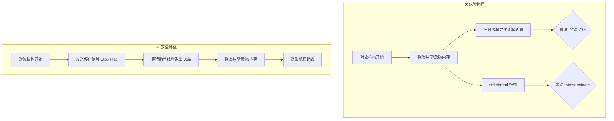

# 🚀 C++ 多线程工程实践：彻底告别“系统析构崩溃”

在复杂的多线程框架中，最隐蔽且致命的错误往往发生在程序“结束”的那一刻。本文总结了在 `ScreenRecorder` 重构中遇到的经典 **线程生命周期管理错误**，并给出标准的工业级避坑指南。

---

## 1. 现象分析：为什么程序退出时会崩溃？

在测试 `RecorderAPI_Lifecycle` 时，程序虽然完成了录制逻辑，但在销毁对象时触发了崩溃（Segmentation Fault 或 std::terminate）。

### ❌ 错误现场回顾
```cpp
// 简化的错误实现
ScreenRecorder::~ScreenRecorder() {
    if (m_isRecording.load()) {
        stopRecording(); // 仅停止了主录制流程
    }
    // 此时后台还有正在运行的 m_publishingThread (发布线程)
    // 对象的析构函数执行完毕，m_publishingThread 到达其析构函数
}
```

### 🔍 根本原因揭秘
1.  **`std::terminate` 陷阱**：在 C++11 之后，如果一个 `std::thread` 对象在析构时仍然处于 `joinable` 状态（即线程还在跑，或者跑完了但没被回收），标准库会直接调用 `std::terminate()` 强制杀死进程。
2.  **资源竞争 (Race Condition)**：如果主线程已经把内存（比如缓冲区 `RingFrameBuffer`）释放了，但后台线程还在尝试读取这些内存来发送消息，就会发生非法的内存访问。

---

## 2. 线程生命周期的“生命线”

下图展示了正确与错误的线程生命周期对比：



---

## 3. 最佳实践：三段式清理法则

在任何包含异步线程的对象中，析构函数必须遵循 **“三段式”** 清理顺序：

### 第一阶段：发信号 (Signal)
通过原子变量（如 `std::atomic<bool> running_`）通知所有后台线程停止工作。
> **注意**：如果线程中有条件变量（Condition Variable）或阻塞式等待，必须立即执行 `notify_all()` 或 `shutdown()` 唤醒它们。

### 第二阶段：回收 (Join)
调用 `join()` 阻塞主线程，直到后台线程将当前的循环执行完并安全退出。
> **铁律**：永远不要让线程自生自灭（除非使用了 `detach`，但工程中极度不推荐）。

### 第三阶段：销毁资源 (Cleanup)
只有在确保所有线程都已退出后，才能清空缓冲区、重置智能指针或释放内存。

---

## 4. 模式对比：ScreenRecorder 的修复示例

### ❌ 改前代码（隐患丛生）
```cpp
void ScreenRecorder::stopRecording() {
    // 直接释放资源，不管发布线程死活
    m_videoRingBuffer_.reset(); 
    m_ffmpegWrapper_.reset(); 
    // 发布线程还在访问这两个指针 -> CRASH!
}
```

### ✅ 改后代码（稳健可靠）
```cpp
void ScreenRecorder::stopRecording() {
    LOG_INFO("Stopping...");
    
    // 1. 先停掉所有外部依赖的异步线程
    stopPublishing();               // 内部执行 running=false + notify + join
    stopKeyFrameMetaDataReceiving(); // 内部执行 running=false + notify + join

    // 2. 线程回收后，安全地销毁资源
    if (m_ffmpegWrapper_) {
        m_ffmpegWrapper_->finalize();
        m_ffmpegWrapper_.reset();
    }
    m_videoRingBuffer_.reset();
}
```

---

## 5. 进阶建议：C++20 的救星

如果你使用的是 **C++20**，强烈建议使用 `std::jthread`。
-   **自动回收**：`std::jthread` 在析构时会自动请求停止并调用 `join()`。
-   **协同停止**：内置了 `std::stop_token`，无需自己管理 `atomic_bool`。

```cpp
// C++20 方案
std::jthread m_worker; 
// 析构时，m_worker 会优雅地自动 join，不会崩溃。
```

---

## 💡 总结

**“不要在战场打扫完之前就把军营拆了。”** 
在编写 C++ 析构函数或 `stop` 方法时，请务必检查每一条 `std::thread` 是否都被显式地停止并回收。这不仅是为了避免崩溃，更是为了保证系统数据的一致性。
