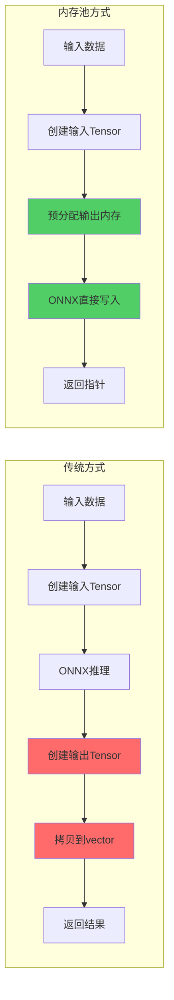
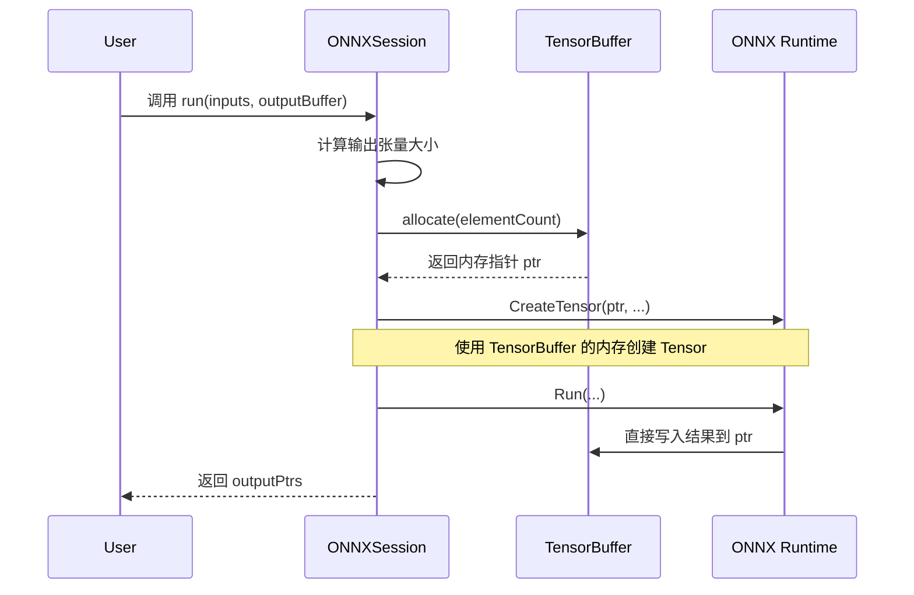

# ONNXSession 内存池优化机制

## 核心思想

ONNXSession 通过 **TensorBuffer 内存池** 实现了 **零拷贝推理**，避免了传统推理流程中的多次内存分配和数据拷贝，显著提升性能。

---

## 传统方式 vs 内存池方式



**关键差异**：
- ❌ **传统方式**：推理完成后，需要从 ONNX 内部缓冲区拷贝到用户空间
- ✅ **内存池方式**：推理结果直接写入预分配的内存池，无需拷贝

---

## 实现细节

### 1. 内存池初始化

```cpp
// ONNXSession 构造时创建 MemoryInfo
memoryInfo_(Ort::MemoryInfo::CreateCpu(OrtArenaAllocator, OrtMemTypeDefault))
```

**OrtArenaAllocator** 告诉 ONNX Runtime 使用 Arena 分配器策略，与 TensorBuffer 的设计理念一致。

---

### 2. 高性能推理接口

```cpp
std::vector<float*> run(const std::vector<std::vector<float>>& inputs,
                        TensorBuffer& outputBuffer)
```

**核心流程**：



---

### 3. 关键代码解析

#### 第一步：从内存池分配内存

```cpp
// 第 126 行
float* ptr = outputBuffer.allocate(elementCount);
outputPtrs.push_back(ptr);
```

- `TensorBuffer::allocate()` 从预分配的大块内存中切分出所需空间
- 内存对齐到 64 字节（AVX-512 优化）

#### 第二步：用内存池地址创建输出 Tensor

```cpp
// 第 129-131 行
outputTensors.push_back(
    Ort::Value::CreateTensor<float>(
        memoryInfo_, ptr, elementCount,
        actualOutputShapes.back().data(),
        actualOutputShapes.back().size()
    )
);
```

**关键点**：
- 传入 `ptr`（来自 TensorBuffer）
- ONNX Runtime 将直接使用这块内存，而不是自己分配

#### 第三步：推理结果直接写入内存池

```cpp
// 第 135-137 行
session_->Run(Ort::RunOptions{nullptr}, 
              inputNames.data(), inputTensors.data(), inputTensors.size(),
              outputNames.data(), outputTensors.data(), outputTensors.size());
```

- 推理完成后，结果已经在 `outputBuffer` 中
- 无需任何拷贝操作

---

## 性能优化点

### ✅ 零拷贝

```
传统方式：ONNX内部缓冲 → 拷贝 → vector<float>
内存池方式：ONNX直接写入 → TensorBuffer（无拷贝）
```

### ✅ 内存复用

```cpp
// 每次推理前重置偏移量
outputBuffer.reset();
```

- 多次推理复用同一块内存
- 避免频繁的 `malloc/free`

### ✅ 内存对齐

```cpp
TensorBuffer(size_t initialCapacity = 1024 * 1024, size_t alignment = 64)
```

- 64 字节对齐，充分利用 CPU 缓存行
- 支持 SIMD 指令加速（AVX-512）

---

## 使用示例

```cpp
// 创建内存池（容量 1MB，64 字节对齐）
TensorBuffer outputBuffer(1024 * 1024, 64);

// 多次推理复用内存
for (int i = 0; i < 1000; ++i) {
    outputBuffer.reset();  // 重置偏移量
    
    auto outputPtrs = session.run(inputs, outputBuffer);
    
    // 直接使用 outputPtrs[0]，无需拷贝
    processOutput(outputPtrs[0]);
}
```

---

## 总结

| 特性 | 传统方式 | 内存池方式 |
|------|---------|-----------|
| **内存分配** | 每次推理分配 | 预分配 + 复用 |
| **数据拷贝** | 需要拷贝 | 零拷贝 |
| **内存对齐** | 未优化 | 64 字节对齐 |
| **适用场景** | 单次推理 | 高频推理 |

**核心优势**：通过 `TensorBuffer` 预分配 + ONNX Runtime 直接写入的设计，实现了 **零拷贝、内存复用、SIMD 友好** 的高性能推理。
