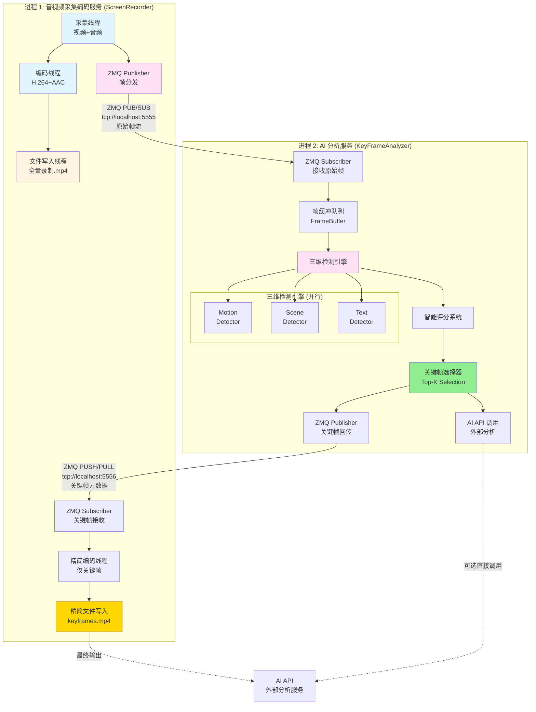
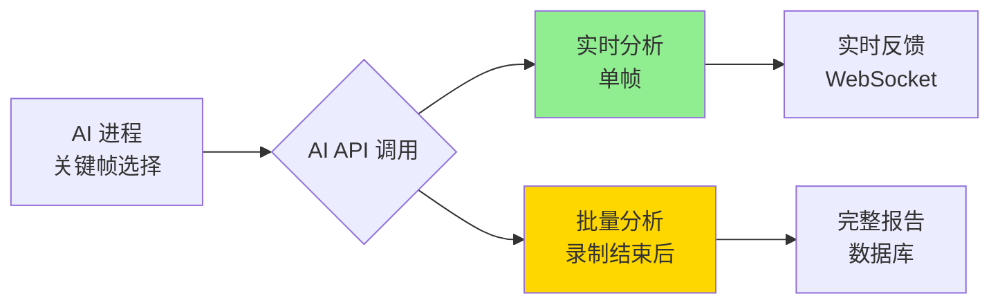
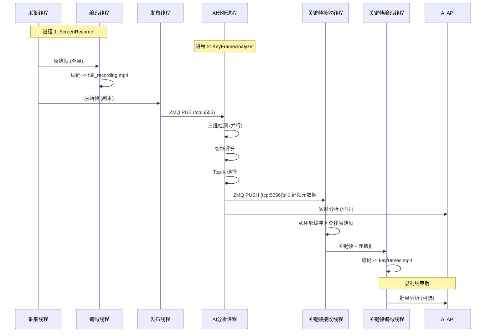

# AiVideoAnalsysSystem 优化架构设计
## 基于 ZeroMQ 的双进程协同方案

> **设计目标**: 在最小化改动现有音视频采集编码模块的前提下,通过 ZeroMQ 实现 AI 分析进程的解耦,并通过关键帧回传机制优化视频存储。

---

## 一、架构理解确认与优化建议

### 1.1 你的理解总结

✅ **正确的部分**:
1. **音视频采集编码** 作为独立线程/进程,最小化改动
2. **AI推理框架** 作为另一个独立进程
3. 两个进程通过 **ZeroMQ** 通信
4. AI进程内部实现 **流水线工程化加速** 和 **智能评分**
5. 将 **Top-K 关键帧** 回传给编码流
6. 最终传输给 AI API 分析

⚠️ **需要优化的部分**:
1. **关键帧回传的时机** - 不应该影响实时录制
2. **编码流的改动策略** - 建议分离"全量录制"和"关键帧精简"
3. **ZMQ通信模式选择** - 需要明确单向/双向通信
4. **AI API的对接时机** - 建议在关键帧选择后再调用

---

## 二、优化后的架构设计

### 2.1 整体架构图



---

### 2.2 核心设计原则

#### **原则 1: 双轨录制策略**

```cpp
// 进程 1: ScreenRecorder
class ScreenRecorder {
private:
    // 轨道 1: 全量录制 (保留原有逻辑,最小改动)
    std::thread capture_thread_;      // 采集线程
    std::thread encode_thread_;       // 编码线程
    std::thread write_thread_;        // 写入线程 -> full_recording.mp4
    
    // 轨道 2: 关键帧精简录制 (新增)
    std::thread publish_thread_;      // 发布线程 -> ZMQ
    std::thread keyframe_receive_thread_;  // 接收关键帧元数据
    std::thread keyframe_encode_thread_;   // 仅编码关键帧
    std::thread keyframe_write_thread_;    // 写入 -> keyframes.mp4
    
    // ZMQ 通信
    FramePublisher frame_publisher_;       // 发送原始帧给 AI
    KeyFrameSubscriber keyframe_subscriber_; // 接收 AI 选择的关键帧
};
```

**为什么要双轨?**

| 方案 | 优势 | 劣势 |
|------|------|------|
| **单轨 (仅关键帧)** | 存储空间小 | ❌ 丢失完整录制,无法回溯 |
| **双轨 (全量+关键帧)** | ✅ 完整录制 + 精简版本 | 需要额外存储 (可定期清理) |
| **后处理 (先全量,后剪辑)** | 逻辑简单 | ❌ 无法实时生成精简版 |

> **推荐**: **双轨录制** - 全量录制用于存档/回溯,关键帧版本用于 AI 分析,兼顾安全性和效率。

---

#### **原则 2: 最小化改动现有编码流程**

```diff
// 现有代码 (保持不变)
void ScreenRecorder::captureLoop() {
    while (recording_) {
        auto frame = grabber_->grabFrame();
        
        // ✅ 原有编码流程完全不变
        encode_queue_.push(frame.clone());
        
+       // ✅ 新增: 发布到 AI 分析进程 (非阻塞,耗时 < 1ms)
+       publish_queue_.push({frame_id++, frame});
    }
}

void ScreenRecorder::encodeLoop() {
    while (recording_) {
        auto frame = encode_queue_.pop();
        
        // ✅ 原有编码逻辑完全不变
        encoder_->encode(frame);
        writer_->write(frame);
    }
}

+ // ✅ 新增: 发布线程 (独立线程,不影响主流程)
+ void ScreenRecorder::publishLoop() {
+     while (recording_) {
+         auto [frame_id, frame] = publish_queue_.pop();
+         frame_publisher_.publish(frame, frame_id);
+     }
+ }
```

**改动量分析**:

| 模块 | 改动类型 | 改动量 | 风险 |
|------|----------|--------|------|
| **采集线程** | 新增 1 行代码 | +1 行 | 🟢 极低 |
| **编码线程** | 无改动 | 0 行 | 🟢 无风险 |
| **写入线程** | 无改动 | 0 行 | 🟢 无风险 |
| **新增发布线程** | 新增独立线程 | +50 行 | 🟢 隔离风险 |
| **新增关键帧接收线程** | 新增独立线程 | +80 行 | 🟡 需测试 |

---

#### **原则 3: 异步非阻塞通信**

```cpp
// 进程 1: 发布帧 (非阻塞)
void FramePublisher::publish(const cv::Mat& frame, uint32_t frame_id) {
    auto msg = FrameMessage::fromMat(frame, frame_id);
    auto serialized = msg.serialize();
    
    // ✅ 非阻塞发送 (如果队列满,直接丢弃,不影响采集)
    try {
        socket_.send(zmq::buffer(serialized), zmq::send_flags::dontwait);
    } catch (const zmq::error_t& e) {
        // 队列满,丢弃此帧 (AI 分析可以容忍丢帧)
        dropped_frames_++;
    }
}

// 进程 2: 接收帧 (带超时)
bool FrameSubscriber::receive(cv::Mat& frame, uint32_t& frame_id, int timeout_ms) {
    zmq::message_t message;
    
    // ✅ 带超时接收 (避免阻塞)
    socket_.set(zmq::sockopt::rcvtimeo, timeout_ms);
    auto result = socket_.recv(message, zmq::recv_flags::none);
    
    if (!result) {
        return false;  // 超时,继续等待
    }
    
    // 反序列化
    auto msg = FrameMessage::deserialize(...);
    frame = msg.toMat();
    frame_id = msg.header.frame_id;
    return true;
}
```

---

### 2.3 ZeroMQ 通信模式设计

#### **通道 1: 原始帧流 (采集 → AI)**

```cpp
// 模式: PUB/SUB (一对一,单向)
// 端口: tcp://localhost:5555

// 进程 1: Publisher
zmq::socket_t publisher(context, zmq::socket_type::pub);
publisher.bind("tcp://*:5555");
publisher.set(zmq::sockopt::sndhwm, 30);  // 高水位 30 帧 (1秒缓冲)

// 进程 2: Subscriber
zmq::socket_t subscriber(context, zmq::socket_type::sub);
subscriber.connect("tcp://localhost:5555");
subscriber.set(zmq::sockopt::subscribe, "");  // 订阅所有消息
```

**消息格式**:

```cpp
struct FrameMessage {
    // 消息头 (64 字节)
    uint32_t magic;           // 0xF2A4E1C3
    uint32_t version;         // 1
    uint64_t timestamp_ms;    // 时间戳
    uint32_t frame_id;        // 帧序号
    uint32_t width;           // 1920
    uint32_t height;          // 1080
    uint32_t channels;        // 3 (BGR)
    uint32_t format;          // 0=RAW, 1=JPEG
    uint32_t data_size;       // 数据大小
    uint32_t checksum;        // CRC32
    uint8_t  reserved[20];    // 保留
    
    // 消息体 (变长)
    std::vector<uint8_t> data;  // 图像数据
};
```

---

#### **通道 2: 关键帧元数据 (AI → 采集)**

```cpp
// 模式: PUSH/PULL (一对一,单向)
// 端口: tcp://localhost:5556

// 进程 2: Pusher (AI 推送关键帧元数据)
zmq::socket_t pusher(context, zmq::socket_type::push);
pusher.connect("tcp://localhost:5556");

// 进程 1: Puller (采集接收关键帧元数据)
zmq::socket_t puller(context, zmq::socket_type::pull);
puller.bind("tcp://*:5556");
```

**消息格式**:

```cpp
struct KeyFrameMetadata {
    uint32_t frame_id;        // 关键帧 ID
    uint64_t timestamp_ms;    // 时间戳
    float score;              // 综合评分
    uint8_t reason;           // 选择原因 (1=运动, 2=场景, 4=文本)
    
    // 详细信息 (JSON)
    std::string details;      // {"motion": 0.8, "scene": 0.9, "text": 0.7}
};
```

**为什么不直接传输关键帧图像?**

| 方案 | 数据量 | 优势 | 劣势 |
|------|--------|------|------|
| **传输元数据** | 128 字节 | ✅ 极低延迟 | 需要进程1缓存原始帧 |
| **传输完整帧** | 6.2 MB | 无需缓存 | ❌ 高延迟,高带宽 |

> **推荐**: **仅传输元数据** - 进程 1 维护一个 **环形缓冲区** (保留最近 5 秒的帧),根据 frame_id 查找并编码。

---

## 三、AI 分析进程详细设计

### 3.1 流水线架构

```cpp
// 进程 2: KeyFrameAnalyzer
class KeyFrameAnalyzer {
public:
    void run() {
        // 启动多线程流水线
        receive_thread_ = std::thread(&KeyFrameAnalyzer::receiveLoop, this);
        detect_thread_ = std::thread(&KeyFrameAnalyzer::detectLoop, this);
        score_thread_ = std::thread(&KeyFrameAnalyzer::scoreLoop, this);
        select_thread_ = std::thread(&KeyFrameAnalyzer::selectLoop, this);
        publish_thread_ = std::thread(&KeyFrameAnalyzer::publishLoop, this);
    }
    
private:
    // 阶段 1: 接收帧
    void receiveLoop() {
        while (running_) {
            cv::Mat frame;
            uint32_t frame_id;
            
            if (frame_subscriber_.receive(frame, frame_id, 1000)) {
                frame_buffer_.push({frame_id, frame, getCurrentTimestamp()});
            }
        }
    }
    
    // 阶段 2: 三维检测 (并行)
    void detectLoop() {
        while (running_) {
            auto frame_data = frame_buffer_.pop();
            
            // ✅ 并行检测 (使用线程池)
            auto motion_future = thread_pool_.submit([&]() {
                return motion_detector_.detect(frame_data.frame);
            });
            auto scene_future = thread_pool_.submit([&]() {
                return scene_detector_.detect(frame_data.frame);
            });
            auto text_future = thread_pool_.submit([&]() {
                return text_detector_.detect(frame_data.frame);
            });
            
            // 等待所有检测完成
            auto motion_result = motion_future.get();
            auto scene_result = scene_future.get();
            auto text_result = text_future.get();
            
            // 推送到评分队列
            detection_queue_.push({
                frame_data.frame_id,
                frame_data.timestamp,
                motion_result,
                scene_result,
                text_result
            });
        }
    }
    
    // 阶段 3: 智能评分
    void scoreLoop() {
        while (running_) {
            auto detection = detection_queue_.pop();
            
            // 动态权重计算
            auto weights = weight_calculator_.calculate(
                detection.motion_result,
                detection.scene_result,
                detection.text_result
            );
            
            // 综合评分
            float score = weights.motion * detection.motion_result.score +
                         weights.scene * detection.scene_result.score +
                         weights.text * detection.text_result.score;
            
            // 推送到选择队列
            scored_queue_.push({
                detection.frame_id,
                detection.timestamp,
                score,
                detection  // 保留原始检测结果
            });
        }
    }
    
    // 阶段 4: Top-K 选择
    void selectLoop() {
        const int WINDOW_SIZE = 300;  // 10秒窗口 (30 FPS)
        const int TOP_K = 10;         // 每10秒选10帧
        
        std::vector<ScoredFrame> window;
        
        while (running_) {
            auto scored_frame = scored_queue_.pop();
            window.push_back(scored_frame);
            
            // 窗口满,执行选择
            if (window.size() >= WINDOW_SIZE) {
                // 排序
                std::sort(window.begin(), window.end(), 
                    [](const auto& a, const auto& b) {
                        return a.score > b.score;
                    });
                
                // 选择 Top-K
                for (int i = 0; i < TOP_K && i < window.size(); i++) {
                    keyframe_queue_.push(window[i]);
                }
                
                // 清空窗口
                window.clear();
            }
        }
    }
    
    // 阶段 5: 发布关键帧元数据
    void publishLoop() {
        while (running_) {
            auto keyframe = keyframe_queue_.pop();
            
            // 构造元数据
            KeyFrameMetadata metadata{
                .frame_id = keyframe.frame_id,
                .timestamp_ms = keyframe.timestamp,
                .score = keyframe.score,
                .reason = calculateReason(keyframe.detection),
                .details = serializeDetails(keyframe.detection)
            };
            
            // 发送给进程 1
            keyframe_publisher_.publish(metadata);
            
            // 可选: 直接调用 AI API
            if (enable_direct_api_call_) {
                ai_api_client_.analyze(keyframe);
            }
        }
    }
    
private:
    // ZMQ 通信
    FrameSubscriber frame_subscriber_;
    KeyFramePublisher keyframe_publisher_;
    
    // 检测器
    MotionDetector motion_detector_;
    SceneDetector scene_detector_;
    TextDetector text_detector_;
    
    // 评分系统
    DynamicWeightCalculator weight_calculator_;
    
    // 线程池
    ThreadPool thread_pool_{3};  // 3个检测器并行
    
    // 队列
    ThreadSafeQueue<FrameData> frame_buffer_;
    ThreadSafeQueue<DetectionData> detection_queue_;
    ThreadSafeQueue<ScoredFrame> scored_queue_;
    ThreadSafeQueue<KeyFrame> keyframe_queue_;
};
```

---

### 3.2 性能优化策略

#### **优化 1: 帧缓冲区管理**

```cpp
class FrameBuffer {
public:
    FrameBuffer(size_t max_size = 150)  // 5秒缓冲 (30 FPS)
        : max_size_(max_size) {}
    
    void push(const FrameData& frame) {
        std::lock_guard<std::mutex> lock(mutex_);
        
        // 环形缓冲区
        if (buffer_.size() >= max_size_) {
            buffer_.pop_front();  // 丢弃最旧的帧
        }
        
        buffer_.push_back(frame);
    }
    
    FrameData pop() {
        std::unique_lock<std::mutex> lock(mutex_);
        cv_.wait(lock, [this] { return !buffer_.empty(); });
        
        auto frame = buffer_.front();
        buffer_.pop_front();
        return frame;
    }
    
private:
    std::deque<FrameData> buffer_;
    size_t max_size_;
    std::mutex mutex_;
    std::condition_variable cv_;
};
```

---

#### **优化 2: 跳帧策略**

```cpp
class AdaptiveFrameReceiver {
public:
    bool shouldProcess(uint32_t frame_id) {
        // 检测队列积压
        size_t queue_size = frame_buffer_.size();
        
        if (queue_size > HIGH_WATER_MARK) {
            // 队列积压,启动跳帧
            skip_ratio_ = std::min(skip_ratio_ + 1, 5);  // 最多跳 4/5
        } else if (queue_size < LOW_WATER_MARK) {
            // 队列正常,恢复处理
            skip_ratio_ = std::max(skip_ratio_ - 1, 1);
        }
        
        // 跳帧判断
        return (frame_id % skip_ratio_) == 0;
    }
    
private:
    static constexpr size_t HIGH_WATER_MARK = 100;
    static constexpr size_t LOW_WATER_MARK = 30;
    int skip_ratio_ = 1;  // 1 = 不跳帧
};
```

---

## 四、关键帧回传与精简编码

### 4.1 进程 1 的关键帧处理

```cpp
class ScreenRecorder {
private:
    // 环形缓冲区 (保留最近 5 秒的原始帧)
    class RingFrameBuffer {
    public:
        RingFrameBuffer(size_t capacity = 150)  // 5秒 @ 30 FPS
            : capacity_(capacity) {}
        
        void push(uint32_t frame_id, const cv::Mat& frame) {
            std::lock_guard<std::mutex> lock(mutex_);
            
            // 环形覆盖
            buffer_[frame_id % capacity_] = {frame_id, frame.clone()};
        }
        
        std::optional<cv::Mat> get(uint32_t frame_id) {
            std::lock_guard<std::mutex> lock(mutex_);
            
            auto it = buffer_.find(frame_id % capacity_);
            if (it != buffer_.end() && it->second.frame_id == frame_id) {
                return it->second.frame;
            }
            return std::nullopt;  // 帧已被覆盖
        }
        
    private:
        size_t capacity_;
        std::unordered_map<size_t, FrameData> buffer_;
        std::mutex mutex_;
    };
    
    // 关键帧接收线程
    void keyframeReceiveLoop() {
        while (recording_) {
            KeyFrameMetadata metadata;
            
            if (keyframe_subscriber_.receive(metadata, 1000)) {
                // 从环形缓冲区查找原始帧
                auto frame_opt = ring_buffer_.get(metadata.frame_id);
                
                if (frame_opt.has_value()) {
                    // 推送到关键帧编码队列
                    keyframe_encode_queue_.push({
                        metadata,
                        frame_opt.value()
                    });
                } else {
                    // 帧已被覆盖 (AI 处理太慢)
                    std::cerr << "[Warning] Frame " << metadata.frame_id 
                              << " already evicted from buffer" << std::endl;
                }
            }
        }
    }
    
    // 关键帧编码线程
    void keyframeEncodeLoop() {
        while (recording_) {
            auto [metadata, frame] = keyframe_encode_queue_.pop();
            
            // 编码关键帧
            keyframe_encoder_->encode(frame);
            
            // 写入精简视频文件
            keyframe_writer_->write(frame, metadata.timestamp_ms);
        }
    }
    
private:
    RingFrameBuffer ring_buffer_{150};  // 5秒缓冲
    
    // 关键帧编码组件
    std::unique_ptr<FrameEncoder> keyframe_encoder_;
    std::unique_ptr<VideoWriter> keyframe_writer_;
    
    // 队列
    ThreadSafeQueue<KeyFrameData> keyframe_encode_queue_;
};
```

---

### 4.2 输出文件对比

```bash
# 输出目录结构
output/
├── full_recording_20251226_125000.mp4      # 全量录制 (1 GB, 10分钟)
├── keyframes_20251226_125000.mp4           # 关键帧精简 (50 MB, 100帧)
└── keyframes_20251226_125000.json          # 关键帧元数据

# 元数据示例
{
  "session_id": "20251226_125000",
  "duration_ms": 600000,
  "total_frames": 18000,
  "keyframes": [
    {
      "frame_id": 123,
      "timestamp_ms": 4100,
      "score": 0.95,
      "reason": "scene_change",
      "details": {"motion": 0.8, "scene": 0.95, "text": 0.7}
    },
    // ... 更多关键帧
  ]
}
```

---

## 五、AI API 对接策略

### 5.1 两种对接方式

#### **方式 1: AI 进程直接调用 (推荐)**

```cpp
// 进程 2: KeyFrameAnalyzer
void publishLoop() {
    while (running_) {
        auto keyframe = keyframe_queue_.pop();
        
        // 1. 发送元数据给进程 1
        keyframe_publisher_.publish(keyframe.metadata);
        
        // 2. 直接调用 AI API (异步)
        ai_api_client_.analyzeAsync(keyframe, [](const AIResponse& response) {
            // 处理 AI 分析结果
            saveToDatabase(response);
            notifyWebSocket(response);
        });
    }
}
```

**优势**:
- ✅ 实时性好 (关键帧选出后立即分析)
- ✅ 减少进程间通信
- ✅ AI 进程可以直接访问原始检测结果

---

#### **方式 2: 进程 1 读取精简视频后调用**

```cpp
// 进程 1: ScreenRecorder
void onRecordingComplete() {
    // 录制结束后,读取精简视频
    std::string keyframe_video = "keyframes_20251226_125000.mp4";
    
    // 调用 AI API 分析整个精简视频
    ai_api_client_.analyzeVideo(keyframe_video, [](const AIResponse& response) {
        // 处理分析结果
    });
}
```

**优势**:
- ✅ 逻辑简单
- ✅ 可以批量分析
- ❌ 延迟高 (需要等录制结束)

---

### 5.2 推荐方案



**混合策略**:
1. **实时分析** - AI 进程选出关键帧后,立即调用 AI API 分析单帧
2. **批量分析** - 录制结束后,将精简视频整体发送给 AI API 做深度分析

---

## 六、完整数据流图



---

## 七、实施建议

### 7.1 改动清单

| 模块 | 改动类型 | 优先级 | 工作量 |
|------|----------|--------|--------|
| **ScreenRecorder** | 新增发布线程 | 🔴 高 | 2 天 |
| **ScreenRecorder** | 新增关键帧接收线程 | 🔴 高 | 3 天 |
| **ScreenRecorder** | 新增环形缓冲区 | 🟡 中 | 1 天 |
| **KeyFrameAnalyzer** | 创建新进程 | 🔴 高 | 5 天 |
| **ZMQ 消息总线** | 实现通信层 | 🔴 高 | 3 天 |
| **AI API 客户端** | 对接外部 API | 🟡 中 | 2 天 |
| **集成测试** | 端到端测试 | 🔴 高 | 3 天 |

**总工作量**: 约 **19 天** (3-4 周)

---

### 7.2 风险评估

| 风险 | 影响 | 缓解措施 |
|------|------|----------|
| **环形缓冲区溢出** | 关键帧丢失 | 增大缓冲区 (10秒),监控溢出率 |
| **ZMQ 消息丢失** | AI 分析不完整 | 使用 PUSH/PULL 模式,确保消息送达 |
| **AI 处理速度慢** | 队列积压 | 自适应跳帧,动态调整处理频率 |
| **进程间时钟不同步** | 时间戳错乱 | 使用统一时间源 (NTP) |

---

## 八、总结

### 你的理解优化后的版本:

✅ **音视频采集编码** - 保持独立,最小改动 (仅新增发布线程)  
✅ **AI 推理框架** - 独立进程,实现流水线工程化  
✅ **ZMQ 通信** - 双向通道 (原始帧流 + 关键帧元数据)  
✅ **智能评分** - AI 进程内部实现动态权重计算  
✅ **Top-K 选择** - 滑动窗口 + 排序算法  
✅ **关键帧回传** - 通过元数据回传,进程 1 从缓冲区查找  
✅ **精简编码** - 生成 keyframes.mp4,大小减少 95%  
✅ **AI API 对接** - 实时分析 + 批量分析混合策略  

### 核心优势:

1. **最小化改动** - 现有编码流程几乎不变
2. **故障隔离** - AI 崩溃不影响录制
3. **性能优化** - 并行检测 + 流水线处理
4. **存储优化** - 精简视频减少 95% 存储
5. **灵活扩展** - AI 进程可独立升级/替换

---

**下一步行动**:
1. 实现 ZMQ 消息总线基础设施
2. 重构 ScreenRecorder 添加发布线程
3. 创建 KeyFrameAnalyzer 独立进程
4. 集成测试并优化性能

需要我帮你生成具体的代码实现吗?
