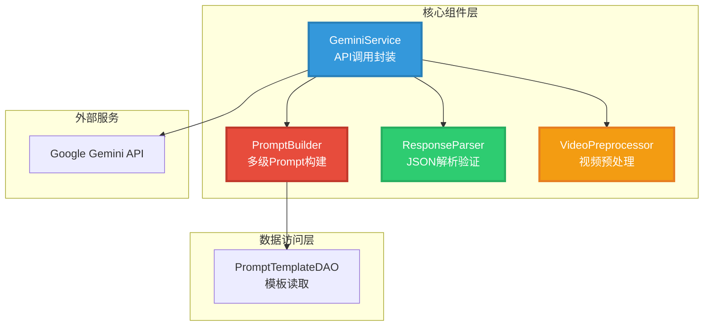
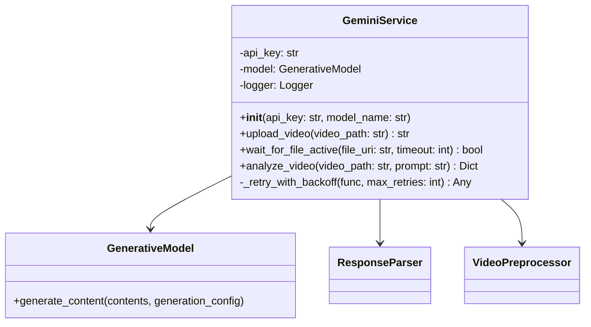
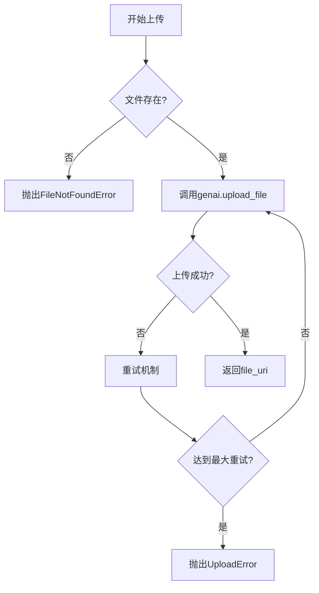
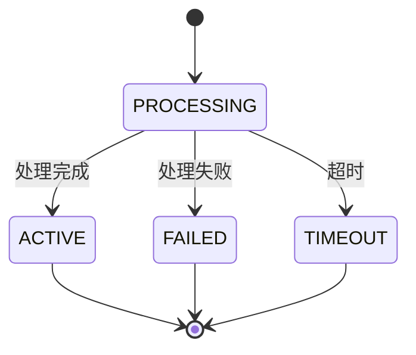
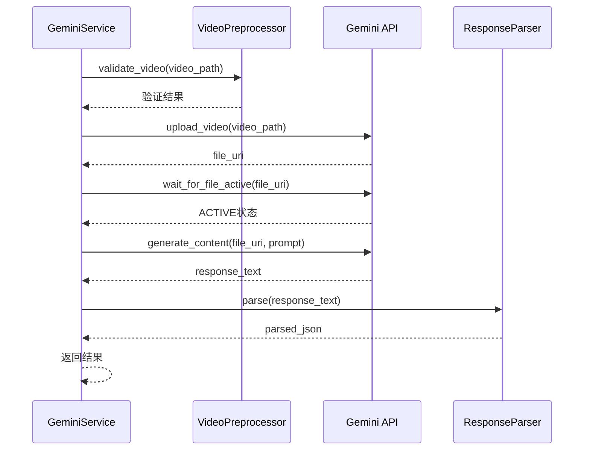
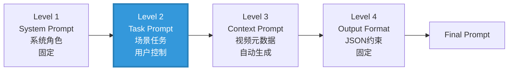
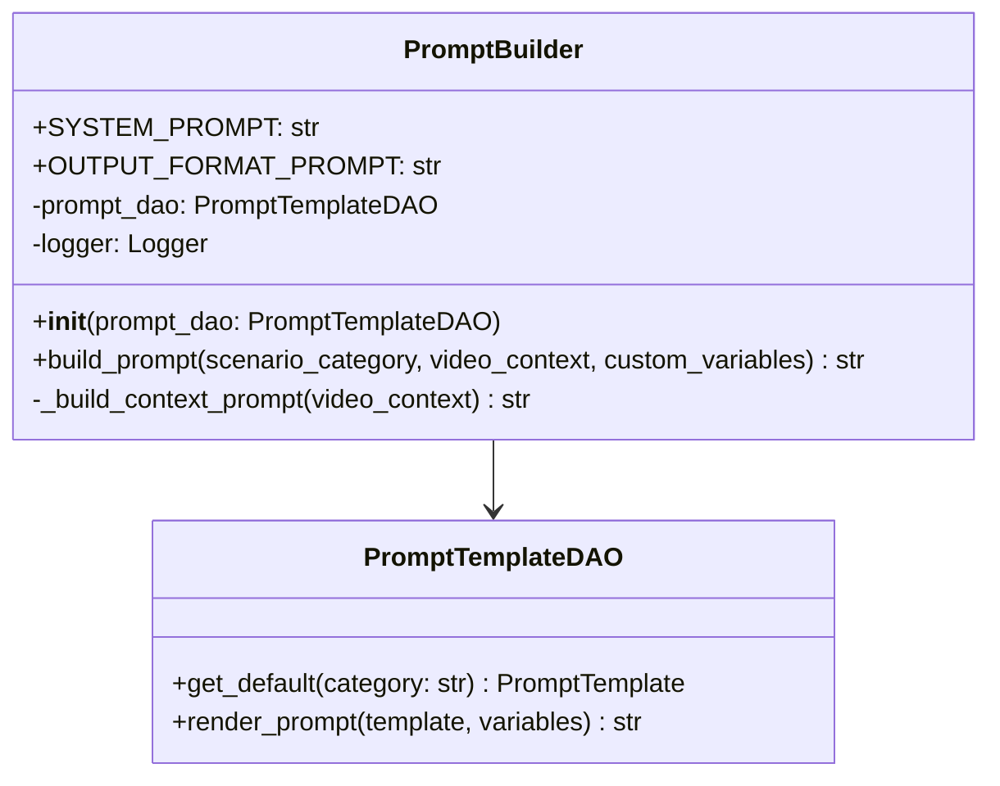
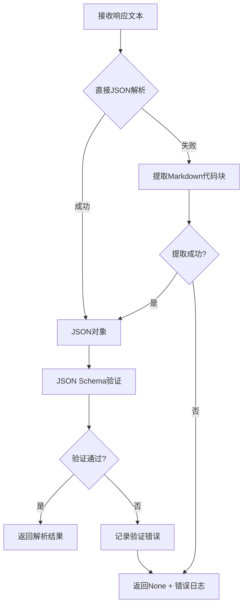
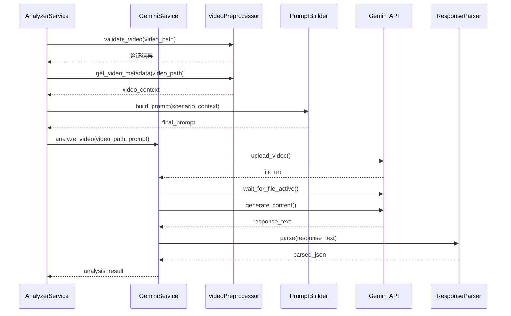

# 第二阶段：核心组件开发架构设计

## 📋 阶段概述

本文档详细设计第二阶段的四个核心组件，为 Google Gemini API 集成提供坚实的技术基础。

### 核心目标
- ✅ 封装 Gemini API 调用逻辑
- ✅ 实现多级 Prompt 框架
- ✅ 提供可靠的 JSON 解析机制
- ✅ 验证视频文件格式和元数据

---

## 🏗️ 组件架构图



---

## 1️⃣ GeminiService 设计

### 职责定义
- 管理 API 密钥和模型配置
- 处理视频文件上传
- 等待文件处理完成
- 发送分析请求并获取结果
- 实现错误处理和重试机制

### 类图设计



### 核心方法设计

#### 1.1 初始化方法

**方法签名**：
```python
def __init__(self, api_key: str = None, model_name: str = "gemini-2.0-flash-exp")
```

**实现要点**：
- 从环境变量或参数读取 API 密钥
- 配置 `google.generativeai` SDK
- 初始化日志记录器
- 验证 API 密钥有效性

**错误处理**：
- `ValueError`: API 密钥缺失
- `AuthenticationError`: API 密钥无效

---

#### 1.2 视频上传方法

**方法签名**：
```python
def upload_video(self, video_path: str) -> str
```

**流程图**：


**返回值**：
- 成功：`file_uri` (字符串)
- 失败：抛出异常

---

#### 1.3 文件激活等待方法

**方法签名**：
```python
def wait_for_file_active(self, file_uri: str, timeout: int = 300) -> bool
```

**状态机设计**：


**轮询策略**：
- 初始间隔：2 秒
- 最大超时：300 秒（可配置）
- 状态检查：调用 `genai.get_file(file_uri)`

---

#### 1.4 视频分析方法

**方法签名**：
```python
def analyze_video(self, video_path: str, prompt: str) -> Optional[Dict[str, Any]]
```

**完整流程**：


**生成配置**：
```python
generation_config = {
    "temperature": 0.4,           # 降低随机性，提高一致性
    "response_mime_type": "application/json",  # 强制JSON输出
    "max_output_tokens": 8192     # 最大输出长度
}
```

---

#### 1.5 重试机制设计

**指数退避算法**：
```python
def _retry_with_backoff(self, func, max_retries: int = 3) -> Any:
    """指数退避重试机制"""
    for attempt in range(max_retries):
        try:
            return func()
        except (NetworkError, TimeoutError) as e:
            if attempt == max_retries - 1:
                raise
            wait_time = 2 ** attempt  # 1s, 2s, 4s
            time.sleep(wait_time)
```

**适用场景**：
- 网络超时
- API 限流（429 错误）
- 临时服务不可用（503 错误）

---

## 2️⃣ PromptBuilder 设计

### 多级 Prompt 框架



### 层级职责表

| 层级 | 名称 | 控制方式 | 存储位置 | 动态性 |
|-----|------|---------|---------|--------|
| 1 | System Prompt | 系统固定 | 代码常量 | 静态 |
| 2 | **Task Prompt** | **用户控制** | **数据库** | **动态** |
| 3 | Context Prompt | 自动生成 | 运行时 | 动态 |
| 4 | Output Format | 系统固定 | 代码常量 | 静态 |

### 类设计



### 核心方法实现

#### 2.1 构建完整 Prompt

**方法签名**：
```python
def build_prompt(
    self, 
    scenario_category: str,
    video_context: Dict[str, Any],
    custom_variables: Dict[str, str] = None
) -> str
```

**参数说明**：
- `scenario_category`: 场景类别（`coding_algorithm`, `meeting`, `teaching`, `gaming`, `general`）
- `video_context`: 视频元数据字典
  ```python
  {
      "duration": 120.5,        # 时长（秒）
      "keyframe_count": 50,     # 关键帧数量
      "file_size": 10485760     # 文件大小（字节）
  }
  ```
- `custom_variables`: 自定义模板变量（可选）

**构建逻辑**：
```python
prompt_parts = []

# Level 1: 系统提示词
prompt_parts.append(self.SYSTEM_PROMPT)

# Level 2: 任务提示词（从数据库读取）
task_template = self.prompt_dao.get_default(category=scenario_category)
if task_template:
    task_prompt = self.prompt_dao.render_prompt(task_template, custom_variables or {})
    prompt_parts.append(f"**分析任务：**\n{task_prompt}")

# Level 3: 上下文提示词（自动生成）
context_prompt = self._build_context_prompt(video_context)
prompt_parts.append(context_prompt)

# Level 4: 输出格式提示词
prompt_parts.append(self.OUTPUT_FORMAT_PROMPT)

return "\n\n---\n\n".join(prompt_parts)
```

---

#### 2.2 上下文提示词生成

**方法签名**：
```python
def _build_context_prompt(self, video_context: Dict[str, Any]) -> str
```

**生成模板**：
```python
context_lines = ["**视频信息：**"]

if "duration" in video_context:
    context_lines.append(f"- 时长: {video_context['duration']:.1f} 秒")

if "keyframe_count" in video_context:
    context_lines.append(f"- 关键帧数量: {video_context['keyframe_count']}")

if "file_size" in video_context:
    size_mb = video_context['file_size'] / (1024 * 1024)
    context_lines.append(f"- 文件大小: {size_mb:.2f} MB")

return "\n".join(context_lines)
```

---

### 场景分类设计

| 场景ID | 中文名称 | 图标 | 适用内容 |
|--------|---------|------|---------|
| `general` | 通用分析 | 📊 | 默认场景，适用于各类视频 |
| `coding_algorithm` | 编程开发 | 💻 | 代码编写、算法讲解、调试 |
| `meeting` | 会议讨论 | 👥 | 团队会议、头脑风暴、评审 |
| `teaching` | 教学讲座 | 🎓 | 课程讲解、知识分享、培训 |
| `gaming` | 游戏录制 | 🎮 | 游戏实况、攻略演示 |

---

## 3️⃣ ResponseParser 设计

### JSON Schema 定义

```python
GEMINI_RESPONSE_SCHEMA = {
    "type": "object",
    "required": ["summary", "key_findings", "timestamp_events"],
    "properties": {
        "summary": {
            "type": "string",
            "minLength": 10,
            "description": "视频内容摘要"
        },
        "key_findings": {
            "type": "array",
            "items": {
                "type": "object",
                "required": ["category", "title", "content", "confidence"],
                "properties": {
                    "category": {"type": "string"},
                    "title": {"type": "string"},
                    "content": {"type": "string"},
                    "confidence": {"type": "integer", "minimum": 0, "maximum": 100},
                    "related_timestamps": {"type": "array", "items": {"type": "number"}}
                }
            }
        },
        "timestamp_events": {
            "type": "array",
            "items": {
                "type": "object",
                "required": ["timestamp", "event_type", "title"],
                "properties": {
                    "timestamp": {"type": "number", "minimum": 0},
                    "event_type": {"type": "string", "enum": ["highlight", "scene_change", "action"]},
                    "title": {"type": "string"},
                    "description": {"type": "string"},
                    "importance_score": {"type": "integer", "minimum": 1, "maximum": 10}
                }
            }
        },
        "metadata": {"type": "object"}
    }
}
```

### 解析流程



### 核心方法

#### 3.1 解析方法

**方法签名**：
```python
def parse(self, response_text: str) -> Optional[Dict[str, Any]]
```

**实现逻辑**：
```python
try:
    # 尝试直接解析
    data = json.loads(response_text)
except json.JSONDecodeError:
    # 提取Markdown代码块
    data = self._extract_json_from_markdown(response_text)

if data is None:
    self.logger.error("Failed to extract JSON from response")
    return None

# JSON Schema 验证
try:
    jsonschema.validate(instance=data, schema=self.schema)
    return data
except jsonschema.ValidationError as e:
    self.logger.error(f"JSON validation failed: {e.message}")
    return None
```

---

#### 3.2 Markdown 提取方法

**方法签名**：
```python
def _extract_json_from_markdown(self, text: str) -> Optional[Dict]
```

**正则表达式**：
```python
pattern = r'```(?:json)?\s*(\{.*?\})\s*```'
match = re.search(pattern, text, re.DOTALL)
```

**支持格式**：
- ` ```json {...} ``` `
- ` ``` {...} ``` `

---

## 4️⃣ VideoPreprocessor 设计

### 验证规则

| 验证项 | 规则 | 错误处理 |
|--------|------|---------|
| 文件存在性 | `os.path.exists()` | 返回 `False` |
| 文件大小 | ≤ 2GB | 记录警告，返回 `False` |
| 文件格式 | 支持列表内 | 记录警告，返回 `False` |

### 支持的视频格式

```python
SUPPORTED_FORMATS = [
    '.mp4',   # MPEG-4
    '.mpeg',  # MPEG
    '.mov',   # QuickTime
    '.avi',   # AVI
    '.flv',   # Flash Video
    '.mpg',   # MPEG
    '.webm',  # WebM
    '.wmv',   # Windows Media
    '.3gpp'   # 3GPP
]
```

### 核心方法

#### 4.1 验证视频

**方法签名**：
```python
def validate_video(self, video_path: str) -> bool
```

**验证流程**：
```python
# 1. 检查文件存在
if not os.path.exists(video_path):
    return False

# 2. 检查文件大小
file_size = os.path.getsize(video_path)
if file_size > self.MAX_FILE_SIZE:
    self.logger.warning(f"Video file too large: {file_size} bytes")
    return False

# 3. 检查文件格式
ext = os.path.splitext(video_path)[1].lower()
if ext not in self.SUPPORTED_FORMATS:
    self.logger.warning(f"Unsupported format: {ext}")
    return False

return True
```

---

#### 4.2 提取元数据

**方法签名**：
```python
def get_video_metadata(self, video_path: str) -> Dict[str, Any]
```

**返回数据结构**：
```python
{
    "duration": 120.5,        # 时长（秒）
    "width": 1920,            # 宽度（像素）
    "height": 1080,           # 高度（像素）
    "fps": 30.0,              # 帧率
    "codec": "h264",          # 编码格式
    "file_size": 10485760     # 文件大小（字节）
}
```

**实现方式**：
- 使用 `cv2.VideoCapture` (OpenCV)
- 或使用 `ffprobe` (FFmpeg)

---

## 📊 组件交互流程

### 完整分析流程



---

## 🔧 配置文件设计

### gemini_config.json

```json
{
  "api": {
    "model_name": "gemini-2.0-flash-exp",
    "api_key_env": "GOOGLE_API_KEY"
  },
  "generation": {
    "temperature": 0.4,
    "max_output_tokens": 8192,
    "response_mime_type": "application/json"
  },
  "upload": {
    "max_file_size_bytes": 2147483648,
    "timeout_seconds": 300,
    "retry_max_attempts": 3,
    "retry_backoff_base": 2
  },
  "validation": {
    "supported_formats": [".mp4", ".mpeg", ".mov", ".avi", ".flv", ".mpg", ".webm", ".wmv", ".3gpp"],
    "enable_schema_validation": true
  }
}
```

---

## ✅ 实施检查清单

### GeminiService
- [ ] 实现 `__init__` 方法（API 密钥配置）
- [ ] 实现 `upload_video` 方法
- [ ] 实现 `wait_for_file_active` 方法
- [ ] 实现 `analyze_video` 方法
- [ ] 实现指数退避重试机制
- [ ] 添加完整的错误处理和日志

### PromptBuilder
- [ ] 定义 `SYSTEM_PROMPT` 常量
- [ ] 定义 `OUTPUT_FORMAT_PROMPT` 常量
- [ ] 实现 `build_prompt` 方法
- [ ] 实现 `_build_context_prompt` 方法
- [ ] 集成 `PromptTemplateDAO`
- [ ] 实现模板变量替换

### ResponseParser
- [ ] 定义 `GEMINI_RESPONSE_SCHEMA` 常量
- [ ] 实现 `parse` 方法
- [ ] 实现 `_extract_json_from_markdown` 方法
- [ ] 集成 `jsonschema` 验证
- [ ] 添加详细的错误日志

### VideoPreprocessor
- [ ] 定义 `SUPPORTED_FORMATS` 常量
- [ ] 定义 `MAX_FILE_SIZE` 常量
- [ ] 实现 `validate_video` 方法
- [ ] 实现 `get_video_metadata` 方法

---

## 📝 后续阶段预览

完成本阶段后，将进入：
- **阶段三**：服务层集成（扩展 AnalyzerService）
- **阶段四**：UI 层集成（场景选择器、结果展示）
- **阶段五**：测试与验证

---

**文档版本**：v1.0  
**创建时间**：2026-01-15  
**适用阶段**：第二阶段 - 核心组件开发
