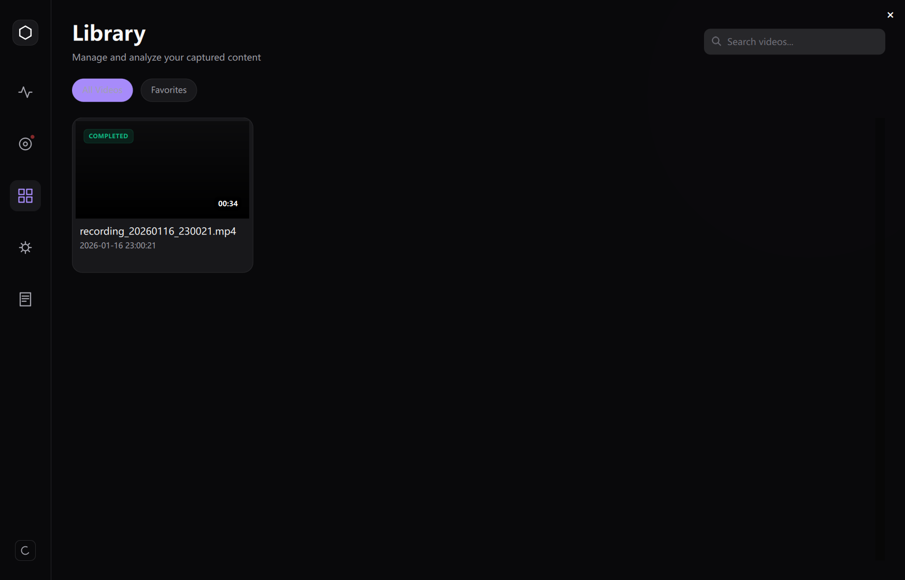
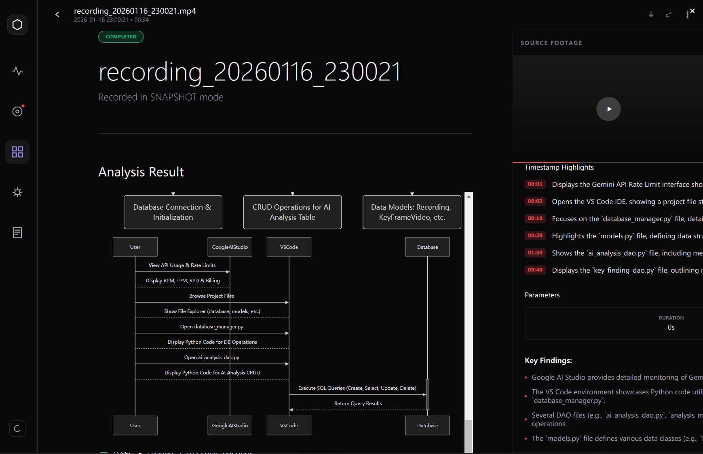

# 🎥 AI Video Analysis System (AVAS)

<div align="center">

[](https://isocpp.org/)
[](https://www.python.org/)
[](https://www.qt.io/)
[](https://ai.google.dev/)
[](LICENSE)

**一个集“高清录制、智能抽帧、多模态分析、知识库存储”于一体的次世代 AI 视频分析系统。**

---

## 📖 项目简介

**AI Video Analysis System** 是一个高性能的跨语言协作系统。它利用 **C++ 17** 构建底层高性能视频捕获与抽帧引擎，结合 **Python** 的灵活性调用 **Google Gemini Pro Vision** 等多模态大模型，实对屏幕录制内容的秒级深度解析。

### 核心亮点
- **🚀 高性能引擎**: C++ 编写的多线程录屏与视频编码模块，支持 GDI/DirectX 采集。
- **🧠 智能抽帧**: 基于多种视觉算法（OpenCV + ONNX YOLOv8）自动过滤无效画面，精准锁定关键信息。
- **✨ AI 深度洞察**: 集成 Google Gemini API，自动生成视频摘要、时序亮点及架构分析。
- **💎 现代界面**: 基于 PySide6 + QML 的毛玻璃（Glassmorphism）质感 UI，极佳的交互体验。

---

## 📸 效果展示

<div align="center">
  
  <p><i>图 1：AI 深度分析界面 - 自动提取代码逻辑与架构图</i></p>
</div>

<div align="center">
  
  <p><i>图 2：内置可视化流程审计与时序分析</i></p>
</div>

---

## 🛠️ 技术架构

系统采用 **进程分离架构**，确保稳定性与扩展性：

- **Core Layer (C++)**: 负责 FFmpeg 编码、RingBuffer 帧管理、场景变动检测。
- **Service Layer (Python)**: 处理多模态大模型对接、日志管理、异步任务调度。
- **Presentation Layer (QML)**: 响应式前端，提供流畅的动画与视觉反馈。
- **Data Layer (SQLite)**: 存储历史记录、分析结果及 Prompts 模板。

---

## 🚀 快速开始

### 📋 先决条件

- **OS**: Windows 10/11
- **Tools**: CMake 3.20+, Visual Studio 2022 (v143), Python 3.10+
- **API Key**: 需准备 [Google AI Studio](https://aistudio.google.com/) 的 API Key。

### 🔧 安装步骤

1. **克隆仓库**
   ```bash
   git clone https://github.com/Ddahuang324/VideoAiAnalysis.git
   cd VideoAiAnalysis
   ```

2. **配置 Python 环境**
   ```bash
   python -m venv .venv
   .\.venv\Scripts\activate
   pip install -r requirements.txt
   ```

3. **构建 C++ 核心组件**
   ```bash
   # 使用提供的脚本一键构建
   .\scripts\cmake_configure.bat
   .\scripts\cmake_build_python.bat
   ```

4. **环境设置**
   在根目录创建 `.env` 文件并填入 API Key：
   ```env
   GEMINI_API_KEY=你的_API_KEY
   ```

### 🏃 运行

```bash
python python/main.py
```

---

## 📂 项目结构

```bash
.
├── cpp/                # C++ 核心引擎 (录制与抽帧)
├── python/             # Python 服务端与 UI 逻辑
├── Models/             # 离线 AI 模型 (YOLO, OCR)
├── configs/            # 配置文件
├── data/               # 图片资源与历史数据
├── CMakeLists.txt      # 构建脚本
└── requirements.txt    # Python 依赖
```

---

## 🗺️ 发展蓝图

- [x] 多模态 Gemini 视频分析
- [x] 基于 ONNX 的本地关键帧分类
- [ ] 支持局部窗口录制模式
- [ ] 导出 PDF 格式的分析报告
- [ ] 集成本地实时大模型 (Llama 3 / VLM)

---

## 🤝 贡献与反馈

欢迎提交 PR 或 Issue。如有任何疑问，请联系项目维护者。

---

<div align="center">
  <p>Made with ❤️ by Ddahuang324</p>
  
</div>
