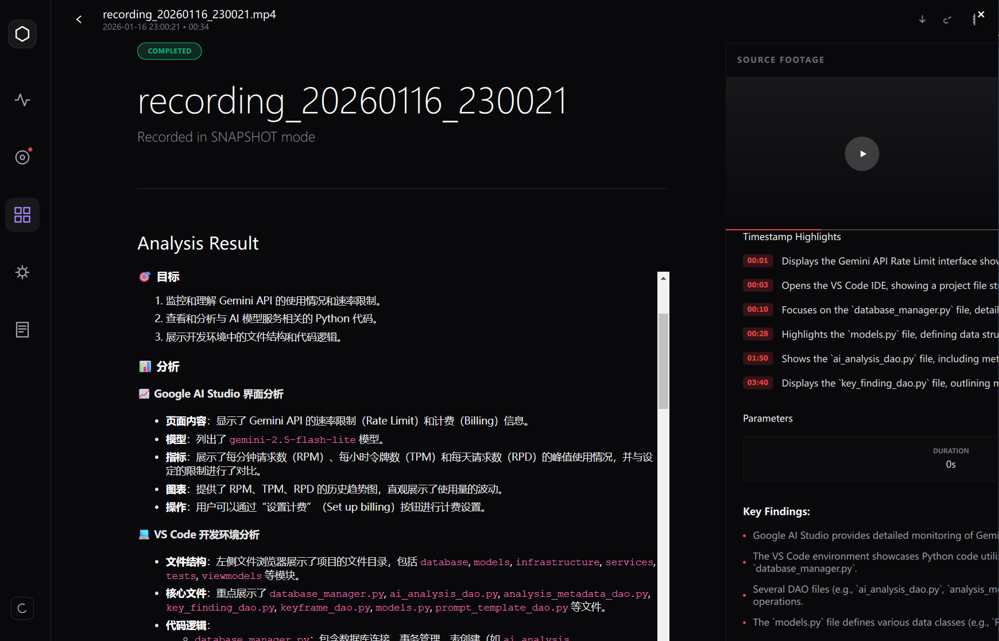
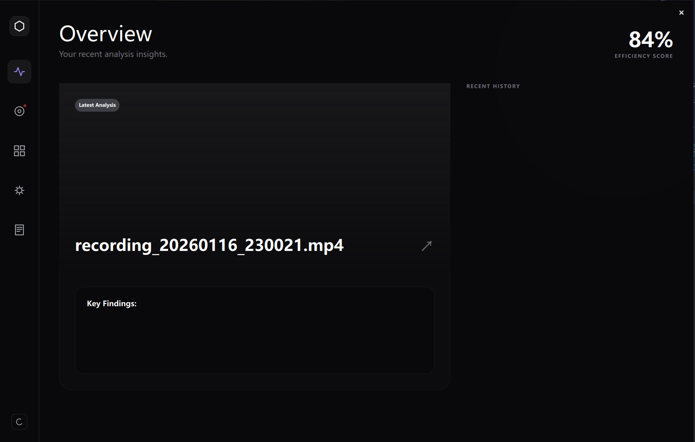
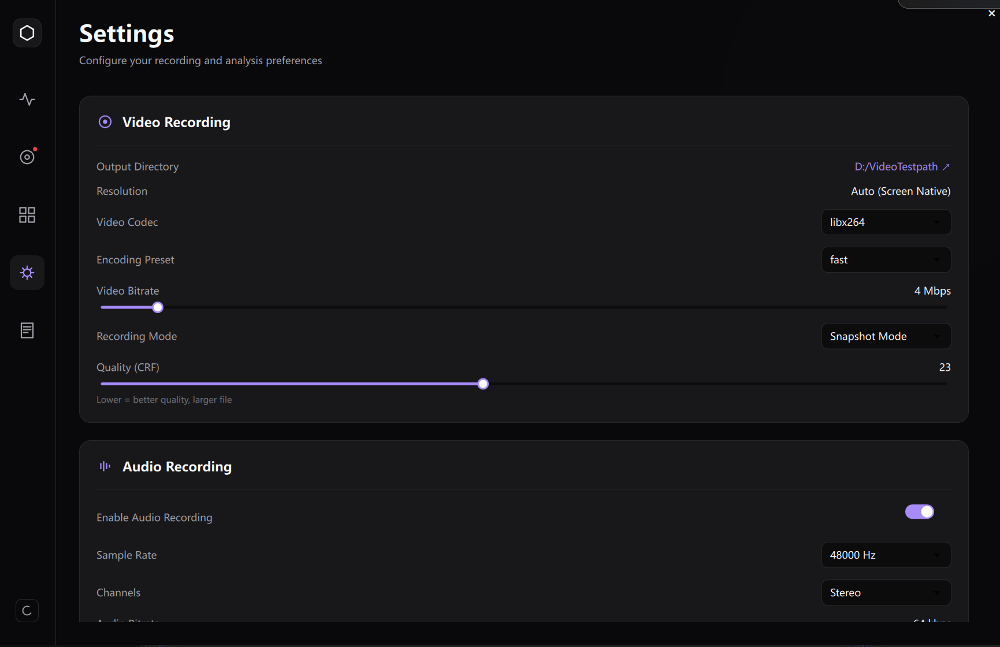
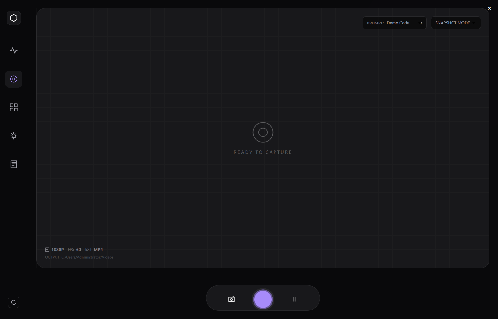

# 🎥 AI Video Analysis System (AVAS)

<div align="center">

[](https://isocpp.org/)
[](https://www.python.org/)
[](https://www.qt.io/)
[](https://ai.google.dev/)
[](LICENSE)

**一个集“高清录制、智能抽帧、多模态分析、知识库存储”于一体的次世代 AI 视频分析系统。**

---

## 📖 项目简介

**AI Video Analysis System (AVAS)** 是一款专为开发者和技术团队设计的智能视频审计与知识提取平台。它打破了传统录屏软件仅作为“记录者”的局限，通过**端云结合**的 AI 架构，将杂乱的视频流转化为结构化的技术知识。

### 核心 AI 能力

- **端侧深度学习 (Edge AI)**: 
  - 集成 **YOLOv8** 目标检测与端侧 **OCR (PaddleOCR/Custom ONNX)**，实现实时的关键界面识别与文本抓取。
  - 采用 **ONNX Runtime** 加速推理，确保在复杂的录制环境下依然保持低资源占用与高帧率检测。
  - **多维度边缘算法**: 结合像素级运动检测 (Motion Detection) 与 场景变动分析 (Scene Change)，仅保留高价值信息，过滤冗余背景波动。
  
- **云端多模态理解 (Cloud AI)**:
  - 深度集成 **Google Gemini Pro Vision**，对端侧筛选出的关键帧序列进行语义化分析。
  - **知识图谱生成**: 自动识别视频中的核心逻辑、系统架构、API 调用序列，并生成高质量的 Markdown 技术文档。

---

## 🛠️ 技术栈 (Tech Stack)

项目采用现代软件工程化设计，实现了极致的跨语言性能协同：

### 1. 端侧 AI 与 推理 (Edge AI & Inference)
- **ONNX Runtime**: 用于端侧模型（YOLO, OCR, Classification）的高性能异步推理。
- **OpenCV**: 核心视觉处理，负责视频帧预处理、空间滤波器及视觉特征提取。

### 2. 高性能底层架构 (System Core)
- **C++ 17**: 核心引擎开发语言，追求极致的执行效率与底层硬件控制。
- **ZeroMQ (ZMQ)**: 高性能分布式消息队列，实现 C++ 核心采集层与 Python 业务层之间的**超低延迟 IPC 通信**，支持异步帧推送。
- **FFmpeg (C API)**: 深度调用 FFmpeg API 进行视频流重采样、色彩空间转换、H.264/HEVC 硬件加速编码。

### 3. 应用层与交互 (Application Layer)
- **Python 3.10+**: 作为粘合层，负责 AI 服务的逻辑调度、数据库管理及 API 对接。
- **PySide6 (Qt for Python) + QML**: 构建具备 GPU 加速渲染的毛玻璃质感 UI。
- **Pybind11**: 建立 C++ 与 Python 的原生二进制双向绑定，实现**零内存拷贝**的数据传递。
- **CMake**: 模块化构建系统，支持跨平台的 C++ 工程化管理。

### 4. 数据管理 (Storage)
- **SQLite**: 本地持久化存储，采用 DAO 模式管理录制元数据、时序事件及分析索引。
- **nlohmann/json**: 现代 C++ 的 JSON 序列化方案，用于各种配置文件的通信协议。

---

## 📸 核心功能展示

系统能够自动捕捉工作流中的关键瞬间，并生成多维度的分析报告。

### 1. AI 智能分析工作流
<div align="center">
  
  <p><i>图 1：通过 Google Gemini 对录制内容进行全自动解析，识别操作意图与代码逻辑。</i></p>
</div>

### 2. 自动化架构拓扑识别
<div align="center">
  
  <p><i>图 2：AI 甚至可以根据视频内容自动绘制系统架构与时序图，帮助快速理解复杂工程。</i></p>
</div>

### 3. 多模态交互界面
<table style="width: 100%">
  <tr>
    <td width="50%"></td>
    <td width="50%"></td>
  </tr>
  <tr>
    <td align="center"><b>时序亮点追踪</b>：精准定位关键帧，生成可跳转的时间轴。</td>
    <td align="center"><b>项目库管理</b>：结构化存储所有录制与分析历史，支持快速回溯。</td>
  </tr>
  <tr>
    <td width="50%"></td>
    <td width="50%"></td>
  </tr>
  <tr>
    <td align="center"><b>元数据提取</b>：自动抓取环境信息、使用的工具与涉及的模块。</td>
    <td align="center"><b>高度可定制</b>：支持自定义抽帧频率、模型参数与 UI 风格。</td>
  </tr>
</table>

---

##  快速开始

### 📋 先决条件

- **OS**: Windows 10/11
- **Tools**: CMake 3.20+, Visual Studio 2022 (v143), Python 3.10+
- **API Key**: 需准备 [Google AI Studio](https://aistudio.google.com/) 的 API Key。

### 🔧 安装步骤

1. **克隆仓库**
   ```bash
   git clone https://github.com/Ddahuang324/VideoAiAnalysis.git
   cd VideoAiAnalysis
   ```

2. **配置 Python 环境**
   ```bash
   python -m venv .venv
   .\.venv\Scripts\activate
   pip install -r requirements.txt
   ```

3. **构建 C++ 核心组件**
   ```bash
   # 使用提供的脚本一键构建
   .\scripts\cmake_configure.bat
   .\scripts\cmake_build_python.bat
   ```

4. **环境设置**
   在根目录创建 `.env` 文件并填入 API Key：
   ```env
   GEMINI_API_KEY=你的_API_KEY
   ```

### 🏃 运行

```bash
python python/main.py
```

---

## 📂 项目结构

```bash
.
├── cpp/                # C++ 核心引擎 (录制与抽帧)
├── python/             # Python 服务端与 UI 逻辑
├── Models/             # 离线 AI 模型 (YOLO, OCR)
├── configs/            # 配置文件
├── data/               # 图片资源与历史数据
├── CMakeLists.txt      # 构建脚本
└── requirements.txt    # Python 依赖
```

---

## 🗺️ 发展蓝图

- [x] 多模态 Gemini 视频分析
- [x] 基于 ONNX 的本地关键帧分类
- [ ] 支持局部窗口录制模式
- [ ] 导出 PDF 格式的分析报告
- [ ] 集成本地实时大模型 (Llama 3 / VLM)

---

## 🤝 贡献与反馈

欢迎提交 PR 或 Issue。如有任何疑问，请联系项目维护者。

---

<div align="center">
  <p>Made with ❤️ by Ddahuang324</p>
  
</div>
