# 视频模式与快照模式录制功能实现文档

> **项目**: AI Video Analysis System  
> **版本**: 1.0.0  
> **日期**: 2025-12-23

---

## 目录

1. [架构概述](#架构概述)
2. [整体数据流](#整体数据流)
3. [C++ 核心层](#c-核心层)
4. [Pybind11 绑定层](#pybind11-绑定层)
5. [Python 服务层](#python-服务层)
6. [ViewModel 层](#viewmodel-层)
7. [QML UI 层](#qml-ui-层)
8. [双模式详解](#双模式详解)
9. [线程模型与 GIL 管理](#线程模型与-gil-管理)
10. [完整调用序列图](#完整调用序列图)

---

## 架构概述

本项目采用 **分层架构**，将屏幕录制功能划分为以下五个层次：

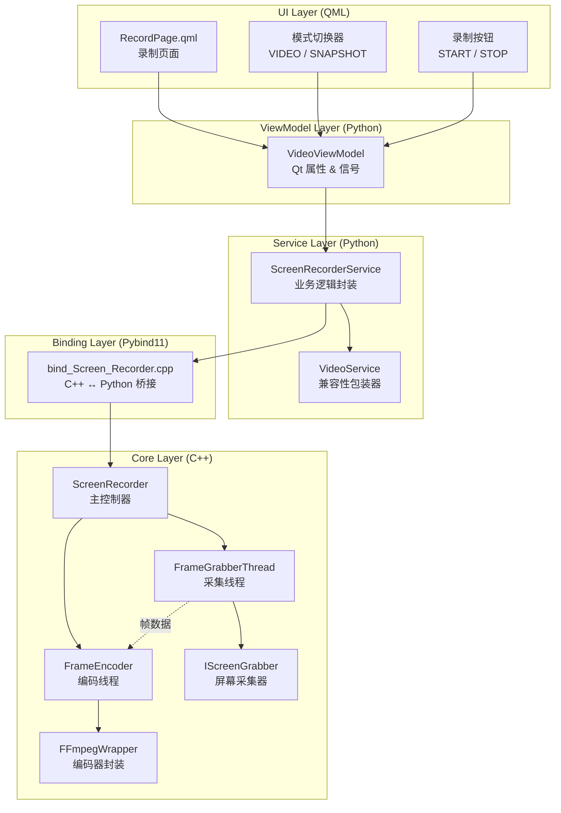

### 层次职责

| 层次 | 技术栈 | 核心职责 |
|------|--------|----------|
| **UI Layer** | QML | 用户界面展示、交互事件处理 |
| **ViewModel Layer** | PySide6 | Qt 属性绑定、信号发射、状态管理 |
| **Service Layer** | Python | 业务逻辑封装、C++ 模块调用 |
| **Binding Layer** | Pybind11 | 类型转换、GIL 管理、回调包装 |
| **Core Layer** | C++17 | 高性能屏幕采集、视频编码 |

---

## 整体数据流

### 视频模式 (VIDEO Mode) 数据流

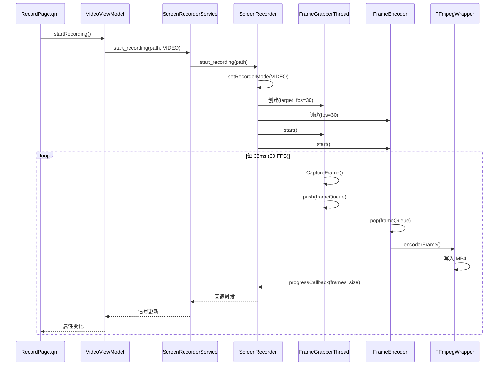

### 快照模式 (SNAPSHOT Mode) 数据流

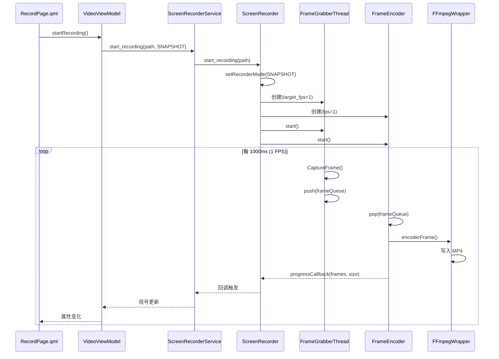

> [!NOTE]
> **两种模式的回调机制完全相同**：无论是 VIDEO 模式还是 SNAPSHOT 模式，编码器都会通过 `progressCallback` → `ScreenRecorderService` → `VideoViewModel` → `RecordPage.qml` 的完整链路更新 UI。唯一的区别是回调频率（VIDEO 约 30次/秒，SNAPSHOT 约 1次/秒）。

---

## C++ 核心层

C++ 核心层是整个录制系统的性能关键部分，负责高效的屏幕捕获和视频编码。

### 目录结构

```
cpp/include/core/ScreenRecorder/
├── CaptureLayer/               # 采集层
│   ├── IScreenGrabber.h        # 采集器接口
│   ├── GrabberFactory.h        # 工厂类
│   └── SpecificGrabber/        # 具体实现
│       └── Win/
│           ├── GDI_Grabber.h   # GDI 采集器
│           └── DXGI_Grabber.h  # DXGI 采集器
├── ProcessLayer/               # 处理层
│   ├── FrameGrabberThread.h    # 采集线程
│   ├── FrameEncoder.h          # 编码线程
│   ├── FFmpegWrapper.h         # FFmpeg 封装
│   └── ThreadSafetyQueue.h     # 线程安全队列
├── WriteLayer/                 # 写入层
└── ScreenRecorder.h            # 主控制器
```

### 核心类详解

#### 1. RecorderMode 枚举

```cpp
// ScreenRecorder.h
enum class RecorderMode {
    VIDEO,    // 视频模式 (普通帧率, 如 30fps)
    SNAPSHOT  // 快照模式 (低帧率, 如 1fps)
};
```

**用途**: 定义录制模式，决定采集帧率和编码参数。

#### 2. ScreenRecorder 主控制器

```cpp
// ScreenRecorder.h
class ScreenRecorder {
public:
    ScreenRecorder();
    ~ScreenRecorder();

    // 录制控制
    bool startRecording(std::string& path);
    void stopRecording();
    void pauseRecording();
    void resumeRecording();

    // 状态查询
    int64_t getFrameCount() const;
    int64_t getEncodedCount() const;
    int64_t getDroppedCount() const;
    int64_t getOutputFileSize() const;
    double getCurrentFps() const;
    bool is_Recording() const;

    // 模式管理
    void setRecorderMode(RecorderMode mode);
    RecorderMode getRecorderMode() const;

    // 回调设置
    using ProgressCallback = FrameEncoder::ProgressCallback;
    using ErrorCallback = FrameEncoder::ErrorCallback;
    void setProgressCallback(ProgressCallback callback);
    void setErrorCallback(ErrorCallback callback);

private:
    std::shared_ptr<IScreenGrabber> m_grabber_;
    std::unique_ptr<FrameEncoder> m_encoder_;
    std::shared_ptr<ThreadSafetyQueue<FrameData>> m_frameQueue_;
    std::shared_ptr<FrameGrabberThread> grabber_thread_;
    std::atomic<bool> m_isRecording{false};
    RecorderMode m_mode{RecorderMode::VIDEO};
    // ...
};
```

**关键实现逻辑** ([ScreenRecorder.cpp](file:///d:/编程/项目/AiVideoAnalsysSystem/cpp/src/core/ScreenRecorder.cpp)):

```cpp
bool ScreenRecorder::startRecording(std::string& path) {
    if (m_isRecording.load()) {
        return false;  // 已经在录制中
    }
    m_isRecording.store(true);

    // 1. 根据模式选择采集器类型
    GrabberType preferredType =
        (m_mode == RecorderMode::SNAPSHOT) ? GrabberType::GDI : GrabberType::AUTO;
    m_grabber_ = GrabberFactory::createGrabber(preferredType);

    // 2. 创建帧队列 (生产者-消费者模式)
    m_frameQueue_ = std::make_shared<ThreadSafetyQueue<FrameData>>(30);

    // 3. 启动采集器获取分辨率信息
    if (!m_grabber_->start()) {
        return false;
    }

    // 4. 根据模式设定目标帧率 ⭐ 核心差异点
    int target_fps = (m_mode == RecorderMode::SNAPSHOT) ? 1 : m_grabber_->getFps();
    if (target_fps <= 0) target_fps = 30;

    // 5. 创建采集线程
    grabber_thread_ = std::make_shared<FrameGrabberThread>(
        m_grabber_, *m_frameQueue_, target_fps);

    // 6. 创建编码器配置
    EncoderConfig config = encoderConfigFromGrabber(m_grabber_.get());
    if (m_mode == RecorderMode::SNAPSHOT) {
        config.fps = 1;  // ⭐ 快照模式使用 1 FPS
    }
    config.outputFilePath = path;

    // 7. 创建编码器
    m_encoder_ = std::make_unique<FrameEncoder>(m_frameQueue_, config);

    // 8. 设置回调
    m_encoder_->setProgressCallback([this](int64_t frames, int64_t size) {
        if (m_progressCallback) {
            m_progressCallback(frames, size);
        }
    });

    // 9. 启动线程
    grabber_thread_->start();
    m_encoder_->start();

    return true;
}
```

#### 3. FrameData 帧数据结构

```cpp
// IScreenGrabber.h
struct FrameData {
    uint8_t* data;              // 原始像素数据指针
    int width;                  // 帧宽度
    int height;                 // 帧高度
    PixelFormat format;         // 像素格式 (BGRA/RGBA/RGB24)
    int64_t timestamp_ms;       // 时间戳 (毫秒)
    std::shared_ptr<uint8_t> data_holder;  // 数据持有者 (RAII)
};
```

#### 4. IScreenGrabber 采集器接口

```cpp
// IScreenGrabber.h
class IScreenGrabber {
public:
    virtual ~IScreenGrabber() = default;

    virtual bool start() = 0;
    virtual void stop() = 0;
    virtual void pause() = 0;
    virtual void resume() = 0;

    virtual int getWidth() const = 0;
    virtual int getHeight() const = 0;
    virtual int getFps() const = 0;
    virtual PixelFormat getPixelFormat() const = 0;

    virtual bool isRunning() const = 0;
    virtual bool isPaused() const = 0;

    virtual FrameData CaptureFrame(int timeout_ms = 100) = 0;
};
```

#### 5. FrameGrabberThread 采集线程

```cpp
// FrameGrabberThread.h
class FrameGrabberThread {
public:
    FrameGrabberThread(std::shared_ptr<IScreenGrabber> grabber,
                       ThreadSafetyQueue<FrameData>& queue,
                       int target_fps = 30);

    void start();
    void stop();
    void pause();
    void resume();

    int64_t getCapturedFrameCount() const;
    int64_t getDroppedFrameCount() const;
    double getCurrentFps() const;

private:
    void captureLoop();  // 采集主循环
    
    std::shared_ptr<IScreenGrabber> grabber_;
    ThreadSafetyQueue<FrameData>& frame_queue_;
    int target_fps_;  // ⭐ 目标帧率 (VIDEO=30, SNAPSHOT=1)
    std::chrono::milliseconds frame_interval_;  // 帧间隔
    // ...
};
```

#### 6. FrameEncoder 编码器

```cpp
// FrameEncoder.h
class FrameEncoder {
public:
    using ProgressCallback = std::function<void(int64_t frames, int64_t size)>;
    using ErrorCallback = std::function<void(const std::string& errorMessage)>;

    FrameEncoder(std::shared_ptr<ThreadSafetyQueue<FrameData>> queue,
                 const EncoderConfig& config);

    void start();
    void stop();
    int64_t getEncodedFrameCount() const;
    int64_t getOutputFileSize() const;

    void setProgressCallback(ProgressCallback callback);
    void setErrorCallback(ErrorCallback callback);

private:
    void encodeLoop();  // 编码主循环
    
    std::shared_ptr<ThreadSafetyQueue<FrameData>> queue_;
    std::unique_ptr<FFmpegWrapper> encoder_;
    EncoderConfig config_;
    // ...
};
```

#### 7. FFmpegWrapper 编码封装

```cpp
// FFmpegWrapper.h
struct EncoderConfig {
    std::string outputFilePath;
    int width;
    int height;
    int fps;        // ⭐ 视频帧率
    int bitrate;    // 码率
    int crf;        // 质量参数 (0-51)
    std::string preset;   // 编码预设
    std::string codec;    // 编码器 (libx264)
};

class FFmpegWrapper {
public:
    bool initialize(const EncoderConfig& config);
    bool encoderFrame(const FrameData& frameData);
    void finalize();
    
    int64_t getOutputFileSize() const;
    int64_t getEncodedFrameCount() const;

private:
    // FFmpeg 资源 (使用 RAII 智能指针管理)
    AVFormatContextPtr formatContext_;
    AVCodecContextPtr codecContext_;
    AVFramePtr frame_;
    AVPacketPtr packet_;
    SwsContextPtr swsContext_;
    // ...
};
```

### 线程模型图

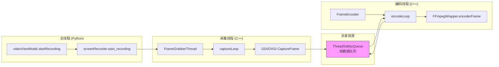

---

## Pybind11 绑定层

绑定层负责将 C++ 类型和方法暴露给 Python，同时处理 GIL (全局解释器锁) 管理。

### 文件位置

[bind_Screen_Recorder.cpp](file:///d:/编程/项目/AiVideoAnalsysSystem/cpp/bindings/bind_Screen_Recorder.cpp)

### GIL 管理核心原理

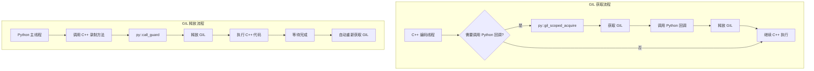

### GIL 包装器实现

```cpp
// bind_Screen_Recorder.cpp

/**
 * @brief 包装 Python 回调函数, 确保在 C++ 线程中调用时正确获取 GIL
 */
template <typename Func>
Func wrapCallbackWithGIL(Func callback) {
    if (!callback) {
        return nullptr;
    }

    return [callback](auto&&... args) {
        // 【关键步骤1】获取 GIL
        py::gil_scoped_acquire gil;

        try {
            // 【关键步骤2】调用 Python 回调
            callback(std::forward<decltype(args)>(args)...);
        } catch (const py::error_already_set& e) {
            // 【关键步骤3】捕获 Python 异常
            PyErr_Clear();
        }
        // 【关键步骤4】GIL 自动释放 (gil 对象析构)
    };
}
```

### 核心绑定代码

```cpp
void bind_Screen_Recorder(py::module& m) {
    // 1. 绑定枚举
    py::enum_<RecorderMode>(m, "RecorderMode", "录制模式")
        .value("VIDEO", RecorderMode::VIDEO, "视频模式 (高帧率)")
        .value("SNAPSHOT", RecorderMode::SNAPSHOT, "快照模式 (1fps)")
        .export_values();

    // 2. 绑定 ScreenRecorder 类
    py::class_<ScreenRecorder>(m, "ScreenRecorder", "屏幕录制器主类")
        .def(py::init<>(), "构造函数")

        // 录制控制方法 - 释放 GIL 以避免阻塞
        .def(
            "start_recording",
            [](ScreenRecorder& recorder, const std::string& path,
               std::optional<RecorderMode> mode) {
                if (mode.has_value()) {
                    recorder.setRecorderMode(mode.value());
                }
                std::string p = path;
                return recorder.startRecording(p);
            },
            py::arg("path"),
            py::arg("mode") = py::none(),
            py::call_guard<py::gil_scoped_release>(),  // ⭐ 释放 GIL
            "开始录制")

        .def("stop_recording", &ScreenRecorder::stopRecording,
             py::call_guard<py::gil_scoped_release>(),
             "停止录制")

        // 回调设置 - 使用 GIL 包装器
        .def(
            "set_progress_callback",
            [](ScreenRecorder& recorder, py::function callback) {
                auto wrapped = wrapCallbackWithGIL<ScreenRecorder::ProgressCallback>(
                    [callback](int64_t frames, int64_t size) {
                        callback(frames, size);
                    });
                recorder.setProgressCallback(wrapped);
            },
            py::arg("callback"),
            "设置进度回调函数")

        // 属性风格访问器
        .def_property("recorder_mode",
                      &ScreenRecorder::getRecorderMode,
                      &ScreenRecorder::setRecorderMode,
                      "录制模式 (VIDEO/SNAPSHOT)")

        // 上下文管理器支持
        .def("__enter__", [](ScreenRecorder& recorder) -> ScreenRecorder& {
            return recorder;
        })
        .def("__exit__", [](ScreenRecorder& recorder, ...) {
            if (recorder.is_Recording()) {
                py::gil_scoped_release release;  // 释放 GIL
                recorder.stopRecording();
            }
            return false;
        });
}
```

### GIL 管理场景总结

| 场景 | GIL 操作 | 说明 |
|------|----------|------|
| Python 调用 C++ 录制方法 | `gil_scoped_release` | 避免 C++ 阻塞 Python 线程 |
| C++ 回调到 Python | `gil_scoped_acquire` | 确保安全调用 Python 代码 |
| 上下文管理器退出 | `gil_scoped_release` | 停止录制可能需要等待线程 |

---

## Python 服务层

服务层封装了 C++ 模块的调用，提供 Pythonic 的 API。

### 文件位置

[video_service.py](file:///d:/编程/项目/AiVideoAnalsysSystem/python/services/video_service.py)

### 核心类图

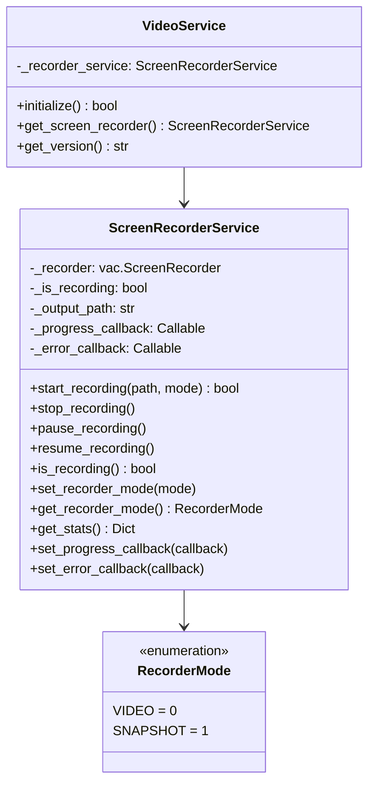

### ScreenRecorderService 实现

```python
# video_service.py

class RecorderMode(IntEnum):
    VIDEO = 0     # 视频模式 (高帧率, 如 30fps)
    SNAPSHOT = 1  # 快照模式 (低帧率, 如 1fps)


class ScreenRecorderService:
    """屏幕录制服务 - 封装 C++ ScreenRecorder 调用"""
    
    def __init__(self):
        if vac is None:
            raise RuntimeError("C++ module not available")
        self._recorder = None
        self._is_recording = False
        self._progress_callback = None  # 防止 GC 回收
        self._error_callback = None
    
    def start_recording(self, output_path: str, mode: Optional[RecorderMode] = None) -> bool:
        """
        开始录制
        
        Args:
            output_path: 输出文件路径
            mode: 录制模式 (VIDEO/SNAPSHOT)
        """
        self._ensure_recorder()
        
        try:
            if mode is not None:
                # 将 Python 枚举转换为 C++ 枚举
                cpp_mode = vac.RecorderMode.VIDEO if mode == RecorderMode.VIDEO \
                           else vac.RecorderMode.SNAPSHOT
                success = self._recorder.start_recording(output_path, cpp_mode)
            else:
                success = self._recorder.start_recording(output_path)
            
            if success:
                self._is_recording = True
                self._output_path = output_path
            return success
        except Exception as e:
            print(f"[ScreenRecorderService] Error: {e}")
            raise
    
    def set_recorder_mode(self, mode: RecorderMode):
        """
        设置录制模式
        
        Note:
            必须在开始录制前设置，录制过程中无法切换模式
        """
        if self.is_recording():
            raise RuntimeError("Cannot change mode while recording")
        
        cpp_mode = vac.RecorderMode.VIDEO if mode == RecorderMode.VIDEO \
                   else vac.RecorderMode.SNAPSHOT
        self._recorder.recorder_mode = cpp_mode
    
    def get_stats(self) -> Dict[str, Any]:
        """获取录制统计信息"""
        return {
            'frame_count': self._recorder.frame_count,
            'encoded_count': self._recorder.encoded_count,
            'dropped_count': self._recorder.dropped_count,
            'output_file_size': self._recorder.output_file_size,
            'current_fps': self._recorder.current_fps,
            'is_recording': self._recorder.is_recording,
            'recorder_mode': 'VIDEO' if self.get_recorder_mode() == RecorderMode.VIDEO else 'SNAPSHOT'
        }
```

---

## ViewModel 层

ViewModel 层是 QML UI 和 Python 服务之间的桥梁，使用 PySide6 提供 Qt 属性和信号。

### 文件位置

[video_viewmodel.py](file:///d:/编程/项目/AiVideoAnalsysSystem/python/viewmodels/video_viewmodel.py)

### 类图

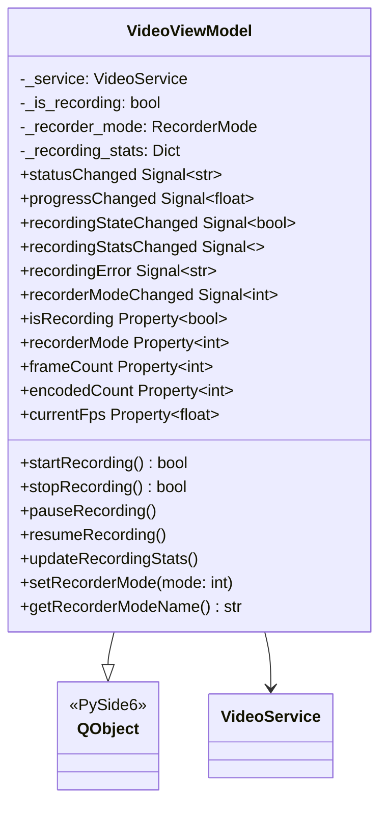

### 核心实现

```python
# video_viewmodel.py

class VideoViewModel(QObject):
    """视频处理 ViewModel"""
    
    # 信号定义
    statusChanged = Signal(str)
    progressChanged = Signal(float)
    recordingStateChanged = Signal(bool)
    recordingStatsChanged = Signal()
    recordingError = Signal(str)
    recorderModeChanged = Signal(int)
    
    def __init__(self, parent=None):
        super().__init__(parent)
        self._service = VideoService()
        self._is_recording = False
        self._recorder_mode = RecorderMode.VIDEO  # 默认 VIDEO 模式
        self._recording_stats = {...}
    
    # ==================== 录制功能 ====================
    
    @Slot(result=bool)
    def startRecording(self):
        """开始录制"""
        try:
            # 生成输出文件名
            timestamp = datetime.now().strftime("%Y%m%d_%H%M%S")
            output_dir = Path.home() / "Videos" / "ScreenRecordings"
            output_dir.mkdir(parents=True, exist_ok=True)
            output_path = output_dir / f"recording_{timestamp}.mp4"
            
            recorder = self._service.get_screen_recorder()
            success = recorder.start_recording(str(output_path))
            
            if success:
                self._is_recording = True
                self.recordingStateChanged.emit(True)
                return True
            return False
        except Exception as e:
            self.recordingError.emit(str(e))
            return False
    
    @Slot(int)
    def setRecorderMode(self, mode: int):
        """
        设置录制模式
        
        Args:
            mode: 0 = VIDEO (高帧率), 1 = SNAPSHOT (低帧率)
        """
        try:
            if self._is_recording:
                self.recordingError.emit("Cannot change mode while recording")
                return
            
            new_mode = RecorderMode.VIDEO if mode == 0 else RecorderMode.SNAPSHOT
            
            if new_mode != self._recorder_mode:
                self._recorder_mode = new_mode
                
                # 更新 C++ 层的模式
                recorder = self._service.get_screen_recorder()
                recorder.set_recorder_mode(new_mode)
                
                self.recorderModeChanged.emit(mode)
        except Exception as e:
            self.recordingError.emit(str(e))
    
    # ==================== 属性 ====================
    
    @Property(int, notify=recorderModeChanged)
    def recorderMode(self):
        """当前录制模式: 0 = VIDEO, 1 = SNAPSHOT"""
        return self._recorder_mode.value
    
    @Property(bool, notify=recordingStateChanged)
    def isRecording(self):
        """是否正在录制"""
        return self._is_recording
    
    @Property(float, notify=recordingStatsChanged)
    def currentFps(self):
        """当前帧率"""
        return self._recording_stats.get('current_fps', 0.0)
```

---

## QML UI 层

QML 层负责用户界面展示和交互处理。

### 文件位置

[RecordPage.qml](file:///d:/编程/项目/AiVideoAnalsysSystem/python/views/pages/RecordPage.qml)

### UI 组件结构

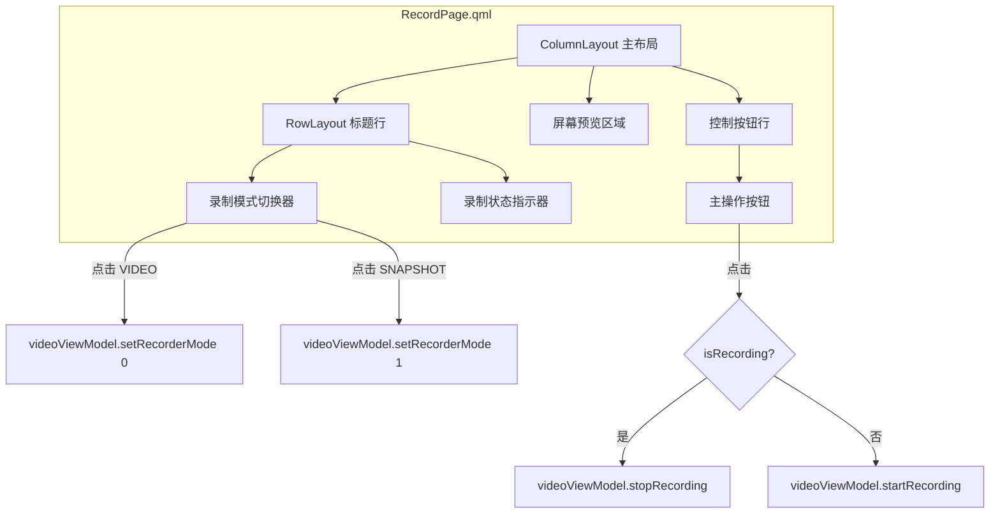

### 模式切换器实现

```qml
// RecordPage.qml

// 录制模式切换器 (Minimalist Toggle)
Rectangle {
    width: 200
    height: 36
    radius: 18
    color: Styles.ThemeManager.bgCard
    visible: !isRecording  // 录制时隐藏

    RowLayout {
        anchors.fill: parent
        anchors.margins: 3
        spacing: 0

        // VIDEO 模式按钮
        Rectangle {
            Layout.fillWidth: true
            Layout.fillHeight: true
            radius: 15
            color: videoViewModel.recorderMode === 0
                   ? Styles.ThemeManager.primary
                   : "transparent"

            Behavior on color {
                ColorAnimation { duration: 200 }
            }

            Text {
                anchors.centerIn: parent
                text: "VIDEO"
                color: videoViewModel.recorderMode === 0
                       ? "#FFFFFF"
                       : Styles.ThemeManager.textSecondary
                font.pixelSize: 11
                font.weight: Font.Bold
            }

            MouseArea {
                anchors.fill: parent
                cursorShape: Qt.PointingHandCursor
                onClicked: {
                    console.log("[RecordPage] Switching to VIDEO mode");
                    videoViewModel.setRecorderMode(0);  // ⭐ 调用 ViewModel
                }
            }
        }

        // SNAPSHOT 模式按钮
        Rectangle {
            Layout.fillWidth: true
            Layout.fillHeight: true
            radius: 15
            color: videoViewModel.recorderMode === 1
                   ? Styles.ThemeManager.primary
                   : "transparent"

            Text {
                anchors.centerIn: parent
                text: "SNAPSHOT"
                color: videoViewModel.recorderMode === 1
                       ? "#FFFFFF"
                       : Styles.ThemeManager.textSecondary
            }

            MouseArea {
                anchors.fill: parent
                onClicked: {
                    videoViewModel.setRecorderMode(1);  // ⭐ 调用 ViewModel
                }
            }
        }
    }
}
```

### 录制按钮实现

```qml
// 主操作按钮
Rectangle {
    width: 240
    height: 56
    radius: 28  // Pill shape
    color: isRecording
           ? Styles.ThemeManager.surfaceHover
           : Styles.ThemeManager.primary

    RowLayout {
        anchors.centerIn: parent
        spacing: 12

        // 图标 (录制时为方形停止图标，空闲时为圆形录制图标)
        Rectangle {
            width: 16
            height: 16
            radius: isRecording ? 2 : 8
            color: isRecording
                   ? Styles.ThemeManager.error
                   : "#FFFFFF"
        }

        Text {
            text: isRecording ? "STOP RECORDING" : "START RECORDING"
            color: isRecording
                   ? Styles.ThemeManager.error
                   : "#FFFFFF"
            font.pixelSize: 14
            font.weight: Font.ExtraBold
        }
    }

    MouseArea {
        anchors.fill: parent
        cursorShape: Qt.PointingHandCursor
        onClicked: {
            if (root.isRecording) {
                videoViewModel.stopRecording();   // ⭐ 停止录制
            } else {
                videoViewModel.startRecording();  // ⭐ 开始录制
            }
        }
    }
}
```

### QML 与 ViewModel 绑定

```qml
Rectangle {
    id: root

    // 使用 videoViewModel 的录制状态
    property bool isRecording: videoViewModel.isRecording

    // 监听录制状态变化
    Connections {
        target: videoViewModel
        function onRecordingStateChanged(recording) {
            if (!recording) {
                recordingTime = 0;
            }
        }
        function onRecordingError(errorMsg) {
            console.error("[RecordPage] Recording error:", errorMsg);
        }
    }

    // 定时更新统计信息
    Timer {
        id: recordingTimer
        interval: 1000
        repeat: true
        running: isRecording
        onTriggered: {
            recordingTime++;
            videoViewModel.updateRecordingStats();
        }
    }
}
```

---

## 双模式详解

### VIDEO 模式 vs SNAPSHOT 模式

| 特性 | VIDEO 模式 | SNAPSHOT 模式 |
|------|-----------|---------------|
| **目标帧率** | 30 FPS | 1 FPS |
| **采集间隔** | ~33ms | 1000ms |
| **采集器类型** | AUTO (优先 DXGI) | GDI (兼容性更好) |
| **输出格式** | MP4 视频 | MP4 视频 (低帧率) |
| **CPU 占用** | 较高 | 极低 (<1%) |
| **存储占用（1小时）** | ~500 MB | ~25 MB |
| **适用场景** | 实时录制、演示 | 长时间监控、AI 分析 |

### 模式切换流程

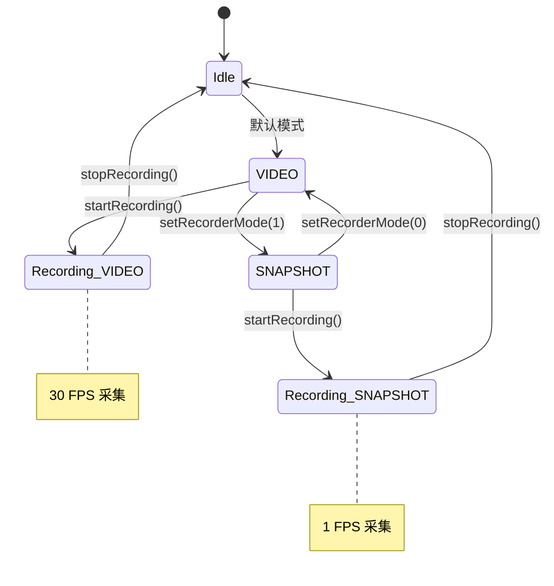

### 模式选择器在 C++ 层的实现

```cpp
// ScreenRecorder.cpp

bool ScreenRecorder::startRecording(std::string& path) {
    // ...

    // 1. 根据模式选择采集器
    GrabberType preferredType =
        (m_mode == RecorderMode::SNAPSHOT)
            ? GrabberType::GDI    // 快照模式使用 GDI (更稳定)
            : GrabberType::AUTO;  // 视频模式自动选择最佳
    m_grabber_ = GrabberFactory::createGrabber(preferredType);

    // 2. 根据模式设定帧率
    int target_fps = (m_mode == RecorderMode::SNAPSHOT) ? 1 : 30;
    grabber_thread_ = std::make_shared<FrameGrabberThread>(
        m_grabber_, *m_frameQueue_, target_fps);

    // 3. 编码器配置也使用对应帧率
    EncoderConfig config = encoderConfigFromGrabber(m_grabber_.get());
    if (m_mode == RecorderMode::SNAPSHOT) {
        config.fps = 1;
    }
    m_encoder_ = std::make_unique<FrameEncoder>(m_frameQueue_, config);

    // ...
}
```

---

## 线程模型与 GIL 管理

### 线程交互图

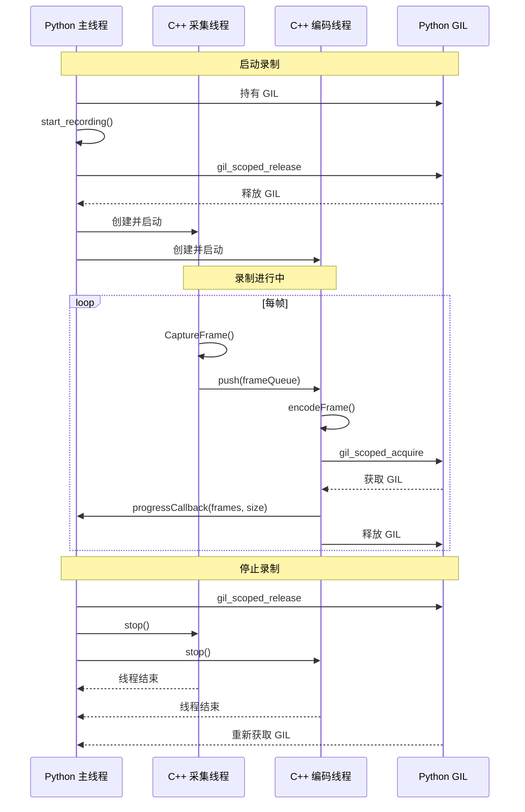

### GIL 管理要点

1. **C++ 长时间操作释放 GIL**
   - `start_recording()`, `stop_recording()` 等可能阻塞的方法使用 `py::call_guard<py::gil_scoped_release>()`

2. **回调到 Python 前获取 GIL**
   - 使用 `wrapCallbackWithGIL()` 包装所有 Python 回调

3. **异常安全**
   - 捕获 `py::error_already_set` 异常，调用 `PyErr_Clear()` 清除错误状态

---

## 完整调用序列图

### 模式切换 + 开始录制完整流程

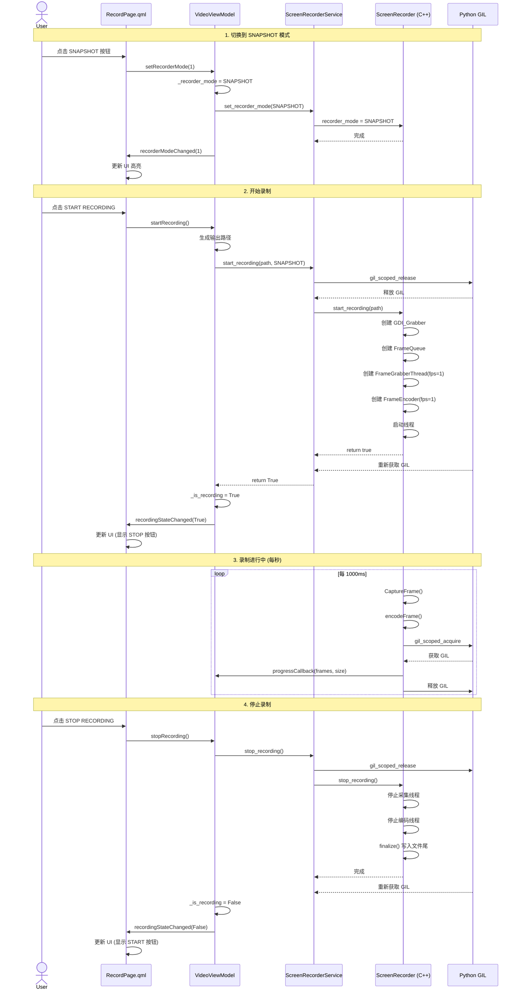

---

## 总结

本文档详细介绍了 AI Video Analysis System 中视频模式和快照模式录制功能的完整实现，涵盖：

1. **C++ 核心层**: 高性能屏幕采集 (`IScreenGrabber`) 和视频编码 (`FFmpegWrapper`)，支持 30 FPS 视频模式和 1 FPS 快照模式
2. **Pybind11 绑定层**: 类型转换、GIL 管理和回调包装，确保线程安全
3. **Python 服务层**: 业务逻辑封装，提供 Pythonic API
4. **ViewModel 层**: Qt 属性绑定和信号发射，连接 UI 和服务
5. **QML UI 层**: 用户界面展示，包含模式切换器和录制控制按钮

关键设计决策：
- **生产者-消费者模式**: 采集线程和编码线程通过 `ThreadSafetyQueue` 解耦
- **模式选择器**: 在启动时根据 `RecorderMode` 配置帧率和采集器类型
- **GIL 管理**: 使用 `gil_scoped_release` 避免阻塞 Python，使用 `wrapCallbackWithGIL` 确保回调安全
