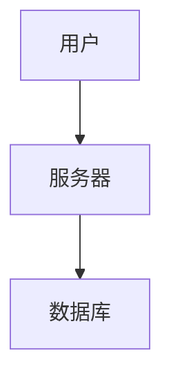

# Google Artifact to Markdown 转换工具 (Mermaid专用版)

## 📖 功能说明

这个工具专门解决**从Google Artifact复制文档到Anytype时图表无法粘贴**的问题!

### ✨ 核心功能

✅ 自动提取Google Artifact文档的完整Markdown内容  
✅ 智能识别所有Mermaid图表代码块  
✅ 将Mermaid图表自动渲染为PNG图片  
✅ 生成可直接导入Anytype的Markdown文件  
✅ 一键完成,无需手动截图!  

### 🎯 解决的问题

**问题**: 从Google Artifact复制文档到Anytype时:
- ❌ 文本可以复制,但Mermaid图表只能复制到源代码
- ❌ Anytype不支持Mermaid渲染,图表无法显示
- ❌ 需要手动一个一个截图,非常麻烦

**解决方案**: 
- ✅ 自动将所有Mermaid图表转换为PNG图片
- ✅ 图片自动嵌入到Markdown中
- ✅ 直接导入Anytype,图表完美显示!

## 🚀 快速开始

### 1. 安装依赖

首先运行安装脚本:

```bash
cd tools
install.bat
```

或者手动安装:

```bash
pip install playwright
playwright install chromium
```

### 2. 使用方法

#### 方法一: 使用批处理脚本(最简单)

```bash
convert.bat <你的Artifact链接>
```

示例:
```bash
convert.bat https://g.co/gemini/share/83a6cfa7-6e28-49e9-a43f-69b350435889
```

#### 方法二: 直接使用Python脚本

```bash
python artifact_to_markdown.py <Artifact链接>
```

高级用法:
```bash
# 指定输出目录
python artifact_to_markdown.py https://g.co/gemini/share/xxxxx -o my_notes

# 指定输出文件名
python artifact_to_markdown.py https://g.co/gemini/share/xxxxx -f "第一阶段架构设计.md"

# 完整参数
python artifact_to_markdown.py https://g.co/gemini/share/xxxxx -o my_notes -f "架构文档.md"
```

### 3. 输出结果

运行后会生成:

```
artifacts/                          # 输出目录
├── artifact_20231224_205800.md     # Markdown文件
└── images/                         # 图片文件夹
    ├── mermaid_1_20231224_205800.png
    ├── mermaid_2_20231224_205800.png
    └── mermaid_3_20231224_205800.png
```

### 4. 导入到Anytype

1. 将整个`artifacts`文件夹复制到你想要的位置
2. 在Anytype中打开Markdown文件
3. 所有Mermaid图表已经转换为PNG,完美显示! 🎉

## 🎯 工作原理

```
┌─────────────────────────────────────────────────────────────┐
│  1. 访问Google Artifact页面                                  │
│     ↓                                                        │
│  2. 提取完整的Markdown内容                                   │
│     ↓                                                        │
│  3. 检测所有 ```mermaid ... ``` 代码块                       │
│     ↓                                                        │
│  4. 使用Mermaid.ink在线服务渲染为PNG                         │
│     ↓                                                        │
│  5. 替换代码块为               │
│     ↓                                                        │
│  6. 保存Markdown文件 + PNG图片                               │
└─────────────────────────────────────────────────────────────┘
```

### 技术细节

1. **Mermaid渲染**: 使用 [mermaid.ink](https://mermaid.ink) 在线服务
   - 将Mermaid代码Base64编码
   - 访问 `https://mermaid.ink/img/<encoded>`
   - 自动渲染为PNG图片

2. **内容提取**: 使用Playwright自动化浏览器
   - 支持JavaScript渲染的动态内容
   - 智能识别文档结构

3. **图片引用**: 使用相对路径
   - ``
   - Anytype可以正确识别和显示

## ⚙️ 参数说明

| 参数 | 说明 | 必需 | 默认值 |
|------|------|------|--------|
| `url` | Google Artifact页面URL | ✅ | - |
| `-o, --output-dir` | 输出目录 | ❌ | `./artifacts` |
| `-f, --filename` | 输出文件名 | ❌ | `artifact_<timestamp>.md` |

## 💡 使用技巧

### 批量转换多个文档

创建批处理脚本 `batch_convert.bat`:

```batch
@echo off
call convert.bat https://g.co/gemini/share/doc1 -f "文档1.md"
call convert.bat https://g.co/gemini/share/doc2 -f "文档2.md"
call convert.bat https://g.co/gemini/share/doc3 -f "文档3.md"
echo 全部转换完成!
pause
```

### 隐藏浏览器窗口

如果不想看到浏览器窗口,修改脚本中的:
```python
browser = p.chromium.launch(headless=False)
```
改为:
```python
browser = p.chromium.launch(headless=True)
```

### 自定义图片质量

可以在`render_mermaid_to_png`方法中添加参数:
```python
page.screenshot(path=str(image_path), full_page=True, type='png', quality=100)
```

## 🐛 常见问题

### Q: 提示"playwright not found"
**A**: 运行安装脚本:
```bash
install.bat
```

### Q: Mermaid图表渲染失败
**A**: 可能的原因:
1. 网络连接问题(mermaid.ink需要访问国外服务)
2. Mermaid代码语法错误
3. 解决方案: 脚本会自动保留原始Mermaid代码块

### Q: 在Anytype中图片不显示
**A**: 确保:
1. 整个文件夹(包括images子文件夹)都在同一位置
2. 没有移动或重命名images文件夹
3. Markdown文件和images文件夹在同一目录下

### Q: 提取的内容不完整
**A**: 
1. 增加等待时间: 修改`page.wait_for_timeout(3000)`为更大的值
2. 检查URL是否正确
3. 确保页面已完全加载

### Q: 需要代理访问mermaid.ink
**A**: 可以在脚本中配置代理:
```python
browser = p.chromium.launch(
    headless=False,
    proxy={"server": "http://your-proxy:port"}
)
```

## 📊 示例对比

### 转换前(复制粘贴到Anytype)
```markdown
# 系统架构


```

**结果**: 只看到代码,没有图表 ❌

### 转换后(使用本工具)
```markdown
# 系统架构


```

**结果**: 完美显示流程图! ✅

## 🔧 高级配置

### 修改Mermaid渲染服务

如果mermaid.ink访问慢,可以使用其他服务:

```python
# 方法1: 使用Kroki服务
kroki_url = f"https://kroki.io/mermaid/png/{encoded}"

# 方法2: 自建Mermaid服务
custom_url = f"http://your-server/mermaid/{encoded}"
```

### 添加图片水印

在`render_mermaid_to_png`方法中添加:
```python
from PIL import Image, ImageDraw, ImageFont

img = Image.open(image_path)
draw = ImageDraw.Draw(img)
draw.text((10, 10), "Generated by Artifact Converter", fill=(128, 128, 128))
img.save(image_path)
```

## 📝 完整示例

假设你有这个Artifact文档:
```
https://g.co/gemini/share/83a6cfa7-6e28-49e9-a43f-69b350435889
```

运行:
```bash
convert.bat https://g.co/gemini/share/83a6cfa7-6e28-49e9-a43f-69b350435889
```

输出:
```
========================================
  Google Artifact to Markdown Converter
  (Mermaid图表专用版)
========================================

🚀 启动浏览器...
✓ 输出目录: D:\artifacts
✓ 图片目录: D:\artifacts\images

🔍 开始提取内容: https://g.co/gemini/share/xxxxx

⏳ 正在加载页面...
✓ 找到内容区域: article
✓ 成功提取内容 (30810 字符)

📊 开始处理Mermaid图表...

✓ 检测到 15 个Mermaid图表

  ⏳ 正在渲染Mermaid图表 1...
  ✓ Mermaid图表 1 已保存: mermaid_1_20231224_205800.png
  ⏳ 正在渲染Mermaid图表 2...
  ✓ Mermaid图表 2 已保存: mermaid_2_20231224_205800.png
  ...

✓ 成功转换 15 个Mermaid图表

✅ Markdown文件已保存: D:\artifacts\artifact_20231224_205800.md
✅ 图片文件夹: D:\artifacts\images

💡 提示: 将整个 'artifacts' 文件夹导入到Anytype即可!
```

## 🎉 总结

使用这个工具,你再也不需要:
- ❌ 手动截图每个图表
- ❌ 一个一个粘贴图片
- ❌ 担心图表格式问题

只需要:
- ✅ 一行命令
- ✅ 等待几秒钟
- ✅ 完美的Markdown文档!

## 📄 许可证

MIT License - 自由使用和修改

---

**享受高效的文档搬运体验! 🚀**
